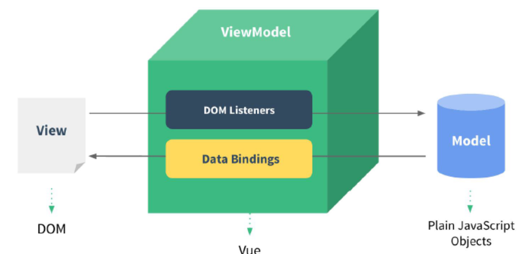

#### 1.抽象类和接口的区别

接口用来做规范，抽象类用来封装

http://t.csdn.cn/z8qki

```
抽象类
抽象类使用abstract修饰类
抽象类当中可以包含普通类所能包含的成员
抽象类和普通类不一样的是，抽象类当中可以包含抽象方法。
抽象类方法是使用abstract修饰的，这个方法没有具体的实现
不能实例化抽象类
抽象类存在的意义是为了被继承
抽象类的方法不能是私有的（private）,要满足重写的规则。
抽象类当中可以有构造方法，为了方便子类能够调用，来初始化抽象类当中的成员

接口
1.使用interface来修饰接口
2.接口当中的成员方法不能有具体的实现（jdk1.8以后才有默认实现）。
在接口中抽象方法默认是public abstract的方法
接口不可以被实例化，也就是说接口不能有静态代码块和构造方法
可以通过implements实现接口，接口里面的抽象方法必须重写，默认方法可重写也可以不重写，静态方法不能被重写。
接口的使用
实现多个接口

抽象类和接口的区别：
Object类
toString
equals
抽象类和接口的区别：
抽象类可以包含普通字段和成员，接口中不能包含普通方法，子类必须重写所有的抽象方法
抽象方法由普通类（普通字段和方法）和抽象方法组成
接口由抽象方法和全局常量组成
使用extends继承抽象类，使用implements关键字实现接口
一个抽象类可以实现若干个接口，接口不能继承抽象类，接口可以使用extends继承多个父类接口
一个子类只能继承一个抽象类，一个子类可以实现多个接口
```


##### 1.1实例化

实例化是指在 面向对象 的编程中，**把用类创建对象的过程**称为实例化。 是将一个抽象的概念类，具体到该类实物的过程。 实例化过程中一般由类名 对象名 = new 类名（参数1，参数2...参数n）构成。 

如 Date date=new Date ();就是用日期类创建了一个日期的对象，就叫对象的实例化。 

多数语言中，实例化一个对象就是为对象开辟内存空间，或者是不用声明，直接使用new 构造函数名，建立一个临时对象。


##### 1.2声明

java中，可以通过指定数据类型和标识符来设置（声明）变量，语法为“变量类型 变量名称;” 或 “变量类型 变量名称=初始值;”；变量类型可以为int、string、char和double等。


##### 1.3构造方法

1.构造方法是类的一种特殊方法，用来初始化类的一个新的对象，在创建对象（new 运算符）之后自动调用。

2.Java中的每个类都有一个默认的构造方法，并且可以有一个以上的构造方法。

3.Java 构造方法有以下特点：

- 方法名必须与类名相同
- 可以有 0 个、1 个或多个参数
- 没有任何返回值，包括 void
- 默认返回类型就是对象类型本身
- 只能与 new 运算符结合使用

值得注意的是，如果为构造方法定义了返回值类型或使用 void 声明构造方法没有返回值，编译时不会出错，但 Java 会把这个所谓的构造方法当成普通方法来处理。

4.注意：构造方法不能被 static、final、synchronized、abstract 和 native（类似于 abstract）修饰。构造方法用于初始化一个新对象，所以用 static 修饰没有意义。构造方法不能被子类继承，所以用 final 和 abstract 修饰没有意义。多个线程不会同时创建内存地址相同的同一个对象，所以用 synchronized 修饰没有必要。

5.例1：

构造方法主要有无参构造方法和有参构造方法两种，示例如下：

```java 
public class MyClass {
    private int m;    // 定义私有变量
    MyClass() {
        // 定义无参的构造方法
        m = 0;
    }
    MyClass(int m) {
        // 定义有参的构造方法
        this.m = m;
    }
}
```

该示例定义了两个构造方法，分别是无参构造方法和有参构造方法。在一个类中定义多个具有不同参数的同名方法，这就是方法的重载。这两个构造方法的名称都与类名相同，均为 MyClass。在实例化该类时可以调用不同的构造方法进行初始化。

注意：类的构造方法不是要求必须定义的。如果在类中没有定义任何一个构造方法，则 Java 会自动为该类生成一个默认的构造方法。默认的构造方法不包含任何参数，并且方法体为空。如果类中显式地定义了一个或多个构造方法，则 Java 不再提供默认构造方法。

提示：无参数的构造方法也被称为 Nullary 构造方法。只有编译程序自动加入的构造方法，才称为默认构造函数。如果自行编写无参数、没有内容的构造函数，就不称为默认构造函数了（只是 Nullary 构造函数）。虽然只是名词定义，不过认证考试时要区别一下两者的不同。

例 2：

要在不同的条件下使用不同的初始化行为创建类的对象，这时候就需要在一个类中创建多个构造方法。下面通过一个示例来演示构造方法的使用。

1）首先在员工类 Worker 中定义两个构造方法，代码如下：

```java 
public class Worker {
    public String name;    // 姓名
    private int age;    // 年龄
    // 定义带有一个参数的构造方法
    public Worker(String name) {
        this.name = name;
    }
    // 定义带有两个参数的构造方法
    public Worker(String name,int age) {
        this.name = name;
        this.age = age;
    }
    public String toString() {
        return "大家好！我是新来的员工，我叫"+name+"，今年"+age+"岁。";
    }
}
```


#### 2.你的XXX项目中是怎么解决分布式登录问题的

1.你的XXX项目中是怎么解决分布式登录问题的？
分布式登录会现单点登录问题：由于后台是多个微服，且登录用户信息是保存到session，当经过负载均衡转发时，转给没有登录过的微服时，没有session会导致重新登录

解决这个问题：

##### 1.1JWT token实现

JWT 生成的token 包含三部分，其中载荷部分就用存储登录用户信息
当用户登录成功后，生成token，把用户信息存入token中的载荷(Base64编码json数据，不能是敏感数据)，返回token给客户端
客户端发来请求时，通过JwtUtil校验token的有效性，当需要用到用户信息时就可以从token的载荷中来获取

##### 1.2如果使用redis 如何实现

登录时：以key=login_user_用户名,用户信息为value存入redis，且设置有效期(PC 30分钟, APP(7天或30天))，返回用户名给客户端
再次请求：用户每次请求时带上用户名, 判断redis的key是否存在，如果不存在则要求登录，如果存在放行。重新设置有效期


##### 补充点：

##### 1.token续期

30分钟.setExpiration(30  *60*  1000)
45分钟以内还有请求，生成新的token，返回给客户端，需要客户端配合。

##### 2.redis实现

续期（每次请求时，重新设置有效为30分钟）

##### 3.双token:

无状态通讯，生成token或解析token比较耗CPU性能(算法)
accessToken:   权限认证       需要独立的token服务器
refreshToken:   当accessToken过期时，用来换新的accessToken
请求访问时，如果后台校验到accessToken已过期，则返回给前端token已失效时。
前端请求Token服务器，提交refreshToken，Token服务验证refreshToken有效性，如果有效则生成新的一对token(accessToken与refreshToken)给前端
前端使用新的accessToken请求后端服务

##### 4.Jwt组成

Header请求头、Payload 载荷、Signature签名。

##### 5.Token令牌

  有状态通讯：用户登录后，把登录用户信息保存在服务端,安全可靠。占用内存空间 （金融与保险行业）

  无状态通讯：用户登录后，服务端不存储登录用户信息，登录用户信息存在token里，用户每次请求时必须带上token。优点：不占空间，缺点：相对没那么安全 社交软件

##### 6.Redis

Redis是一个基于**内存**的key-value结构数据库。Redis 是互联网技术领域使用最为广泛的存储中间件，它是「**Re**mote **Di**ctionary **S**ervice」的首字母缩写，也就是「远程字典服务」。

基于内存存储，读写性能高。

它可以用作：数据库、缓存和消息中间件。


#### 3.JSPJava 服务端页面

==JSP（全称：Java Server Pages）：Java 服务端页面。==是一种动态的网页技术，其中既可以定义 HTML、JS、CSS等静态内容，还可以定义 Java代码的动态内容，也就是 `JSP = HTML + Java`。如下就是jsp代码

```jsp
<html>
    <head>
        <title>Title</title>
    </head>
    <body>
        <h1>JSP,Hello World</h1>
        <%
        	System.out.println("hello,jsp~");
        %>
    </body>
</html>
```

替代。Ajax 是我们后续会重点学习的技术。有个这个技术后，前端工程师负责前端页面开发，而后端工程师只负责前端代码开发。下来对技术的发展进行简单的说明


1. 第一阶段：使用 `servlet` 即实现逻辑代码编写，也对页面进行拼接。这种模式我们之前也接触过

2. 第二阶段：随着技术的发展，出现了 `JSP` ，人们发现 `JSP` 使用起来比 `Servlet` 方便很多，但是还是要在 `JSP` 中嵌套 `Java` 代码，也不利于后期的维护

3. 第三阶段：使用 `Servlet` 进行逻辑代码开发，而使用 `JSP` 进行数据展示

   

4. 第四阶段：使用 `servlet` 进行后端逻辑代码开发，而使用 `HTML` 进行数据展示。而这里面就存在问题，`HTML` 是静态页面，怎么进行动态数据展示呢？这就是 `ajax` 的作用了。


#### 6.DOM文档对象模型 

文档对象模型 (DOM) 是 HTML 和 XML 文档的编程接口。它提供了对文档的结构化的表述，并定义了一种方式可以使从程序中对该结构进行访问，从而改变文档的结构，样式和内容。DOM 将文档解析为一个由节点和对象（包含属性和方法的对象）组成的结构集合。简言之，它会将 web 页面和脚本或程序语言连接起来。

一个 web 页面是一个文档。这个文档可以在浏览器窗口或作为 HTML 源码显示出来。但上述两个情况中都是同一份文档。==文档对象模型（DOM）提供了对同一份文档的另一种表现，存储和操作的方式。==DOM 是 web 页面的完全的面向对象表述，它能够使用如 JavaScript 等脚本语言进行修改。


#### 7.Vue 前端框架

Vue 是一套前端框架，免除原生JavaScript中的DOM操作，简化书写。

我们之前也学习过后端的框架 `Mybatis` ，`Mybatis` 是用来简化 `jdbc` 代码编写的；而 `VUE` 是前端的框架，是用来简化 `JavaScript` 代码编写的。

基于MVVM(Model-View-ViewModel)思想，实现数据的双向绑定，将编程的关注点放在数据上。=

`MVC` 思想是没法进行双向绑定的。双向绑定是指当数据模型数据发生变化时，页面展示的会随之发生变化，而如果表单数据发生变化，绑定的模型数据也随之发生变化。接下来我们聊聊 `MVVM` 思想，如下图是三个组件图解



图中的 `Model` 就是我们的数据，`View` 是视图，也就是页面标签，用户可以通过浏览器看到的内容；`Model` 和 `View` 是通过 `ViewModel` 对象进行双向绑定的，而 `ViewModel` 对象是 `Vue` 提供的。


#### 8.AJAX异步的 JavaScript 和 XML

`AJAX` (Asynchronous JavaScript And XML)：异步的 JavaScript 和 XML。概念中的 `JavaScript` 和 `XML`，`JavaScript` 表明该技术和前端相关；`XML` 是指以此进行数据交换。而这两个我们之前都学习过。

##### 8.1  作用

AJAX 作用有以下两方面：

1. **与服务器进行数据交换**：通过AJAX可以给服务器发送请求，服务器将数据直接响应回给浏览器。如下图


如上图，`Servlet` 调用完业务逻辑层后将数据存储到域对象中，然后跳转到指定的 `jsp` 页面，在页面上使用 `EL表达式` 和 `JSTL` 标签库进行数据的展示。

而我们学习了AJAX 后，就可以==使用AJAX和服务器进行通信，以达到使用 HTML+AJAX来替换JSP页面==了。如下图，浏览器发送请求servlet，servlet 调用完业务逻辑层后将数据直接响应回给浏览器页面，页面使用 HTML 来进行数据展示。


2. **异步交互**：可以在==不重新加载整个页面==的情况下，与服务器交换数据并==更新部分网页==的技术，如：搜索联想、用户名是否可用校验，等等…


上图所示的效果我们经常见到，在我们输入一些关键字（例如 `奥运`）后就会在下面联想出相关的内容，而联想出来的这部分数据肯定是存储在百度的服务器上，而我们并没有看出页面重新刷新，这就是 ==更新局部页面== 的效果。再如下图：


我们在用户名的输入框输入用户名，当输入框一失去焦点，如果用户名已经被占用就会在下方展示提示的信息；在这整个过程中也没有页面的刷新，只是在局部展示出了提示信息，这就是 ==更新局部页面== 的效果。

##### 8.2  同步和异步

知道了局部刷新后，接下来我们再聊聊同步和异步:

- 同步发送请求过程如下


​	浏览器页面在发送请求给服务器，在服务器处理请求的过程中，浏览器页面不能做其他的操作。只能等到服务器响应结束后才能，浏览器页面才能继续做其他的操作。

- 异步发送请求过程如下

  

  浏览器页面发送请求给服务器，在服务器处理请求的过程中，浏览器页面还可以做其他的操作。


#### 9.axios基于 promise 的 HTTP 库

Axios 是一个基于 promise 的 HTTP 库，可以用在浏览器和 node.js 中。

Axios 对原生的AJAX进行封装，简化书写。

Axios官网是：`https://www.axios-http.cn`

##### 9.1  axios基本使用

axios 使用是比较简单的，分为以下两步：

- 引入 axios 的 js 文件

  ```html
  <script src="js/axios-0.18.0.js"></script>
  ```

- 使用axios 发送请求，并获取响应结果

  - 发送 get 请求

    ```js
    axios({
        method:"get",
        url:"http://localhost:8080/ajax-demo1/aJAXDemo1?username=zhangsan"
    }).then(function (response){
        alert(response.data);
    })
    ```

  - 发送 post 请求

    ```js
    axios({
        method:"post",
        url:"http://localhost:8080/ajax-demo1/aJAXDemo1",
        data:"username=zhangsan"
    }).then(function (response){
        alert(response.data);
    });
    ```

`axios()` 是用来发送异步请求的，小括号中使用 js 对象传递请求相关的参数：

- `method` 属性：用来设置请求方式的。取值为 `get` 或者 `post`。
- `url` 属性：用来书写请求的资源路径。如果是 `get` 请求，需要将请求参数拼接到路径的后面，格式为： `url?参数名=参数值&参数名2=参数值2`。
- `data` 属性：作为请求体被发送的数据。也就是说如果是 `post` 请求的话，数据需要作为 `data` 属性的值。

`then()` 需要传递一个匿名函数。我们将 `then()` 中传递的匿名函数称为 ==回调函数==，意思是该匿名函数在发送请求时不会被调用，而是在成功响应后调用的函数。而该回调函数中的 `response` 参数是对响应的数据进行封装的对象，通过 `response.data` 可以获取到响应的数据。

##### 9.2**axios和ajax的区别**

1、axios是一个基于Promise的HTTP库，而ajax是对原生XHR的封装；2、ajax技术实现了局部数据的刷新，而axios实现了对ajax的封装。 


#### 3.JSPJava 服务端页面

==JSP（全称：Java Server Pages）：Java 服务端页面。==是一种动态的网页技术，其中既可以定义 HTML、JS、CSS等静态内容，还可以定义 Java代码的动态内容，也就是 `JSP = HTML + Java`。如下就是jsp代码

```jsp
<html>
    <head>
        <title>Title</title>
    </head>
    <body>
        <h1>JSP,Hello World</h1>
        <%
        	System.out.println("hello,jsp~");
        %>
    </body>
</html>
```

替代。Ajax 是我们后续会重点学习的技术。有个这个技术后，前端工程师负责前端页面开发，而后端工程师只负责前端代码开发。下来对技术的发展进行简单的说明


1. 第一阶段：使用 `servlet` 即实现逻辑代码编写，也对页面进行拼接。这种模式我们之前也接触过

2. 第二阶段：随着技术的发展，出现了 `JSP` ，人们发现 `JSP` 使用起来比 `Servlet` 方便很多，但是还是要在 `JSP` 中嵌套 `Java` 代码，也不利于后期的维护

3. 第三阶段：使用 `Servlet` 进行逻辑代码开发，而使用 `JSP` 进行数据展示

   

4. 第四阶段：使用 `servlet` 进行后端逻辑代码开发，而使用 `HTML` 进行数据展示。而这里面就存在问题，`HTML` 是静态页面，怎么进行动态数据展示呢？这就是 `ajax` 的作用了。


#### 4. EL表达式语言

EL（全称Expression Language ）表达式语言，用于简化 JSP 页面内的 Java 代码。

EL 表达式的主要作用是 ==获取数据==。其实就是从域对象中获取数据，然后将数据展示在页面上。

而 EL 表达式的语法也比较简单，==${expression}== 。例如：${brands} 就是获取域中存储的 key 为 brands 的数据。


#### 5.MVC模式和三层架构

##### 5.1MVC模式

MVC 是一种分层开发的模式，其中：

- M：Model，业务模型，处理业务
- V：View，视图，界面展示
- C：Controller，控制器，处理请求，调用模型和视图


控制器（serlvlet）用来接收浏览器发送过来的请求，控制器调用模型（JavaBean）来获取数据，比如从数据库查询数据；控制器获取到数据后再交由视图（JSP）进行数据展示。

**MVC 好处：**

- 职责单一，互不影响。每个角色做它自己的事，各司其职。
- 有利于分工协作。
- 有利于组件重用

##### 5.2  三层架构

三层架构是将我们的项目分成了三个层面，分别是 `表现层`、`业务逻辑层`、`数据访问层`。


- 数据访问层：对数据库的CRUD基本操作
- 业务逻辑层：对业务逻辑进行封装，组合数据访问层层中基本功能，形成复杂的业务逻辑功能。例如 `注册业务功能` ，我们会先调用 `数据访问层` 的 `selectByName()` 方法判断该用户名是否存在，如果不存在再调用 `数据访问层` 的 `insert()` 方法进行数据的添加操作
- 表现层：接收请求，封装数据，调用业务逻辑层，响应数据

而整个流程是，浏览器发送请求，表现层的Servlet接收请求并调用业务逻辑层的方法进行业务逻辑处理，而业务逻辑层方法调用数据访问层方法进行数据的操作，依次返回到serlvet，然后servlet将数据交由 JSP 进行展示。

三层架构的每一层都有特有的包名称：

- 表现层： `com.itheima.controller` 或者 `com.itheima.web`
- 业务逻辑层：`com.itheima.service`
- 数据访问层：`com.itheima.dao` 或者 `com.itheima.mapper`

后期我们还会学习一些框架，不同的框架是对不同层进行封装的


##### 5.3  MVC 和 三层架构

通过 MVC 和 三层架构 的学习，有些人肯定混淆了。那他们有什么区别和联系？


如上图上半部分是 MVC 模式，上图下半部分是三层架构。 `MVC 模式` 中的 C（控制器）和 V（视图）就是 `三层架构` 中的表现层，而 `MVC 模式` 中的 M（模型）就是 `三层架构` 中的 业务逻辑层 和 数据访问层。

可以将 `MVC 模式` 理解成是一个大的概念，而 `三层架构` 是对 `MVC 模式` 实现架构的思想。 那么我们以后按照要求将不同层的代码写在不同的包下，每一层里功能职责做到单一，将来如果将表现层的技术换掉，而业务逻辑层和数据访问层的代码不需要发生变化。

