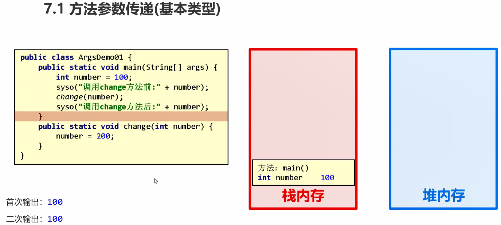
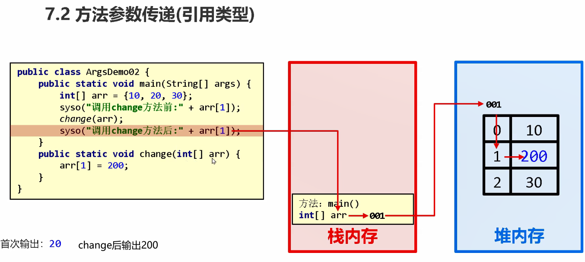
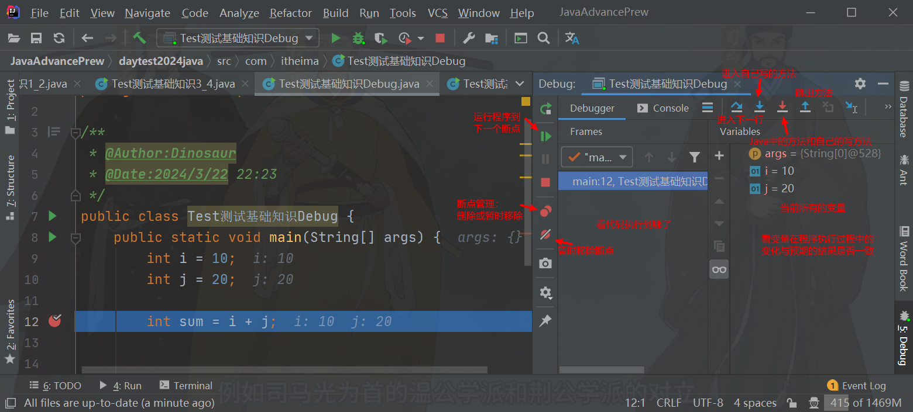
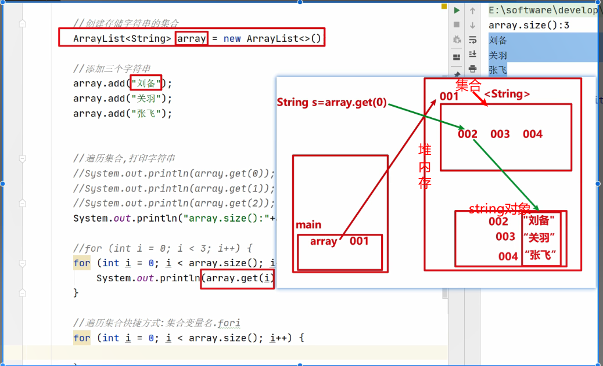
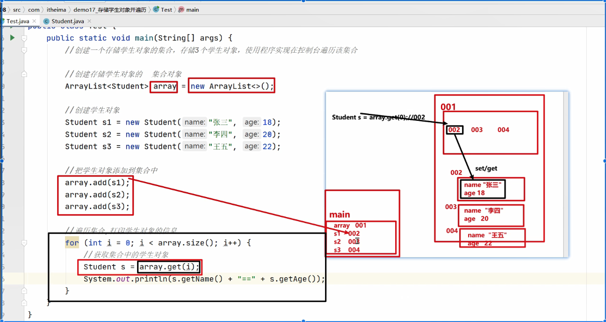

#### day1-2

##### 1.快捷键：

格式化（自动排齐代码）：ctrl+alt+L


##### 2.idea使用技巧

不加载模块：右击--Load/Uload Models


##### 3.字节与位

1个byte（字节）=8个连续的bit（位）

0000 0000


##### 4.数据类型与范围


##### 5.强制类型转换


##### 6.逻辑与/或/异或/非


##### 7.短路逻辑运算符&&，||


##### 8.三元运算符


##### 9.数据输入Scanner


##### 10.分支语句if和switch，循环语句for，while，do while

执行流程


#### day2-4

##### 1.结束循环continue，break，return


##### 2.随机数Random

nextInt（10）范围小1，位【0,10）


##### 3.栈内存，堆内存


##### 4.获取数组长度

arr.length


##### 5.数组遍历格式快捷键

数组名 .for


##### 6.数组最小索引最大索引


##### 7.数组动态初始化，静态初始化


##### 8.git中同步push到gitee和github上

[无法在git中同步push到github和gitee-CSDN博客](https://blog.csdn.net/weixin_59022513/article/details/136854353?spm=1001.2014.3001.5502)


##### 9.git使用命令

```
1.git init
2.git add . （".“代表该目录下的所有文件，如果不想上传所有文件，把”."换成想要上传的文件名）
3.git commit -m 'first'（first可任意换，相当于描述）
4.git remote add origin https://github.com/xxx/vvv.git
5.git push -u origin master
```


#### day5

##### 1.方法定义


##### 2.方法调用

定义

方法抽取快捷键ctrl+alt+M


##### 3.方法重载


##### 4.方法参数传递

1.基本类型参数传递

形式参数的改变不影响实际参数的改变。



2.引用类型参数传递

形式参数的改变影响实际参数的改变（因为引用类型变量指向的是一个地址值，改变的是地址值里的数据）。




##### 5.Debug




#### day06

##### 1.健身计划思路

```
需求：输入星期数，显示今天的减肥活动
```


##### 2.逢七过思路

```
需求：
    朋友聚会的时候可能会玩一个游戏：逢七过。
    规则是：从任意一个数字开始报数，当你要报的数字包含7或者是7的倍数时都要说：过。输出1-100中所有符合条件的数字。
```


##### 3.不死神兔思路

```
需求：
    有一对兔子，从出生后第3个月起每个月都生一对兔子，小兔子长到第三个月后每个月又生一对兔子，
    假如兔子都不死，问第二十个月的兔子对数为多少？
```


##### 4.百钱百鸡思路

```
需求：
        我国古代数学家张丘建在《算经》一书中提出的数学问题：鸡翁一值钱五，鸡母一值钱三，鸡雏三值钱一。
        百钱买百鸡，问鸡翁、鸡母、鸡雏各几何？
```


##### 5.数组指定元素求和思路

```
有这样的一个数组，元素是{68,27,95,88,171,996,51,210}。求出该数组中满足要求的元素和，
    要求是：求和的元素个位和十位都不能是7，并且只能是偶数
```


##### 6.判断数组是否相同

```
需求：
    设计一个方法，用于比较两个数组的内容是否相同
```


##### 7.查找元素位置

```
需求：
    已知一个数组 arr = {19, 28, 37, 46, 50}; 键盘录入一个数据，查找该数据在数组中的索引，并在控制台输出找到的索引值。
```


##### 8.数组反转

```
需求：
    已知一个数组 arr = {19, 28, 37, 46, 50}; 用程序实现把数组中的元素值交换，
    交换后的数组 arr = {50, 46, 37, 28, 19}; 并在控制台输出交换后的数组元素。
```


##### 9.评委打分

```
需求：
    在编程竞赛中，有6个评委为参赛的选手打分，分数为0-100的整数分。
    选手的最后得分为：去掉一个最高分和一个最低分后 的4个评委平均值 (不考虑小数部分)。
```


#### day7

##### 1.类包含成员变量、成员方法

定义和使用


##### 2.成员变量和局部变量的区别

初始值、内存、位置


##### 3.权限修饰符private（方法的封装）

get、set方法

快捷键：

alt+insert--getter and setter--按ctrl选成员变量


##### 4.this修饰变量

格式

作用


##### 5.构造方法

定义

使用

作用：

1.初始化对象。构造方法在创建对象时被调用，可以给成员变量赋值。

2.

快捷键：

无参构造alt+insert--Construct--select none

有参构造alt+insert--Construct--按ctrl选择成员变量


##### 6.构造方法和get、set方法的不同

new一个对象、修改同一个对象的值


##### 7.API


Application Programming Interface：应用程序编程接口

会查看文档JDK_API_1_6_zh_CN.CHM

使用步骤：

搜索--所在的包--查看构造方法--成员方法

##### 8.


#### day8

##### 1.字符串String对象特点


##### 2.String构造方法

```
public String()	            创建一个空白字符串对象，不含有任何内容
public String(char[] chs)	根据字符数组的内容，来创建字符串对象
public String(byte[] bys)	根据字节数组的内容，来创建字符串对象
特殊方式  String s = “abc”;  推荐使用直接赋值的方式得到字符串对象
```

使用：

```
1.前三种
 		byte[] bys ={97,98,99};
        String s2 = new String(bys);//在堆内存中开辟空间
        System.out.println("s2="+s2);

2.直接赋值的方式创建字符串对象
//直接赋值的方式创建字符串对象，内容就是abc
        String s3 ="abc";//存放在堆内存中的常量池，可共享
        System.out.println("s3="+s3);
```


##### 3.String方法

```
 public boolean equals​(Object anObject)：
    将此字符串与指定对象进行比较。由于我们比较的是字符串对象，所以参数直接传递一个字符串
 public char charAt​(int index)：
 	返回指定索引处的char值，字符串的索引也是从0开始的
 public int length​()：
 	返回此字符串的长度，使用：字符串对象.length()
```


##### 4.StringBuilder定义与构造方法

1.定义：一个可变字符串类，StringBuilder对象中内容是可变的（String不可变）。

2.构造方法：

```
	public StringBuilder()：创建一个空白可变字符串对象，不含有任何内容
    public StringBuilder(String str)：根据字符串的内容，来创建可变字符串对象
```


##### 5.StringBuilder方法

```
	public StringBuilder append(任意类型)：添加数据，并返回对象本身
    public StringBuilder reverse()：返回相反的字符序列
```


##### 6.StringBuilder与String互转方法

```
StringBuilder 转换为 String
    public String toString()：通过 toString() 就可以实现把 StringBuilder 转换为 String

String 转换为 StringBuilder
    public StringBuilder(String s)：通过构造方法就可以实现把 String 转换为 StringBuilder
```


##### 7.ArrayList集合概述与构造方法

```
ArrayList:集合中的常用类之一。底层基于可改变长度的数组实现。
	使用格式:ArrayList<E>
   		<E>:泛型，一种特殊的数据类型,此处的E表示集合中存储的(引用)数据类型
    	范例:ArrayList<String> array=new ArrayList<>(); 
    		ArrayList<Student>  
ArrayList构造方法：
        public ArrayList​()：创建一个空的集合对象
```


##### 8.ArrayList方法

```
ArrayList添加方法：
    public boolean add(E e)：将指定的元素追加到此集合的末尾
    public void add(int index,E element)：在此集合中的指定位置插入指定的元素
ArrayList删除方法：
    public boolean remove(Object o)：删除指定的元素，返回删除是否成功
    public E remove(int index)：删除指定索引处的元素，返回被删除的元素
ArrayList修改方法：
    public E set(int index,E element)：修改指定索引处的元素，返回被修改的元素
ArrayList获取方法：
    public E get(int index)：返回指定索引处的元素
    public int size()：返回集合中的元素的个数
注意：返回值没有必要使用
```


##### 11.存储学生并遍历升级版

```
需求：创建一个存储学生对象的集合，存储3个学生对象，使用程序实现在控制台遍历该集合
     学生的姓名和年龄来自于键盘录入
```


##### 9.特殊方法toString()

String类下有toString方法，所以在main方法中new一个String对象后，填入值并直接输出是会返回输入的值的字符串形式的。而自己定义的类中通常没有toString方法，所以同样的操作在main方法中直接输出时，只会输出地址值。

`toString` 方法是一个特殊的方法，因为它是由 `Object` 类定义的，并且它在对象被转换为字符串时自动被调用。在Java中，当您使用 `System.out.println()` 或其他方式将对象转换为字符串时，Java虚拟机会自动调用对象的 `toString()` 方法。

toString方法是一个特殊的方法吗... →点击查看智谱清言的回答https://chatglm.cn/share/FoOYu

例如：

```Java
//自己写的类
public class Teather {
private String name;
    private int age;
    //构造方法
    //有参构造
    public Teather(String name){
        this.name=name;
    }
    public void show(){
    System.out.println(name+age);
    }
}

public static void main(String[] args) {
        //构造方法
        //有参构造
        Teather te2=new Teather("lsi");
        System.out.println("te2 = " + te2);//te2 = com.itheima.Test测试基础知识7.demo04_构造方法.Teather@4554617c
        System.out.println("show="+show);//lsi0
}
```

```Java
//String构造方法在main方法中的使用
char[] hs={'1','2'};
        String s2 = new String(hs);
        System.out.println("s2 = " + s2);//s2 = 12
```


##### 10.存储字符串并遍历与存储学生并遍历输出类型不同

Test5_ArrayList类之所以输出的是一个字符串，是因为它的String类里有toString方法，而Test6_studentTest 关联类的Student类里只有最基础的返回地址值的toString方法。

所以Test5_ArrayList类之... →点击查看智谱清言的回答https://chatglm.cn/share/FoliK

```java
package com.itheima.Test测试基础知识8;
import java.util.ArrayList;
import java.util.Scanner;
public class Test5_ArrayList {
    //创建一个存储字符串的集合，存储3个字符串元素，使用程序实现在控制台遍历该集合
    //要求：
    // 1.要能够获取到集合中的每一个元素，这个通过get(int index)方法实现
    // 2.遍历集合，其次要能够获取到集合的长度，这个通过size()方法实现
    public static void main(String[] args) {
        ArrayList<String> s1 = new ArrayList<>();
        Scanner sc = new Scanner(System.in);
        for (int i=0;i<3;i++){
            System.out.println("请输入一个字符串：");
            String l = sc.nextLine();
            s1.add(l);
        }
        System.out.println("s1 = " + s1);
        for (int i = 0; i < s1.size(); i++) {
            System.out.println("第"+(i+1)+"个字符串是：" + s1.get(i));
        }
    }
}
```



```java
public class Student {
    String name;
    int age;

    public Student() {
    }

    public Student(String name, int age) {
        this.name = name;
        this.age = age;
    }
}

public class Test6_studentTest {
    //创建一个存储学生对象的集合，存储3个学生对象，使用程序实现在控制台遍历该集合
    public static void main(String[] args) {
        //创建学生对象
        Student stu1 = new Student("zs", 90);
        Student stu2 = new Student("ls", 80);
        //创建集合对象
        ArrayList<Student> s = new ArrayList<>();
        //添加到集合
        s.add(stu1);
        s.add(stu2);
        //遍历输出集合
        for (int i = 0; i < s.size(); i++) {
            System.out.println("第"+(i+1)+"个字符串是：" + s.get(i));
        }
    }
}
```




# 第二章 递归

## 2.1 递归的概述

- 概述:

  - 生活中的递归:  放羊-->赚钱-->盖房子-->娶媳妇-->生娃-->放羊-->赚钱-->盖房子-->娶媳妇-->生娃-->放羊...
  - 程序中的递归: **方法自己调用自己**
  - **注意:**
    - 1.递归没有出口,就会报栈内存溢出错误StackOverflowError
    - 2.出口不能太晚了,否则也会报栈内存溢出错误StackOverflowError

- 案例

  ```java
  public class Test {
      static int count = 0;
  
      public static void main(String[] args) {
          method1();
      }
  
      public static void method1(){
          count++;
          // 出口--递归结束
          if (count > 10000){
              return;
          }
          // 调用method1方法
          method1();
          System.out.println("method1方法...");
      }
  }
  
  ```

  

## 2.2 递归累和 

### 需求

- 定义一个方法,使用递归计算1 ~ n的累加和

### 分析

- 什么时候递归------->规律
- 什么时候结束递归---->出口
- n的累加和 =  1 + 2 + 3 + ... + n-1 + n
- n-1的累加和= 1 + 2 + 3 + ... + n-1 
- ...
- 规律:  一个数的累加和 = 前一个数的累加和 +  当前这个数
- n的累加和 = n +  (n-1)的累加和

### 实现

```java
public class Test {
    public static void main(String[] args) {
        // 需求:定义一个方法,使用递归计算1 ~ n的累加和
        System.out.println(getSum(5));// 15
    }

    /**
     * 计算一个数的累加和
     * @param n
     * @return sum
     */
    public static int getSum(int n){
        // 出口
        if (n == 1){
            return 1;
        }

        // 规律
        return n + getSum(n - 1);
    }
}

```


#### 代码执行图解


## 2.3 递归求阶乘

### 需求

- 计算n的阶乘

### 分析

- **阶乘**：所有小于及等于该数的正整数的积。

```java
n的阶乘：n! = n * (n-1) *...* 3 * 2 * 1 
```

n的阶乘 = n * (n1)的阶乘，所以可以把阶乘的操作定义成一个方法，递归调用。

```
推理得出：n! = n * (n-1)!
```

### 实现

```java
public class Test {
    public static void main(String[] args) {
        System.out.println(jieCheng(5));// 120
    }

    /**
     * 计算阶乘的方法
     * @param n
     * @return 阶乘
     */
    public static int jieCheng(int n){
        // 出口
        if (n == 1){
            return 1;
        }

        // 规律
        return n * jieCheng(n-1);
    }
}

```


## 2.4 文件搜索

### 需求

- 输出day10目录中的所有.java文件的绝对路径。

### 分析

1. 获取文件夹中所有的子文件和子文件夹
2. 循环遍历所有的子文件和子文件夹
3. 如果遍历出来的是文件,就判断该文件是否是.java文件,如果是就直接打印输出该文件的绝对路径
4. 如果遍历出来的是文件夹,就递归

### 实现

```java
public class Test {
    public static void main(String[] args) {
        File file = new File("day10");
        //findFile(file,".java");
        findFile(file,"jpg");
    }

    /**
     * 查找文件
     *
     * @param file
     */
    public static void findFile(File file,String type) {
        //1. 获取文件夹中所有的子文件和子文件夹
        File[] arr = file.listFiles();

        //2. 循环遍历所有的子文件和子文件夹
        if (arr != null) {
            for (File file1 : arr) {
                //3. 如果遍历出来的是文件,就判断该文件是否是.java文件,如果是就直接打印输出该文件的绝对路径
                if (file1.isFile() && file1.getName().endsWith(type)){
                    System.out.println("绝对路径:"+file1.getAbsolutePath());
                }

                //4. 如果遍历出来的是文件夹,就递归
                if (file1.isDirectory()){
                    findFile(file1,type);
                }
            }
        }
    }

    /**
     * 查找文件
     *
     * @param file
     */
    public static void findFile(File file) {
        //1. 获取文件夹中所有的子文件和子文件夹
        File[] arr = file.listFiles();

        //2. 循环遍历所有的子文件和子文件夹
        if (arr != null) {
            for (File file1 : arr) {
                //3. 如果遍历出来的是文件,就判断该文件是否是.java文件,如果是就直接打印输出该文件的绝对路径
                if (file1.isFile() && file1.getName().endsWith(".java")){
                    System.out.println("绝对路径:"+file1.getAbsolutePath());
                }

                //4. 如果遍历出来的是文件夹,就递归
                if (file1.isDirectory()){
                    findFile(file1);
                }
            }
        }
    }
}

```

# 

