### day1

快捷键：

alt+insert，快速生成构造方法

Alt+鼠标上下拉动，选中多行的同列进行操作

Ctrl+R，替换文本

Ctrl+F，查找文本


#### 1.类和对象

##### 1.定义一个类

格式

```
修饰符 class 类名{
    //类中的五大成分。
    1.成员变量（属性）
    2.成员方法 (行为。无static，自定义方法+get、set方法) 
    3.构造器 （初始化类的对象数据的。构造方法）
    4.内部类（后续补充）
    5.代码块
}
```


#### 2.继承（有内存图）

格式：

```
修饰符 class 子类名 extends 父类名{

}
```


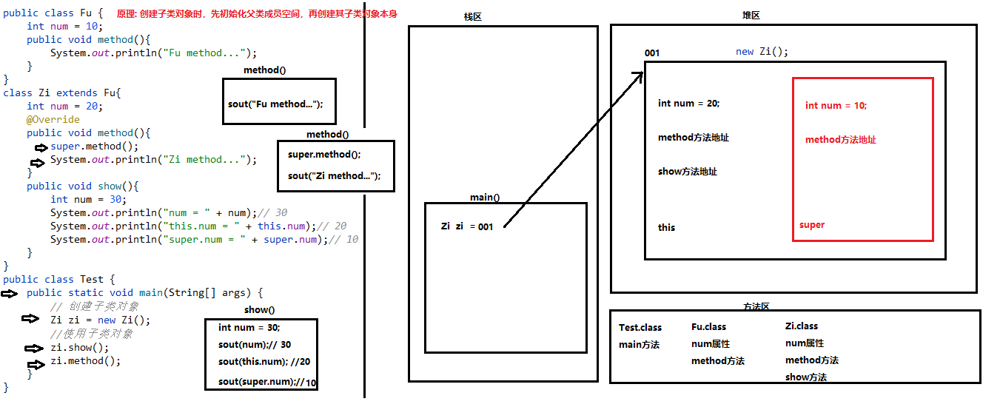


#### 3.一个文件可以定义多个类

注意：

1.该文件中只能有一个public修饰的类
2.public修饰的类的类名必须和文件名一致
3.开发中,一般是一个类对应一个文件


#### 4.继承后成员访问规则

##### 1.构造方法

子类构造方法用super调用（空参构造可直接访问）

##### 2.私有成员

①私有成员变量

set、get方法

②私有成员方法

父类公共方法间接访问

##### 3.非私有成员

直接访问


#### 5.方法重写

子类中出现与父类一模一样的方法（返回值类型，方法名和参数列表都相同）。

注意事项：

1.父子类关系

2.概念

3.子类方法重写父类方法，必须权限大于父类权限

public >  protected  > (默认) > private

4.加上@Override注解，检验是否重写成功，重写注解校验（提高代码的可读性）。


方法重载：

在同一个类中，出现多个同名的方法，仅参数列表不同，与其他无关。


#### 6.关键字this、super

##### 1.this

访问本类的成员属性、成员方法、构造方法（this（实参））

注意：

1.this调用本类的构造方法必须放在构造方法的第一行
2.两个本类的构造方法不能使用this相互调用

##### 2.super

访问父类的成员属性（super.父类成员变量）、成员方法（super.成员方法名（实参））、构造方法（super（实参））

注意：

1.super访问父类的构造方法一定要放在子类构造方法的第一行
2.子类构造方法默认会调用父类的空参构造方法
3.在子类构造方法中调用父类的构造方法,其实就是为了初始化从父类继承过来的属性


#### 7.抽象类

使用abstract关键字修饰的类就是抽象类，没有方法体（直接；分号收尾）。

格式：修饰符  abstract  class  类名{  }

成员：

1.成员变量

2.成员方法

3.构造方法

4.抽象方法

①格式：修饰符  abstract  返回值类型  方法名(形参列表)；

②不是必须有，但有抽象方法的类一定是抽象类（不过抽象类中不一定有抽象方法）

③==强制要求子类重写父类中的所有抽象方法（除非子类是抽象类）==

④抽象类不能被创建对象，只能用来做“父类”，被子类继承的，体现的是模板思想

⑤抽象类不能被创建对象，但可以有“构造方法”——为从父类继承过来的属性初始化。


#### 8.模版设计模式

解决一些问题时的固定思路（抽象类体现的是模板思想）

例如：新老司机开车功能


### day2


#### 1.final关键字

概念：不可变，用来修饰类、方法、变量

1.修饰类

被final修饰的类不能被继承

`修饰符 final class 类名{ 类中成员 }`

2.修饰方法

被final修饰的方法不能被重写

`修饰符 final 返回值类型 方法名(形参列名){ 方法体  }`

3.修饰变量

被final修饰的变量不能重复赋值,只能赋值一次（注：变量所有字母需大写）

 `final 数据类型 变量名 = 值;`


#### 2.static关键字

静态的意思，用来修饰成员变量、成员方法、代码块

##### 2.1static修饰成员变量

格式： `修饰符 static 数据类型 变量名;`

访问方式：

①对象名.静态成员变量名;

②类名.静态成员变量名;（推荐） 

注意：

1.被static修饰的成员变量会被该类的所有对象共享；

2.如果该类的某个对象修改了静态成员变量的值,那么该类的所有对象使用的都是修改后的值。


##### 2.2==static修饰成员方法==

格式：`修饰符 static 返回值类型 方法名(形参列名){ 方法体}`

访问方式：

①对象名.静态方法名(实参);

②**<font color='red'>类名.静态方法名(实参);</font>**（推荐）

注意：

1.静态方法（也称类方法）中不能出现this关键字（this必须有对象调用，而static修饰的方法通常用类名.方法名()访问，是没有对象的）。

2.静态方法中只能直接访问静态成员变量和静态成员方法，不能直接访问非静态成员变量和非静态成员方法。

4.非静态方法（也称实例方法）中可以直接访问一切成员变量和成员方法。


##### 2.3static修饰代码块（sout有疑惑）

1.格式：`static {  }`

2.位置：类中方法外（类的成员位置）

3.特点：

类加载时自动执行，由于类只加载一次，所以静态代码块也只执行一次（先于构造器、方法执行）。

4.作用：

完成类的初始化（例如：对类变量的初始化赋值）

5.使用场景：

加载驱动，或者放只需要执行一次的代码

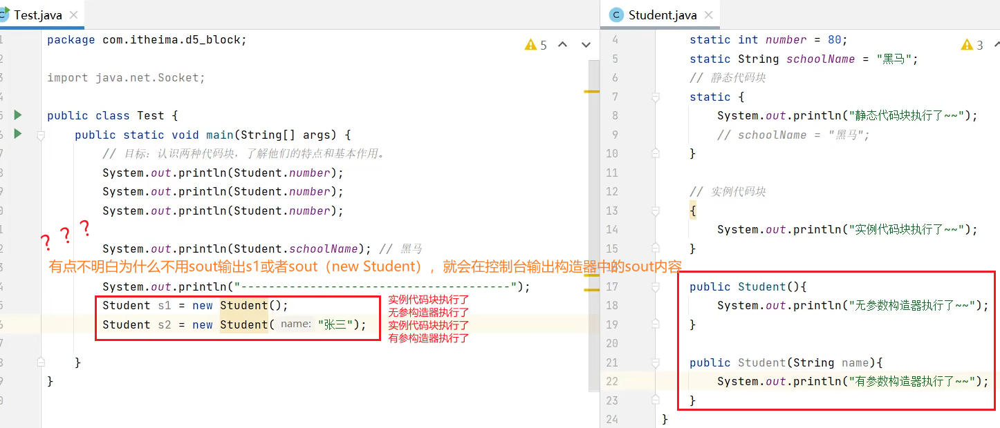


#### 3.代码块

执行顺序：静态代码块>构造代码块>局部代码块

##### 3.1静态代码块

static修饰的代码块

具体如上


##### 3.2构造代码块

也称实例代码块

1.格式：`{  }`

2.位置：类中方法外

3.特点：

每次创建对象时，执行实例代码块，并在构造器前执行。

4.作用：

和构造器一样，都是用来完成对象的初始化的（例如：对初始化变量进行初始化赋值）。

5.使用场景：

统计创造了多少个对象。


##### 3.3局部代码块

1.格式：`{  }`

2.位置：方法中

3.执行特点：

调用方法时，执行到了局部代码块的位置才执行（按代码行顺序执行）。

4.使用场景：

节省内存空间，执行完局部代码块即会被先释放掉，而其他非局部代码块的方法变量则需要等到所有方法执行完毕才能释放。==但是！这种作用不大，一般设备内存空间非常大，不需要节省，所以意义不大。==


#### 4.权限修饰符

不同权限的访问能力

```java
				同一个类		同一个包		不同包的父子类			不同包的无关类
public（公共的）   	√				√				√					√
protected（受保护的）	√				√				√					×
默认				   √			   √               ×                   ×
private（私有的）   	  √               ×               ×                   ×
```

开发中的使用：

1.定义类一般使用public

2.定义成员方法一般使用public

3.定义成员变量一般使用private

4.定义构造方法一般使用public


#### 5.接口

1.定义：一种引用类型，主要用来存储数据。

2.成员：**变量**（jdk7及前，public static final）、**抽象方法**（jdk7及前，abstract）、**默认方法**（jdk8，default）、**静态方法**（jdk8，static）、**私有方法**（jdk9，private）。

3.用interface定义接口，会生成class文件。

4.接口无构造方法，也不能创建对象，一般都是供类实现的（implements），类似继承。

5.实现接口的类叫做接口类，实现类如果是普通类必须重写接口中的所有抽象方法，否则实现类只能是一个抽象类。


#### 6.实现接口关系

单实现、多实现、先继承后实现（例：public class 实现类名 extends 父类名 implements 接口名1，接口名2，...{ }）


#### 7.接口中成员访问特点

1.接口中常量：主要供接口名访问，也可以被实现类继承（例：`IA.NUM`或者`Imp.NUM`）

2.接口中抽象方法：供实现类重写（例：`Imp imp=new Imp();  imp.method1();`）

3.接口中默认方法：可以供实现类对象直接调用，或者在实现类中重写（例：`Imp imp=new Imp();  imp.method1();`）

4.接口中静态方法：只供接口名直接访问，不可以被实现类继承（例：` IA.method3();`）（同时也不能被子接口继承）

5.接口中私有方法：只能在接口内部方法中调用，不能被实现类继承


#### 8.接口多实现时的几种冲突情况

1.公有静态常量：多个接口中的同名常量不能被实现类继承，会编译报错。

2.公有抽象方法：必须重写一次抽象方法

3.公有默认方法：必须重写一次默认方法

4.公有静态方法：没有冲突，因为静态方法不会被实现类继承

5.私有方法：没有冲突，因为私有方法不会被实现类继承


#### 9.接口和接口之间的关系

单继承、多继承（public interface C extends A,B{ }）、多层继承（B extends A;  C extends B）


#### 10.接口继承接口的冲突情况

1.公有静态常量：多个接口中同名的常量不会被子接口继承，不同名的会被继承

2.公有抽象方法：多个父接口中有相同的抽象方法，子接口只会继承一个抽象方法（所以子接口或子接口实现类必须重写一次）

3.公有默认方法：多个父接口中有相同的默认方法，子接口必须重写默认方法（default）

4.公有静态方法/私有方法：无冲突，因为不会被子接口继承


#### 11.继承的同时又实现存在的冲突情况

1.父类和接口的公有静态常量：实现类不会继承有冲突的常量，编译报错

2.父类和接口的公有抽象方法：实现类必须重写一次有冲突的抽象方法

3.父类和接口的公有默认方法：权限修饰符相同时，优先访问父类的；~不同时，需要实现类重写一次有冲突的默认方法

4.父类和接口的公有静态方法：不存在冲突，使用的是父类的静态方法

5.父类和接口的私有方法：不存在冲突，因为既不能继承也不能实现


#### 12.接口与抽象类使用场景

1.接口适合定义扩展功能。

2.抽象类适合定义父类下所有子类共有的功能。


### day3

#### 1.多态

概念：对于不同的对象，同一种行为会有不同的表现形式。

例：

```Java
Animal anl=new Dog();
anl.eat();//吃骨头
anl=new Cat();
anl.eat();//吃鱼

//anl的重复赋值相当于
int num=10;
num=20;
```


#### 2.实现多态的前提条件

1.继承或实现

2.父类引用指向子类对象。例：`Animal anl=new Dog();`

3.子类方法的重写（否则这个多态是没有意义的）


#### 3.多态时访问成员特点

|                  | 编译看       | 运行看           |
| ---------------- | ------------ | ---------------- |
| 1.成员变量       | 左边（父类） | 左边（父类）     |
| 2.静态成员方法   | 左边（父类） | 左边（父类）     |
| 3.非静态成员方法 | 左边（父类） | ==右边（子类）== |

非静态成员方法：必须子类中有的成员在父类中也存在时才能运行成功


#### 4.多态的应用场景

##### 4.1变量多态

父类的引用指向子类对象

即：父类类型的变量可以接收该父类类型的对象以及父类类型的所有的子类对象。

例：

```
Animal anl=new Dog();
anl.eat();//吃骨头
anl=new Cat();
anl.eat();//吃鱼
```


##### 4.2形参多态==（常用）==

格式：

```java 
修饰符  返回值  方法名(父类名  变量名){
	变量名.方法名();//该方法与main方法同级
  }
```

参数的类型是父类类型，那么就可以接收该父类类型的对象以及该父类类型的所有子类对象。


##### 4.3返回值多态

格式：

```java 
修饰符  父类名  方法名(参数){
	return 子类对象;//该方法与main方法同级
}
```

返回值类型是父类类型，那么就可以返回该父类类型的对象以及该父类类型的所有子类对象。


#### 5.多态的好处和弊端

1.好处：

可以将方法的参数定义为父类引用，使程序编写简单，提高程序的灵活性、扩展性、复用性。（例，如上形参多态，避免方法的重载，避免多个子类对象写多个方法名相同的功能方法）

2.弊端：

因为所有的方法、变量都是编译看左边父类，所以无法访问子类独有的方法和变量，硬要访问会编译报错（可看多态时访问非静态成员方法特点）。


#### 6.引用类型转换

##### 1.原因：

解决多态不能访问子类独有成员的弊端

##### 2.格式：

向上转型: `父类类型 变量名 = new 子类名(实参);`

向下转型:  `子类类型 变量名 = (子类类型) 父类类型的变量;`

注意：

1.向下转型需先有向上转型（即多态标准写法）

2.向下转换时，父类类型的变量指向的对象一定是左边子类类型的对象

错误示范：

```
Animal anl2=new Cat();
Dog dog2=(Dog) anl2;//运行报转换异常，因为anl2指向的对象是cat而非dog
```


**什么是引用类型**

在Java中，引用类型（Reference Type）是指那些不是基本数据类型（Primitive Data Types）的类型，如类（Class）、接口（Interface）、数组（Array）等。这些类型用于存储指向内存中对象的引用，而不是直接存储对象本身。

Java中什么是引用类型 →点击查看智谱清言智能体「AI搜索」的回答https://chatglm.cn/share/FWCgq

引用类型与基本数据类型的主要区别在于：

- 基本数据类型直接存储值，而引用类型存储的是值的内存地址。
- 基本数据类型的值是直接存储在栈内存中的，而引用类型的对象是存储在堆内存中的。
- 基本数据类型的值是不可变的，而引用类型的对象可以被修改。


#### 7.向下转型判断（instanceof避免转型异常）

instanceof实例化，判断变量是否指向数据类型。如果没有这个判断会报错并终止后续进程。

格式：`变量名 instanceof 数据类型`

例：

```Java
Animal anl1=new Dog();
if (anl1 instanceof Dog){
            Dog dog = (Dog) anl1;
            System.out.println(dog.num);
            dog.lookHome();
        }
```

执行流程:       

```
如果变量指向的对象是属于后面的数据类型,那就返回true
如果变量指向的对象不属于后面的数据类型,那就返回false
```


#### 8.内部类

概念：将一个类定义在另一个类的里面，里面的那个类叫做内部类,外面的那个类就叫做外部类。

特点: 内部类是一个独立的类，在编译后，有自己独立的class文件。


#### 9.成员内部类

1.概念：定义在类的成员位置(类中方法外)的类就叫做成员内部类。

格式：

```Java
class 外部类名{
	class 内部类名{
	
	}
}
```

2.访问特点：

成员内部类中的成员变量和成员方法在其他类中访问时，需要创建成员内部类对象

格式：`外部类名.内部类名 对象名=new 外部类名().new 内部类名();`

3.注意：

- 在成员内部类中,可以直接访问外部类的一切成员,包括外部类的私有成员
- 在外部类中,需要直接访问内部类的成员,需要创建内部类对象来访问

4.局部变量示例：

```Java
class Body {
    int num = 10;
    public class Heart{
        // 成员变量
        int num = 20;
        // 成员方法
        public void show(){
            int num = 30;
            System.out.println("局部变量num:"+num);// 30
            System.out.println("内部类的成员变量num:"+this.num);// 20
            System.out.println("外部类的成员变量num:"+Body.this.num);// 10
        }
    }
}
```


#### 10.匿名内部类

1.本质：是一个继承了父类的匿名子类的对象（一个类的子类对象）。

2.格式：

```Java
new 类名(){
    必须重写所有抽象方法
};

new 接口名(){
    必须重写所有抽象方法
};

示例：
public static void main(String[] args){
Animal anl1 = new Animal() {
            @Override
            public void eat() {
                System.out.println("匿名内部类的eat...");
            }
        };
        anl1.eat();
        }
```

3.作用：用来简化代码--不用创建子类，直接得到子类对象。

4.使用场景：

- 如果想得到一个抽象类的子类对象,那么就可以直接给该类的匿名内部类
- 如果想得到一个接口的实现类对象,那么就可以直接给该接口的匿名内部类


#### 11.引用类型作为方法参数和返回值传递/返回的是地址值

1.参数的类型为接口类型，调用的时候只能传入该接口的实现类对象（因为接口是抽象类，抽象类没有对象，所以不能传入该接口的对象，即父类）。

2.参数类型为类类型，调用的时候可以传入该类的对象或者其子类对象（多态）。

3.返回值类型为接口类型，方法体只能返回该接口的实现类对象（因为接口是抽象类，抽象类没有对象，所以不能传入该接口的对象，即父类）。

4.返回值类型为类类型，方法体可以返回该类的对象或者其子类的对象（多态）。

==注意：==如果类类型为抽象类，那么传递/返回的只能是其子类对象。

示例：

```java
public class Animal {
    String name;
    public Animal() {
    }
    public Animal(String name) {
        this.name = name;
    }
    public void eat(){
        System.out.println("吃东西");
    }
}
public class Test {
    public static void main(String[] args) {
        Animal anld = new Animal("小狗汪汪");
        System.out.println("anld.name = " + anld.name);
        System.out.println("method1(anld).name = " + method1(anld).name);
        /*如果method1方法不加static，就得通过创建对象来调用方法了，如下
        //System.out.println("new Test().method1(anld).name = " + new Test().method1(anld).name);*/
    }
    //需要注意方法要加static
    public static Animal method1(Animal anl){
        anl.name="小猫咪真乖";
        return anl;
    }
}
```

为什么Java类中没加static的方法不能在方法中调用... →点击查看智谱清言的回答https://chatglm.cn/share/FWNgE

简略原因：

1.查看static修饰方法知识点

2.没有关键字static修饰的就是实例方法，实例方法需要创建对象后使用。static修饰的是静态方法，可直接用类名.方法名调用，如果在同一类，那直接方法名调用即可。


#### 12.引用类型作为成员变量

可看个人代码库的代码

```Java
abstract class Pet{}

interface FaShu{}

class Person{
    int age;// 基本类型作为成员变量
    String name; // 普通类作为成员变量
    Pet pet;// 抽象类作为成员变量
    FaShu fs;// 接口作为成员变量
}

public class Test {
    public static void main(String[] args) {
        // 创建Person对象
        Person p = new Person();
        // 给p对象的属性赋值
        p.age = 18;
        p.name = "张三";
        p.pet = new Pet() {};// 成员变量类型为抽象类,那么就赋该抽象类的子类对象
        p.fs = new FaShu() {};// 成员变量类型为接口,那么就赋该接口的实现类对象
    }
}
```


#### 13.包装类

概念：为了更好的维护基本类型数据，java为基本类型创建了对应的引用类型，这些类称为包装类。

分类:

```java
| 基本类型 | 对应的包装类（位于java.lang包中） |
|   byte   |               Byte                |
|  short   |               Short               |
|   int    |               Integer             |
|   long   |               Long                |
|  float   |               Float               |
|  double  |              Double               |
|   char   |             Character             |
| boolean  |              Boolean              |

```


#### 14.包装类装箱和拆箱

1.装箱: 把基本类型转换为对应的包装类类型---->包装类的构造方法\valueOf静态方法可以实现

2.拆箱:  把包装类类型转换为对应的基本类型---->包装类的 `xx类型Value()` 非静态方法实现

```Java
// Integer的构造方法（已过时）
        Integer i1 = new Integer(10);// 表示整数10

// Integer的静态方法
        Integer i2 = Integer.valueOf(10);// 表示整数10

 // 拆箱: 包装类型类型---->基本类型
        int num1 = i1.intValue();// 10
```


3.自动装箱和自动拆箱

自动装箱: 基本类型自动转换为对应的包装类类型---->直接把基本类型的值赋值给对应的包装类类型变量

自动拆箱:  包装类类型自动转换为对应的基本类型---->直接把包装类的对象赋值给对应的基本类型的变量

```java
public class Test {
    public static void main(String[] args) {
        // - 自动装箱: 基本类型自动转换为对应的包装类类型---->直接把基本类型的值赋值给对应的包装类类型变量
        Integer i1 = 10;
        Double d = 3.14;

        // - 自动拆箱:  包装类类型自动转换为对应的基本类型---->直接把包装类的对象赋值给对应的基本类型的变量
        int num = i1;
        double numD = d;
        System.out.println(num + 10);//20
    }
}
```


#### 15.基本类型和字符串之间的转换

##### 15.1基本类型转字符串方式

1.基本类型的数据+空的字符串("")

2.==字符串==（String类）的静态方法`public static String valueOf(基本类型的值);`

3.toString()方法


##### 15.2字符串转基本类型方式

1.通过包装类的静态方法`public static 基本数据类型 valueOf(String s)`得到包装类对象，然后包装类对象自动拆箱为基本类型（除了Character包装类之外，其他的包装类都有这个方法。只能使用`String对象.charAt(0)`）。

2.通过包装类的静态方法`public static 基本数据类型 parseXXX类型(String s)`得到对应的基本类型（除了Character包装类之外，其他的包装类都有这个方法）。


```jAVA
//基本类型转字符串类型，valueOf()方法，toString()方法,构造方法
        //Integer i1 = new Integer(12);//在jdk中已过时，不用
        /*//装箱: 把基本类型转换为对应的包装类类型
        Integer i2 = Integer.valueOf(11);
        System.out.println("i2 = " + i2);
        System.out.println("Integer.valueOf(23) = " + Integer.valueOf(23));*/
        String si1 = String.valueOf(13);
        System.out.println("si1 = " + si1);
        System.out.println("String.valueOf(15) = " + String.valueOf(15));

        String s1 = Double.toString(23.22);
        System.out.println("s1 = " + s1);
        System.out.println("Double.toString(12.11) = " + Double.toString(12.11));

		int num1 = 100;
        String str1 = num1 + "";

        //字符串类型转基本数据类型,valueOf(String s)方法，paseXX类型(String s)方法
        Integer i5 = Integer.valueOf("135");
        //自动拆箱
        int num=i5;
        System.out.println("i5 = " + i5);

        Float i6=Float.parseFloat("1.22");
        float f=i6;
        System.out.println("f = " + f);
```


##### 15.3String类中都有ToString方法

```java 
Integer i2 = Integer.valueOf(11);
System.out.println("i2 = " + i2);//11
```

Integer a=Integer.v... →点击查看智谱清言的回答https://chatglm.cn/share/FWN5o

`toString()`方法的作用是将一个对象转换成字符串形式，以便于打印或者与其他字符串操作。


##### 15.4哪些类有重写过的toString方法

在Java中，`Object` 类是所有类的根，它定义了 `toString()` 方法，用于返回对象的字符串表示形式。这个方法通常包含对象所属的类名和对象的哈希码值。许多类都重写了 `Object` 类的 `toString()` 方法，以提供更有意义的字符串表示形式，这通常包括对象的关键属性。
以下是一些常见类，它们重写了 `toString()` 方法：

1. **`String`**：
   - `String` 类重写了 `Object` 类的 `toString()` 方法，返回字符串对象的字符序列。
2. **`Integer`、`Double`、`Float`、`Long` 等包装类**：
   - 这些包装类重写了 `toString()` 方法，以返回它们所表示的数值的字符串形式。
3. **`Date` 和 `Calendar` 类**：
   - 这些类重写了 `toString()` 方法，以返回日期和时间的字符串表示形式。
4. **`File` 类**：
   - `File` 类重写了 `toString()` 方法，以返回文件或目录的路径名。
5. **`ArrayList`、`HashSet`、`HashMap` 等集合类**：
   - 这些集合类重写了 `toString()` 方法，以返回集合中元素的字符串表示形式。
6. **自定义类**：
   - 开发者经常会在自定义类中重写 `toString()` 方法，以提供对象的属性和状态的描述性字符串表示形式。
这些类的 `toString()` 方法通常包括一些属性或状态信息，以便于调试和日志记录。重写 `toString()` 方法是Java编程中非常常见的一个做法，特别是在需要输出对象信息时。


### day4

#### 1.Object类

##### 1.1Object类概念

1.java.lang.Object类是java语言的根类，所有java类的父类。

2.在java中所有的类都是直接或者间接继承Object类。


##### 1.2toString方法重写（返回该对象的字符串）

快捷键：alt+insert，选toString，或者直接输toString选择重写

`public String toString() 返回该对象的字符串表示。`
            1.因为java中所有的类都会继承Object类,所以所有的类都拥有toString方法
            2.Object类中的toString方法返回的字符串格式默认为: 类的全名+@+地址值
            3.如果不想使用toString方法的默认返回值,那么就得重写toString方法
            4.直接打印对象名,其实打印的是该对象调用toString方法返回的字符串内容


##### 1.3equals方法重写（判断两个对象是否相等）

快捷键：alt+insert，选equals() and hashCode()，或者直接输equals选择重写

`public boolean equals(Object obj)：判断2个对象是否相等。`

Object类的equals方法默认比较的是地址值，如果希望比较的不是地址值，而是所有的属性值，就需要重写equals方法。


##### 1.4==Objects==工具类

==注意是有s的Objects类哦，包名有util注意别选错，java.util.Objects==

在**JDK7**添加了一个Objects工具类，它提供了一些方法来操作对象，它由一些静态的实用方法组成，这些方法是null-save（空指针安全的）或null-tolerant（容忍空指针的），用于计算对象的hashCode、返回对象的字符串表示形式、比较两个对象。

在比较两个对象的时候，Object的equals方法容易抛出空指针异常（见1.3equals方法重写），而Objects类中的equals方法就优化了这个问题。

`public static boolean equals(Object a, Object b)`:判断两个对象是否相等。

```java
class Person{
    String name;
    int age;
    public Person(String name,int age){
        this.name=name;
        this.age=age;
    }
    public Person(){}
/*@Override
    //初步写法，缺点速度慢，当参数o为null时会报空指针异常
    public boolean equals(Object o){
        Person p=(Person) o;
        return this.name.equals(p.name)&&this.age==p.age;
    }*/
@Override
    public boolean equals(Object o){
        //如果两个对象地址值相同，直接返回true结束方法
        if (this==o) return true;
        //如果参数为null，或者两个对象的类不同，直接返回false结束方法
        if (o==null||getClass()!=o.getClass()) return false;
        //执行到这里，说明地址值相同，类（getClass()是获取类）相同，不为null。于是比较所有属性是否相同
        //多态的向下转型，访问子类的独有成员
        Person p=(Person) o;
        //注意是Objects工具类的equals方法
        return age==p.age&& Objects.equals(name,p.name);
    }}
```


##### 1.5Objects工具类的equals方法和object的equals方法的不同

Objects工具类的equals方法和object的equals方法有什么不一样... →点击查看智谱清言智能体「AI搜索」的回答https://chatglm.cn/share/Fj1HE

1. **空值处理**：`Objects.equals`方法可以安全地处理`null`值，如果两个参数都是`null`，则返回`true`；如果其中一个参数是`null`，而另一个不是，则返回`false`。而`Object`类中的`equals`方法默认是调用`==`操作符，如果任一参数是`null`，则直接返回`false`。
2. **可重写性**：`Objects.equals`方法是一个**静态方法**，**不能**被**重写**。而`Object`类中的`equals`方法是一个**实例方法**，可以在子类中被重写以提供自定义的相等性比较逻辑。
3. **便捷性**：`Objects.equals`方法可以减少代码中的`null`检查，提高代码的可读性和简洁性。使用`Objects.equals`方法可以避免直接使用`==`或`!=`来比较对象，这样可以减少因错误地使用`==`（比较对象引用）而不是`equals`（比较对象内容）而导致的bug。

补充：

1.第3点：可以理解成因为多态在访问静态方法时，编译和运行都是看左边的父类，所以即便是重写了子类的静态方法，编译运行的结果也跟子类的静态方法不相关。所以才说Objects.equals方法不能被重写。

2.什么是静态方法，什么是实例方法

什么是静态方法，什么是实例方法 →点击查看智谱清言智能体「AI搜索」的回答https://chatglm.cn/share/Fj1H5

```Java
public class MathUtils {
    public static int add(int a, int b) {
        return a + b;
    }
}

// 调用静态方法
int result = MathUtils.add(5, 3); // 或者 int result = new MathUtils().add(5, 3);
```

```Java
public class Circle {
    private double radius;

    public Circle(double radius) {
        this.radius = radius;
    }

    public double getArea() {
        return Math.PI * radius * radius;
    }
}

// 调用实例方法
Circle circle = new Circle(5.0);
double area = circle.getArea();
```


#### 2.Date类

1.概述

java.util.Date类表示日期,内部精确到毫秒.表示自从标准基准时间（称为“历元（epoch）”，即1970年1月1日00:00:00 GMT）以来的指定毫秒数。

2.Date类中的构造方法

```
public Date();当前系统时间对应的日期对象
public Date(long mills);距离标准基准时间 指定偏移毫秒数 对应的日期对象
```

3.Date类中的常用方法

```
public long getTime();获取当前日期对象距离标准基准时间的毫秒值
public void setTime(long time);把毫秒值给标准时间
public boolean after(Date when) 判断此日期是否在指定日期之后
public boolean before(Date when) 判断此日期是否在指定日期之前
```


#### 3.DateFormat类

##### 1.DateFormat类概述

 java.text.DateFormat 该类可以使得在Date对象与String对象之间进行来回转换。

注意: DateFormat是一个抽象类,无法创建对象,应该使用其子类来实现Date和String之间的转换。

##### 2.SimpleDateFormat类概述

 java.text.SimpleDateFormat 该类继承DateFormat类,所以该类也可以使得在Date对象与String对象之间进行来回转换。

##### 3.构造方法

```Java
public SimpleDateFormat(String pattern)：传入日期指定格式,创建SimpleDateFormat对象

1.参数: 指定的日期格式
2.日期格式的组成元素: 
y: 年
M: 月
d: 日
H: 时
m: 分钟
s: 秒
3.常见的日期格式:
yyyy-MM-dd HH:mm:ss
yyyy年MM月dd日 HH:mm:ss
```

##### 4.常用方法

```Java
public String format(Date date)：将Date对象格式化为字符串。
public Date parse(String source)：将字符串解析为Date对象。

示例：
 public static void main(String[] args) throws ParseException {
        // 创建日期格式化对象,指定日期格式为:yyyy-MM-dd HH:mm:ss
        SimpleDateFormat sdf = new SimpleDateFormat("yyyy-MM-dd HH:mm:ss");

        // - public String format(Date date)：将Date对象格式化为字符串。
        // 创建当前系统时间的日期对象
        Date nowDate = new Date();
        // Date-->String
        String strDate = sdf.format(nowDate);
        System.out.println("strDate:" + strDate);// 2021-03-20 11:23:59

        // - public Date parse(String source)：将字符串解析为Date对象。
        // 创建一个表示出生日期的字符串对象
        String birthday = "1996-10-01 08:08:08";
        // String-->Date
        Date birthdayDate = sdf.parse(birthday);
        System.out.println("birthdayDate:" + birthdayDate);// Tue Oct 01 08:08:08 CST 1996
```

##### 5.注意：

日期格式化对象中指定的日期要和解析的字符串日期格式一致,否则会报解析异常ParseException解析异常。


#### 4.Calendar类

##### 1.Calendar概述

`java.util.Calendar`类表示一个“日历类”，可以进行日期运算。

特点：

1.Calendar类是一个抽象类，不能创建对象,所以只能使用其子类

2.子类:  GregorianCalendar。


##### 2.获取日历对象

```Java
方式一：通过 GregorianCalendar 子类的构造方法（不建议）

方式二：通过Calendar类的静态方法getInstance()
public static Calendar getInstance();
```

注意：

- 日历对象中的月份是0-11, 0表示1月,依次类推, 11表示12月
- 日历对象中的星期是1-7,  1表示星期天,依次类推,7表示星期六


3.Calendar类的常用方法

```Java
public int get(int field)  获取某个字段的值。
public void set(int field,int value)  设置某个字段的值
public void add(int field,int amount)  为某个字段增加/减少指定的值
public void setTime(Date date) 修改当前日历对象表示的时间（将日期对象转日历对象）。
public boolean after(Object when)判断当前日历对象是否在指定的日历对象之后
public boolean before(Object when) 判断当前日历对象是否在指定的日历对象之前
public Date getTime() 日历对象转日期对象

```


`public void setTime`

```Java
public class Test4_setTime {
    public static void main(String[] args) throws ParseException {
        // void setTime(Date date) 修改当前日历对象表示的时间。
        String birthdayStr = "1996-10-01";
        // 需求:得到该出生日期对应的日历对象
        // 1.把String类型的日期转换为Date
        SimpleDateFormat sdf = new SimpleDateFormat("yyyy-MM-dd");
        Date birthdayDate = sdf.parse(birthdayStr);

        // 2.获取当前时间对应的日历对象
        Calendar cal = Calendar.getInstance();

        // 3.调用日历对象的setTime方法修改日历对象的时间为出生日期的时间
        cal.setTime(birthdayDate);

        // 4.获取年,月,日
        System.out.println(cal.get(Calendar.YEAR));// 1996
        System.out.println(cal.get(Calendar.MONTH));// 09
        System.out.println(cal.get(Calendar.DAY_OF_MONTH));// 01
    }
}
```


#### 5.Math类

1.概述： java.lang.Math(类): Math包含执行基本数字运算的方法的工具类。

2.特点：

Math类构造方法被私有修饰，不能创建对象。

操作的时候,都是通过Math类名直接调用该类的静态方法即可。

3.常用方法：

```Java
public static int abs(int a)                   获取参数a的绝对值
public static double ceil(double a)            向上取整 (得到大于参数的最小整数)
public static double floor(double a)           向下取整(得到小于参数的最大整数)
public static double pow(double a, double b)   获取a的b次幂
public static long round(double a)             四舍五入取整
public static int max(int a, int b)            返回两个 int 值中较大的一个
public static int min(int a, int b)            返回两个 int 值中较小的一个
```


#### 6.System类

1.概述：java.lang.System类中提供了大量的静态方法，可以获取与系统相关的信息或系统级操作。

2.特点：

System类构造方法被私有修饰，不能创建对象。

直接通过System类名调用该类的静态方法。

3.常用方法

```Java
public static void exit(int status)    终止当前运行的Java虚拟机，非零表示异常终止
public static long currentTimeMillis() 返回当前时间距离标准基准时间的毫秒值;
```

4.案例：在控制台输出1-10000，计算这段代码执行了多少毫秒


#### 7.BigInteger类

1.概述：java.math.BigInteger  表示一个超大的整数

2.构造方法

```Java
public BigInteger(String value); 根据字符串内容创建一个超大的整数对象
注意: 字符串参数一定要传整数的字符串
```

3.成员方法

```Java
public BigInteger add(BigInteger value)  		加法运算
public BigInteger subtract(BigInteger value)  		减法运算 
public BigInteger multiply(BigInteger value)  		乘法运算
public BigInteger divide(BigInteger value)  		除法运算
```


#### 8.BIgDecimal类

1.概述：java.math.BigDecimal类,表示一个超大的小数,并且可以解决小数运算的精度问题

2.构造方法

```Java
BigDecimal(double val)  将double类型的数据封装为BigDecimal对象（不推荐使用,因为使用这个依然还是有精度问题，即0.01+0.09=0.09999999，无法等于0.1）
BigDecimal(String val)  将 BigDecimal 的字符串表示形式转换为 BigDecimal
```

3.常用方法

```Java
public BigDecimal add(BigDecimal value)  		加法运算  
public BigDecimal subtract(BigDecimal value)  		减法运算  
public BigDecimal multiply(BigDecimal value)  		乘法运算  
public BigDecimal divide(BigDecimal value)  		除法运算
```

==注意==:如果使用上面的除法运算的方法,遇到除不尽的就会报数学运算异常,得使用下面重载的方法

```Java
public BigDecimal divide(BigDecimal divisor, int scale, RoundingMode roundingMode) 除法运算

参数1: 除数
参数2: 精确的位数
参数3: 取舍的模式  RoundingMode.HALF_UP: 四舍五入
```


#### 9.Arrays类

1.概述：该类包含用于操作数组的各种静态方法（如排序和搜索）。

2.常用方法

```java
public static void sort(int[] a)：按照数字顺序排列指定的数组 升序 
public static String toString(int[] a)：返回指定数组的内容的字符串表示形式
```

```java 
public class Test {
    public static void main(String[] args) {
        // - public static void sort(int[] a)：按照数字顺序排列指定的数组 升序
        // - public static String toString(int[] a)：返回指定数组的内容的字符串表示形式
        int[] arr = {10, 43, 23, 5, 32, 65, 2, 76};
        System.out.println("排序前数组内容:" + Arrays.toString(arr));// 数组内容:[10, 43, 23, 5, 32, 65, 2, 76]
        // 排序,升序
        Arrays.sort(arr);
        System.out.println("排序后数组内容:" + Arrays.toString(arr));// 数组内容:[2, 5, 10, 23, 32, 43, 65, 76]
    }
}
```


#### 10.idea快捷键ctrl+n  搜索


### day05

#### 1.Collection集合

1.概述：一种容器,可以用来存储多个引用类型的数据，Collection接口是所有单列集合的根接口。

2.分类：

单列集合：以单个单个元素进行存储

双列集合：以键值对的方式进行存储

3.集合与数组区别：

**长度：**

数组长度是固定的

集合长度是不固定的

**存储范围：**

- 数组可以存储基本类型+引用类型 eg; int[],String[]
- 集合只能存储引用类型,如果要存储基本类型,需要存储基本类型对应的包装类类型 eg; ArrayList<String> ,ArrayList<Integer>


#### 2.单列集合常用类的继承体系

1.==Collection接口是所有单列集合的根接口==，也就意味着所有的单列集合都实现了Collection接口。

2.List接口继承Collection接口: List集合元素有索引,元素**存取有序**,元素可重复

- ArrayList类: 数组存储结构, 查询快,增删慢

- LinkedList类: 链表存储结构,查询慢,增删快

- ......

3.Set接口继承Collection接口:  Set集合元素没有索引 , 元素不可重复(唯一)

- HashSet类:  哈希表结构,由哈希表保证元素唯一,元素存取无序,不可以排序
  - LinkedHashSet类:: 链表+哈希表结构,由哈希表保证元素唯一,由链表保证元素存取有序,不可以排序
- TreeSet类: 二叉树结构,可以对元素进行排序
- ......

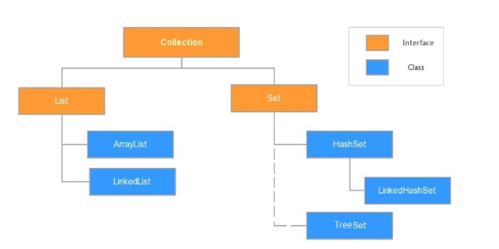


#### 3.Collection常用功能

Collection是接口，只能通过其子类创建对象

常用方法：

`public boolean add(E e)`：  把给定的对象添加到当前集合中 。

`public void clear()` :清空集合中所有的元素。

`public boolean remove(E e)`: 把给定的对象在当前集合中删除。

`public boolean contains(Object obj)`: 判断当前集合中是否包含给定的对象。

`public boolean isEmpty()`: 判断当前集合是否为空。

`public int size()`: 返回集合中元素的个数。

`public Object[] toArray()`: 把集合中的元素，存储到数组中


#### 4.？？？Collection集合遍历疑问

1.为什么此处的遍历不是集合/数组名.size，比如arr.size。基础day08ArrayList是集合名.szie


#### 5.Iterator迭代器

##### 5.1概念

Collection集合元素的通用获取方式。**在取元素之前先要判断集合中有没有元素，如果有，就把这个元素取出来，继续再判断，如果还有就再取出来。一直把集合中的所有元素全部取出。**这种取出方式专业术语称为迭代。

##### 5.2迭代的步骤

a：获取迭代器对象

`public Iterator iterator()`: 获取集合对应的迭代器，用来遍历集合中的元素的**（这是Collection集合中的方法）**。

b：使用迭代器对象判断集合中是否有元素可以取出

c：如果有元素可以取出,就直接取出来该元素,如果没有元素可以取出,就结束迭代


#### 6.Iterator迭代器对象的常用方法

- `public boolean hasNext()`:如果仍有元素可以迭代，则返回 true。
- `public E next()`:返回迭代的下一个元素。
- `void remove() `删除当前迭代出来的元素

快捷键：itit回车（与变量名无关）循环判断是否有元素可以迭代

```Java
public class Test {
    public static void main(String[] args) {
        /*
            获取迭代器对象
                Collection集合提供了一个获取迭代器的方法：
                - public Iterator iterator(): 获取集合对应的迭代器，用来遍历集合中的元素的。

            Iterator迭代器对象的常用方法
                - public boolean hasNext():如果仍有元素可以迭代，则返回 true。
                - public E next():返回迭代的下一个元素。
                - void remove()删除当前迭代出来的元素
         */
        Collection<String> col = new ArrayList<>();

        // 往集合中添加元素
        col.add("王宝强");
        col.add("贾乃亮");
        col.add("谢霆锋");
        col.add("陈羽凡");

        // 通过集合对象获取对应的迭代器对象
        Iterator<String> it = col.iterator();

        // 循环判断是否有元素可以迭代
        //快捷键：itit回车（与变量名无关）
        while (it.hasNext()) {
            // 如果有,就在循环中取出可以迭代的元素
            String e = it.next();
            System.out.println("元素:"+e);

            // 需求:如果迭代出来的元素是谢霆锋,就删除该元素
            if ("谢霆锋".equals(e)){
                it.remove();
            }
        }

        System.out.println("col:"+col);// col:[王宝强, 贾乃亮, 陈羽凡]
    }
}
```


#### 7.迭代器使用原理

 Iterator迭代器对象在遍历集合时，**内部采用指针的方式来跟踪集合中的元素**。在调用Iterator的next方法之前，迭代器的索引位于第一个元素之前，不指向任何元素，当第一次调用迭代器的next方法后，迭代器的索引会向后移动一位，指向第一个元素并将该元素返回，当再次调用next方法时，迭代器的索引会指向第二个元素并将该元素返回，依此类推，直到hasNext方法返回false，表示到达了集合的末尾，终止对元素的遍历。

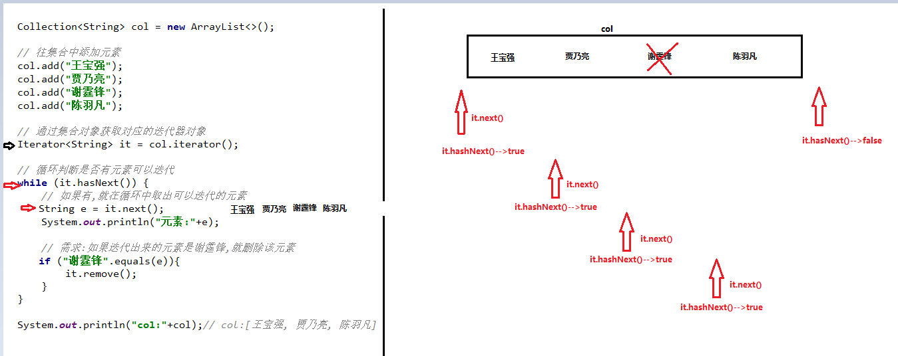


#### 8.迭代器的常见异常

问题一：

在进行集合元素获取时，如果集合中已经没有元素可以迭代了，还继续使用迭代器的next方法，将会抛出java.util.NoSuchElementException没有集合元素异常。

问题二：

在进行集合元素迭代时，如果添加或移除集合中的元素 , 将无法继续迭代 , 将会抛出ConcurrentModificationException并发修改异常.

```Java
//每迭代一个元素后，对集合进行增删操作，就会报并发修改异常
// col.remove(e); 
// 解决方法：用迭代器的删除方法（col是集合的），迭代器可以一边迭代一边删除
   it.remove();
```


#### 9.增强for循环(foreach循环)

1.概述

增强for循环(foreach循环)，是JDK1.5以后出来的一个高级for循环，专门用来遍历数组和Collection集合

2.原理

内部基于Iterator迭代器实现，所以在遍历的过程中，不能对集合中的元素进行增删操作，否则抛出ConcurrentModificationException并发修改异常

3.格式

```Java
for(数据类型 变量名 :  数组名\集合名){
    
}
```

快捷键: 集合名.for

```Java
public class Test4_增强for循环 {
    public static void main(String[] args) {
        /*
            for(数据类型 变量名 :  数组名\集合名){

            }
         */
        // 需求1: 增强for循环遍历集合元素
        Collection<String> col = new ArrayList<>();

        // 往集合中添加元素
        col.add("王宝强");
        col.add("贾乃亮");
        col.add("谢霆锋");
        col.add("陈羽凡");

        // 快捷键: 集合名.for
        for (String e : col) {
            System.out.println("e:" + e);
        }

        System.out.println("--------");

        // 需求1: 增强for循环遍历数组元素
        String[] arr = {"王宝强",
                "贾乃亮",
                "谢霆锋",
                "陈羽凡"};

        // 快捷键: 数组名.for
        for (String e : arr) {
            System.out.println("e:" + e);
        }
    }
}
```


#### 10.泛型

##### 10.1概述

 JDK5之后，新增了泛型(Generic)语法，可以在类、接口或方法中预支地使用未知的类型。

简而言之就是表示一种未知的数据类型,在使用的时候确定其具体的数据类型。

##### 10.2泛型的好处

- 将运行时期的ClassCastException，转移到了编译时期变成了编译失败
- 避免了类型转换的麻烦

案例：

集合不使用泛型会出现的问题：

- 可能会发生类型转换异常
- 避免类型转换异常,就需要先做类型判断,再转型--->比较麻烦

```Java
public class Test1集合不使用泛型 {
    public static void main(String[] args) {
        // 注意: 不指定集合元素的类型,元素的类型默认是Object类型

        // 创建ArrayList集合对象,不指定泛型的具体数据类型
        ArrayList list = new ArrayList();

        // 往集合中添加元素
        list.add("itheima");
        list.add(666);
        list.add(3.14);
        list.add(true);
        list.add("itcast");
        System.out.println("list:"+list);// list:[itheima, 666, 3.14, true, itcast]

        // 获取集合中所有字符串元素的长度
        for (Object obj : list) {
            // String str = (String) obj;// 发生类型转换异常
            // System.out.println(str.length());
            
            // 转换类型之前先判断
            if (obj instanceof String){
                String str = (String) obj;
                System.out.println(str.length());
            }
        }
    }
}
```

集合使用泛型

- 概述:指定泛型的具体数据类型----->(只能是引用数据类型)

```Java
public class Test2集合使用泛型 {
    public static void main(String[] args) {
        // 注意: 使用集合的时候,建议通过泛型来限制集合元素类型一致
        
        // 创建ArrayList集合对象,指定泛型的具体数据类型为String
        ArrayList<String> list = new ArrayList<>();

        // 往集合中添加元素
        list.add("itheima");
        // list.add(666);// 编译报错,把运行时的类型转换异常,转移到了编译时期变成了编译失败
        // list.add(3.14);// 编译报错,把运行时的类型转换异常,转移到了编译时期变成了编译失败
        // list.add(true);// 编译报错,把运行时的类型转换异常,转移到了编译时期变成了编译失败
         list.add("itcast");
        System.out.println("list:"+list);// list:[itheima, itcast]

        // 获取集合中所有字符串元素的长度
        for (String s : list) {
            System.out.println(s.length());
        }
    }
}
```


#### 11.定义和使用含有泛型的类

1.定义含有泛型的类格式：

```Java
public class 类名<泛型变量>{
    
}
泛型变量: 可以是任意字母,eg: A,B,E,...a,b,....;一般写E
```

2.使用含有泛型的类需注意：

创建含有泛型的类的对象的时候，指定泛型的具体数据类型(只能是引用数据类型)。具体使用如下图：

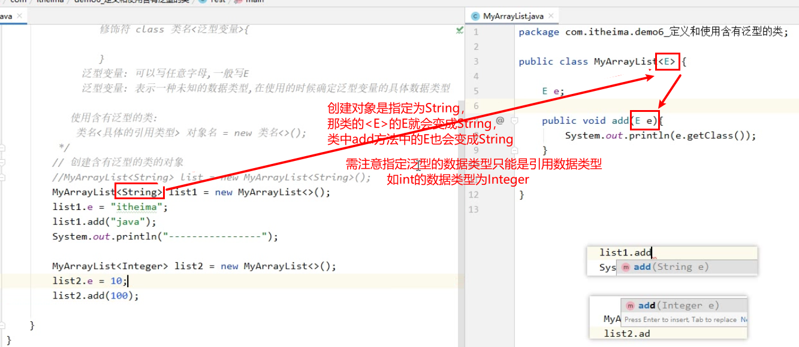


创建对象时指定为String，那类的<E>的E就会变成String，类中add方法中的E也会变成String。


#### 12.定义和使用含有泛型的方法

1.格式：

```Java
修饰符 <泛型变量> 返回值类型 方法名(形参列名){
    方法体
}
// 泛型变量:可以写任意字母,一般写T
```

2.使用含有泛型的方法

调用含有泛型方法的时候,确定泛型的具体数据类型

```Java
public class MyUtils {
    public static <T> void method(int num,T t1){
        //如果不写<T>，参数T会提示解析符号异常cannot resolve symbol
        System.out.println("num = " + num);
        System.out.println("t1.getClass() = " + t1.getClass());
    }
}

public class Test {
    public static void main(String[] args) {
        /*MyUtils myu = new MyUtils();
        myu.method(12,"8");*/
        //method方法加上static才是静态方法，才可以不用创建对象直接类.方法名调用
        MyUtils.method(12,"0");
    }
}
```


#### 13.定义和使用含有泛型的接口

1.格式

```Java
public interface 接口名<泛型变量>{
    
}
// 泛型变量:可以是任意字母,一般写E
```

2.使用含有泛型的接口

方式一: 实现类实现接口的时候,确定接口泛型的具体数据类型

```Java
public class 类名 implements 接口名<具体的引用数据类型>{}
```

方式二：实现类实现接口的时候,不确定接口泛型的具体数据类型,而是创建实现类对象的时候确定泛型的具体数据类型。

```Java
public class 类名<泛型变量> implements 接口名<泛型变量>{}
```

案例：

```Java
public interface MyUtils2<E> {
    void method1(E e);
    default void method2(E e){
        System.out.println("t.getClass() = " + e.getClass());
    }
}
//使用含有泛型的接口
//实现类实现接口时指定泛型的具体数据类型
//修饰符 class 实现类名 implements 接口名<具体的引用类型>{}
class Imp implements MyUtils2<String>{
    @Override
    public void method1(String s) {
        System.out.println("s = " + s);
    }
}
//实现类实现接口时不指定泛型的具体数据类型
//1.所有的（实现类名、接口名）都不写<>
class Imp2 implements MyUtils2{
    @Override
    public void method1(Object o) {
        System.out.println("o = " + o);
        System.out.println("Imp2不指定泛型的具体数据类型");
    }
}
//2.修饰符 class 实现类名<接口泛型变量> implements 接口名<接口泛型变量>{}
class Imp3<E> implements MyUtils2<E>{
    @Override
    public void method1(E i) {
        System.out.println("i = " + i);
        System.out.println("imp3不指定泛型的具体数据类型");
    }
}
```

```java
public class Test {
    public static void main(String[] args) {
        Imp imp = new Imp();
        imp.method1("it");
        imp.method2("er");

        System.out.println("------------------");
        new Imp2().method1(23);

        System.out.println("------------------");
        new Imp3().method1(34);
    }
}
```


#### 14.泛型通配符

##### 14.1概述

泛型通配符用问号表示(?）

##### 14.2为什么需要泛型通配符

- 泛型本身不存在继承关系，不可以给已指定泛型的变量接收有其他泛型类型的对象
  - `Collection<Object> list = new ArrayList<String>(); //错误格式，泛型不存在继承关系`
- 如果想要使变量在未来接收有泛型定义的对象，又不确定泛型要定义的类型可以使用泛型通配符
  - `Collection<?> list 变量接收`

##### 14.3通配符基本使用

格式：`数据类型<?> 变量`

注意：

1.如果使用了泛型通配符,那么该集合变量元素类型默认是Object类型

2.如果使用了泛型通配符,那么该集合变量只能取元素,无法增删元素（无法增删是因为取元素用的是foreach循环，具体可看foreach循环原理）


#### 15.通配符范围限制

1.上限: 

- 格式: `<? extends 类名>`
- 表示: 只接受该类类型或者其子类类型

2.下限：

- 格式: `<? super 类名>`
- 表示: 只接受该类类型或者其父类类型

案例：

```Java
public class Test {
    public static void main(String[] args) {
        // Integer继承Number,Number继承Object,String继承Object
        ArrayList<Object> list1 = new ArrayList<>();
        ArrayList<String> list2 = new ArrayList<>();
        ArrayList<Integer> list3 = new ArrayList<>();
        ArrayList<Number> list4 = new ArrayList<>();

        method1(list1);
        //method1(list2);// 编译报错
        method1(list3);
        method1(list4);
        
        //method2(list1);// 编译报错
        //method2(list2);// 编译报错
        method2(list3);
        method2(list4);

    }

    // 定义一个方法,只可以接收泛型是Integer或者其父类类型的ArrayList集合对象
    public static void method1(ArrayList<? super Integer> list){
        list.add(100);
    }

    // 定义一个方法,只可以接收泛型是Number或者其子类类型的ArrayList集合对象
    public static void method2(ArrayList<? extends Number> list){
  
    }

}
```


#### 16.常见数据结构

概述：存储数据和表示数据的方式。

常见的数据结构：栈、队列、数组、链表和红黑树


##### 16.1栈

**stack**,又称堆栈，它是运算受限的**线性表**，其限制是**仅允许在表的一端**进行插入和删除操作，不允许在其他任何位置进行添加、查找、删除等操作。

特点（参考子弹压进弹夹，开枪弹出子弹）：

1.先进**后**出；

2.栈的入口、出口都是栈的顶端位置。


##### 16.2队列

**queue**,简称队，它同堆栈一样，也是一种运算受限的**线性表**，其限制是仅允许在表的一端进行插入，而在表的另一端进行取出并删除。

特点（参考火车进出山洞）：

1.先进先出；

2.队列的入口和出口在两侧。


##### 16.3数组

**Array**,是有序的元素序列，数组是在内存中开辟一段连续的空间，并在此空间存放元素。就像是一排出租屋，有100个房间，从001到100每个房间都有固定编号，**通过编号**就可以**快速**找到租房子的人。

特点（参考通过编号找到房子）：

1.查找元素快：通过索引可以快速找到指定位置的元素。

2.增删元素慢：每次增删都需要**先创建一个新数组**，再在新数组的基础上，对指定的位置进行增删元素操作，最后将原数组的其他元素复制到新数组对应索引的位置。


##### 16.4链表

**linked list**,由一系列结点node（链表中每一个元素称为结点）组成，结点可以在运行时动态生成。每个结点包括两个部分：一个是存储数据元素的数据域，另一个是存储下一个结点地址的指针域。我们常说的链表结构有**单向链表**与**双向链表**。下图一是**单向链表**，双向链表为第二张图。

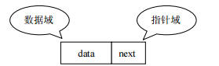

特点：

1.**多个节点之间通过地址进行连接。**例如，多个人手拉手，每个人使用自己的右手拉住下个人的左手，依次类推，这样多个人就连在一起了。

2.**查找元素慢：**想查找某个元素，需要通过连接的节点，依次向后查找指定元素。

3.**增删元素快：**只需要修改链接下一个元素的地址值即可。

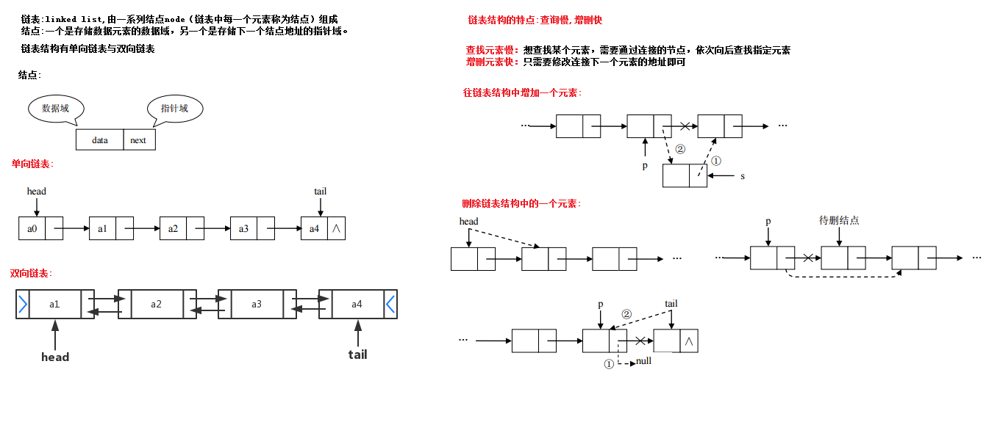


#### 17.树的基本结构

##### 17.1树的特点

1. 每一个节点有零个或者多个子节点
2. 没有父节点的节点称之为根节点，一个树最多有一个根节点。
3. 每一个非根节点有且只有一个父节点


| 名词     | 含义                                                         |
| -------- | ------------------------------------------------------------ |
| 节点     | 指树中的一个元素                                             |
| 节点的度 | 节点拥有的子树的个数，二叉树的度不大于2                      |
| 叶子节点 | 度为0的节点，也称之为终端结点                                |
| 高度     | 叶子结点的高度为1，叶子结点的父节点高度为2，以此类推，根节点的高度最高（上图高度为4） |
| 层       | 根节点在第一层，以此类推（上图层为4）                        |
| 父节点   | 若一个节点含有子节点，则这个节点称之为其子节点的父节点       |
| 子节点   | 子节点是父节点的下一层节点                                   |
| 兄弟节点 | 拥有共同父节点的节点互称为兄弟节点                           |


##### 17.2二叉树

如果树中的每个节点的子节点的个数不超过2，那么该树就是一个二叉树。


##### 17.3二叉查找树

1.左子树上所有的节点的值均小于等于他的根节点的值

2.右子树上所有的节点值均大于或者等于他的根节点的值

3.每一个子节点最多有两个子树

案例演示(20,18,23,22,17,24,19)数据的存储过程：

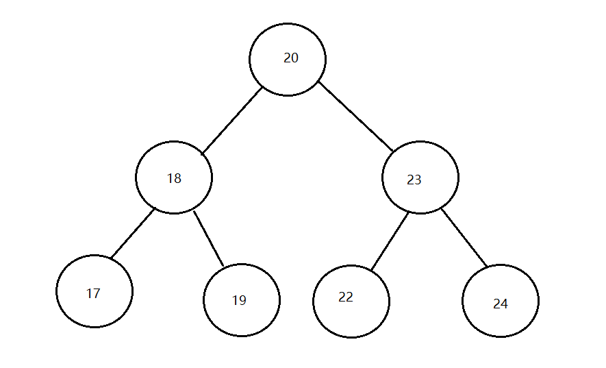

遍历获取元素的时候可以按照"左中右"的顺序进行遍历: 17 , 18, 19,20,22,23,24

注意：二叉查找树存在的问题：会出现"瘸子"的现象，影响查询效率


##### 17.4平衡二叉树

1.概述：

为了避免出现"瘸子"的现象，减少树的高度，提高我们的搜素效率，又存在一种树的结构："平衡二叉树"。

2.规则：

它的左右两个子树的高度差的绝对值不超过1，并且左右两个子树都是一棵平衡二叉树。

如下图所示：


如下图所示，左图是一棵平衡二叉树，根节点10，左右两子树的高度差是1，而右图，虽然根节点左右两子树高度差是0，但是右子树15的左右子树高度差为2，不符合定义，

所以右图不是一棵平衡二叉树。


##### 17.5旋转

在构建一棵平衡二叉树的过程中，当有新的节点要插入时，检查是否因插入后而破坏了树的平衡，如果是，则需要做旋转去改变树的结构。

###### 1.左旋

**左旋就是将节点的右支往左拉，右子节点变成父节点，并把晋升之后多余的左子节点出让给降级节点的右子节点。**

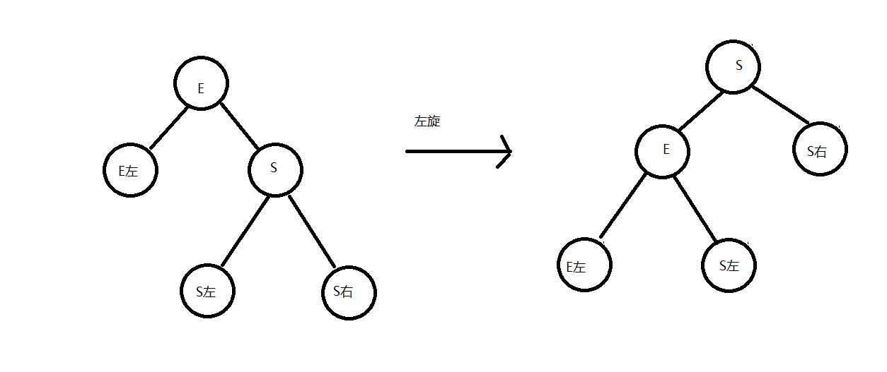

###### 2.右旋

**将节点的左支往右拉，左子节点变成了父节点，并把晋升之后多余的右子节点出让给降级节点的左子节点。**

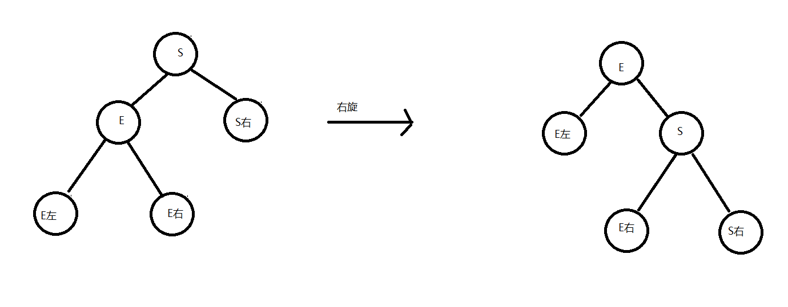


----------------------------------分割线-----------------------------------------

举个例子，像下图是否平衡二叉树的图里面，左图在没插入"19"节点前，该树还是平衡二叉树，但是在插入"19"后，导致了"15"的左右子树失去了"平衡"，

所以此时可以将"15"节点进行左旋，让"15"自身把节点出让给"17"作为"17"的左树，使得"17"节点左右子树平衡，而"15"节点没有子树，左右也平衡了。如下图，

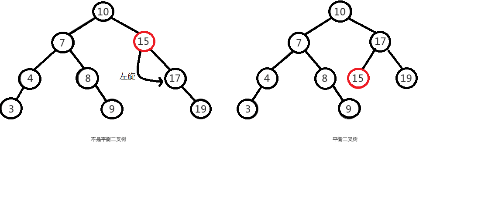

由于在构建平衡二叉树的时候，当有**新节点插入**时，都会判断插入后时候平衡，这说明了插入新节点前，都是平衡的，也即高度差绝对值不会超过1。当新节点插入后，

有可能会有导致树不平衡，这时候就需要进行调整，而可能出现的情况就有4种，分别称作**左左，左右，右左，右右**。

```java
左左：只需要做一次右旋就变成了平衡二叉树。
右右：只需要做一次左旋就变成了平衡二叉树。
左右：先做一次分支的左旋，再做一次树的右旋，才能变成平衡二叉树。
右左：先做一次分支的右旋，再做一次数的左旋，才能变成平衡二叉树。
```

----------------------------------分割线-----------------------------------------


###### 3.左左--即一次右旋

**只需要做一次右旋就变成了平衡二叉树。**

左左即为在原来平衡的二叉树上，在节点的左子树的左子树下，有新节点插入，导致节点的左右子树的高度差为2，如下即为"10"节点的左子树"7"，的左子树"4"，插入了节点"5"或"3"导致失衡。

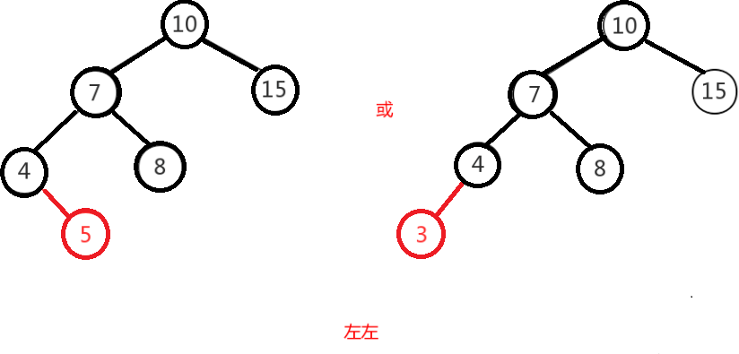

左左调整其实比较简单，只需要对节点进行右旋即可，如下图，对节点"10"进行右旋，

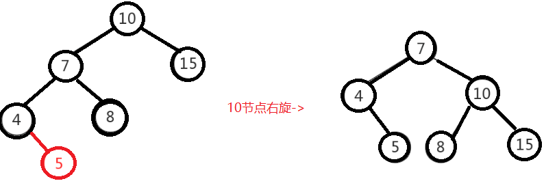


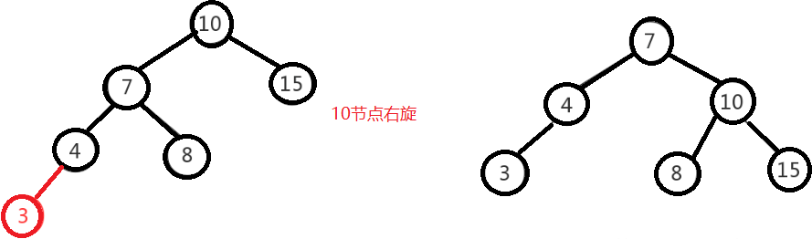


###### 4.左右

**先做一次分支的左旋，再做一次树的右旋，才能变成平衡二叉树。**

左右即为在原来平衡的二叉树上，在节点的左子树的右子树下，有新节点插入，导致节点的左右子树的高度差为2，如上即为"11"节点的左子树"7"，的右子树"9"，

插入了节点"10"或"8"导致失衡。

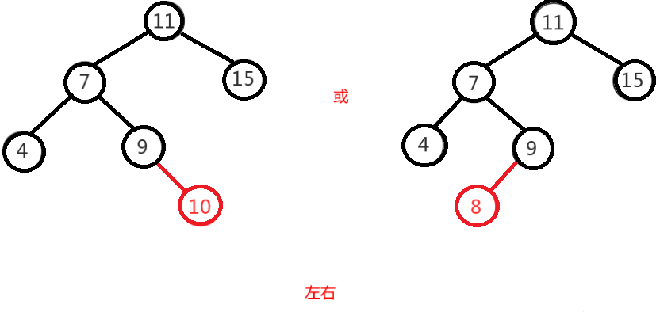


左右的调整就不能像左左一样，进行一次旋转就完成调整。我们不妨先试着让左右像左左一样对"11"节点进行右旋，结果图如下，右图的二叉树依然不平衡，而右图就是接下来要

讲的右左，即左右跟右左互为镜像，左左跟右右也互为镜像。

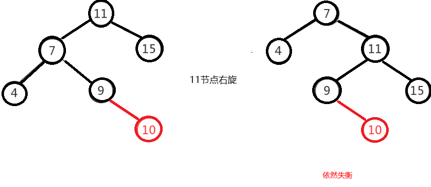

图左右这种情况，进行一次旋转是不能满足我们的条件的，正确的调整方式是，将左右进行第一次旋转，将左右先调整成左左，然后再对左左进行调整，从而使得二叉树平衡。

即先对上图的节点"7"进行左旋，使得二叉树变成了左左，之后再对"11"节点进行右旋，此时二叉树就调整完成，如下图:

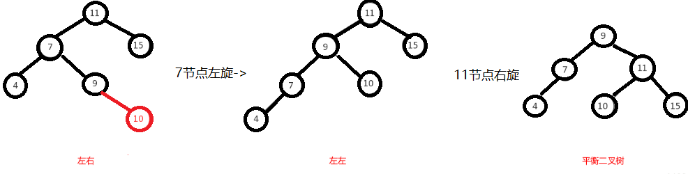


###### 5.右左

**先做一次分支的右旋，再做一次数的左旋，才能变成平衡二叉树。**

右左即为在原来平衡的二叉树上，在节点的右子树的左子树下，有新节点插入，导致节点的左右子树的高度差为2，如上即为"11"节点的右子树"15"，的左子树"13"，

插入了节点"12"或"14"导致失衡。

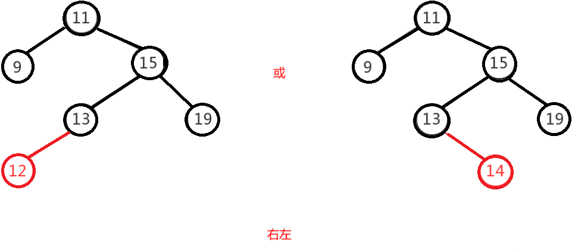

面也说了，右左跟左右其实互为镜像，所以调整过程就反过来，先对节点"15"进行右旋，使得二叉树变成右右，之后再对"11"节点进行左旋，此时二叉树就调整完成，如下图:

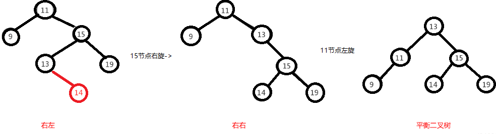


###### 6.右左

**只需要做一次左旋就变成了平衡二叉树。**

右右即为在原来平衡的二叉树上，在节点的右子树的右子树下，有新节点插入，导致节点的左右子树的高度差为2，如下即为"11"节点的右子树"13"，的左子树"15"，插入了节点

"14"或"19"导致失衡。

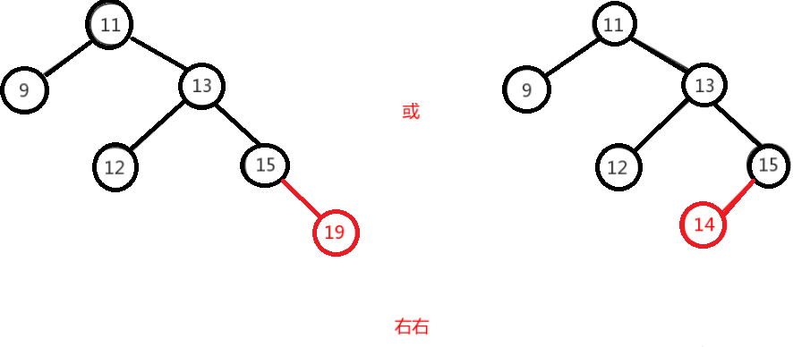

右右只需对节点进行一次左旋即可调整平衡，如下图，对"11"节点进行左旋。

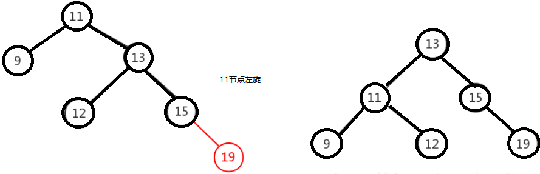


##### 17.6红黑树

1.概述

一种自**平衡的二叉查找树**，是计算机科学中用到的一种数据结构。它是一种特殊的二叉查找树，红黑树的每一个节点上都有存储位表示节点的颜色，可以是红或者黑。

红黑树不是高度平衡的，它的平衡是通过"红黑树的特性"进行实现的。

2.特性

1. 每一个节点或是红色的，或者是黑色的。
2. 根节点必须是黑色。
3. 每个叶节点(Nil)是黑色的；（如果一个节点没有子节点或者父节点，则该节点相应的指针属性值为Nil，这些Nil视为叶节点）。
4. 如果某一个节点是红色，那么它的子节点必须是黑色(不能出现两个红色节点相连的情况)。
5. 对每一个节点，从该节点到其所有后代叶节点的简单路径上，均包含相同数目的黑色节点。


在进行元素插入的时候，和之前一样； 每一次插入完毕以后，使用黑色规则进行校验，如果不满足红黑规则，就需要通过变色，左旋和右旋来调整树，使其满足红黑规则。


##### 17.7常见数据结构与二叉树小结

- 栈结构: 先进后出
- 队列结构:先进先出
- 数组: 查询快,增删慢
- 链表; 查询慢,增删快
- 二叉查找树: 提供搜索效率


#### 18.List接口

1.概述

java.util.List接口继承自Collection接口，是单列集合的一个重要分支。

2.特点

- 它是一个元素存取有序的集合
- 它是一个带有索引的集合，通过索引就可以精确的操作集合中的元素
- 集合中可以有重复的元素 


#### 19.List接口中常用方法

- `public void add(int index, E element)`: 将指定的元素，添加到该集合中的指定位置上。
- `public E get(int index)`:返回集合中指定位置的元素。
- `public E remove(int index)`: 移除列表中指定位置的元素, 返回的是被移除的元素。
- `public E set(int index, E element)`:用指定元素替换集合中指定位置的元素,返回值的更新前的元素。

List集合特有的方法都是跟索引相关。


补充点：

remove方法有两个，不过不需要特意记住，一般都是优先根据索引删除，尤其集合元素为Integer时。

```java 
//public boolean remove(Object obj): 删除指定的元素。
//public E remove(int index): 移除列表中指定位置的元素, 返回的是被移除的元素。

public class Test2 {
    public static void main(String[] args) {
        /*
            public boolean remove(Object obj): 删除指定的元素。
            public E remove(int index): 移除列表中指定位置的元素, 返回的是被移除的元素。
         */
        // 创建List集合,限制集合元素的类型为Integer
        List<Integer> list = new ArrayList<>();

        // 往集合中添加元素
        list.add(1);
        list.add(2);
        list.add(3);
        list.add(4);

        // 删除元素
        list.remove(2);// 优先根据索引删除
        System.out.println("list:" + list);// list:[1, 2, 4]
    }
}
```


#### 20.List的子类--ArrayList、LinkedList

- ArrayList集合: 底层采用的是数组结构,查询快,增删慢
  
  - 方法: 来自Collection,List
- LinkedList集合; 底层采用的是链表结构,查询慢,增删快
  - 方法: 来自Collection,List,LinkedList特有的方法
  - 特有的方法:
  
  有队列和栈（pop、push）的方法

```Java
public void addFirst(E e):将指定元素插入此列表的开头
public void addLast(E e):将指定元素添加到此列表的结尾
public E getFirst():返回此列表的第一个元素
public E getLast():返回此列表的最后一个元素
public E removeFirst():移除并返回此列表的第一个元素
public E removeLast():移除并返回此列表的最后一个元素
public E pop():从此列表所表示的堆栈处弹出一个元素（删除栈顶的第一个元素）
public void push(E e):将元素推入此列表所表示的堆栈（在栈顶位置添加元素）
```


#### 21.斗地主综合案例

##### 21.1需求

按照斗地主的规则，完成洗牌发牌的动作。
具体规则：

使用54张牌打乱顺序,三个玩家参与游戏，三人交替摸牌，每人17张牌，最后三张留作底牌。

##### 21.2分析

- 造牌
  1.创建一个集合,用来存储54张扑克牌
  2.创建一个花色集合,用来存储4个花色
  3.创建一个牌面值集合,用来存储13个牌面值
  4.往存储扑克牌的集合中存储大小王
  5.花色集合和牌面值集合循环嵌套,生成52张扑克牌
  6.在循环中,把生成的扑克牌添加到存储扑克牌的集合中

- 洗牌: 打乱集合元素顺序

- 发牌:

  1.创建4个集合,用来存储玩家1,玩家2,玩家3,底牌的手牌,
  2.循环遍历打乱顺序之后的存储54张扑克牌的集合（取牌）
  3.在循环中,判断索引
  3.0 如果索引大于等于51,就取出的牌给底牌
  3.1 如果索引%3==0,就取出的牌给玩家1
  3.2 如果索引%3==1,就取出的牌给玩家2
  3.3 如果索引%3==2,就取出的牌给玩家3
  4.展示牌

- 展示牌: 打印输出即可


##### 21.3实现

```Java
public class Test1 {
    /*具体规则：
    使用54张牌打乱顺序,三个玩家参与游戏，三人交替摸牌，每人17张牌，最后三张留作底牌。
    */
    public static void main(String[] args) {
    //- 造牌
        //  1.创建一个集合,用来存储54张扑克牌
        ArrayList<String> pukeBox = new ArrayList<>();
        //  2.创建一个花色集合,用来存储4个花色
        ArrayList<String> huaSes = new ArrayList<>();
        huaSes.add("！");
        huaSes.add("@");
        huaSes.add("#");
        huaSes.add("$");
        //  3.创建一个牌面值集合,用来存储13个牌面值
        ArrayList<String> numbers = new ArrayList<>();
        numbers.add("A");
        numbers.add("K");
        numbers.add("Q");
        numbers.add("J");
        for (int i = 2; i <= 10; i++) {
            numbers.add(i+"");
        }
        //  4.往存储扑克牌的集合中存储大小王
        pukeBox.add("大王");
        pukeBox.add("小王");
        //  5.花色集合和牌面值集合循环嵌套,生成52张扑克牌
        for (String huaSe : huaSes) {
            for (String number : numbers) {
                String pai=huaSe+number;
                //  6.在循环中,把生成的扑克牌添加到存储扑克牌的集合中
                pukeBox.add(pai);
            }
        }
        System.out.println("pukeBox.size() = " + pukeBox.size());
        System.out.println("pukeBox = " + pukeBox);
        //- 洗牌: 打乱集合元素顺序
        Collections.shuffle(pukeBox);//注意是带s的Collections工具类
        System.out.println("打乱后： " + pukeBox);
        //- 发牌:
        //  1.创建4个集合,用来存储玩家1,玩家2,玩家3,底牌的手牌,
        ArrayList<String> player1 = new ArrayList<>();
        ArrayList<String> player2 = new ArrayList<>();
        ArrayList<String> player3 = new ArrayList<>();
        ArrayList<String> dipai = new ArrayList<>();
        //  2.循环遍历打乱顺序之后的存储54张扑克牌的集合
        for (int i = 0; i < pukeBox.size(); i++) {
            String p=pukeBox.get(i);

            //  3.在循环中,判断索引
            //  3.0 如果索引大于等于51,就取出的牌给底牌
            if (i>=51){
                dipai.add(p);
                //  3.1 如果索引%3==0,就取出的牌给玩家1
            }else if (i%3==0){
                player1.add(p);
                //  3.2 如果索引%3==1,就取出的牌给玩家2
            }else if (i%3==1){
                player2.add(p);
                //  3.3 如果索引%3==2,就取出的牌给玩家3
            }else player3.add(p);

        }
        //  4.展示牌
        //- 展示牌: 打印输出即可
        System.out.println("player1 = " + player1);
        System.out.println("player2 = " + player2);
        System.out.println("player3 = " + player3);
        System.out.println("dipai = " + dipai);
    }
}
```


### day06

#### 1.???compareTo()方法和Collections.sort()方法是怎样实现对元素进行排序的

`Collections.sort()` 方法是 Java 集合框架的一部分，它用于对实现了 `List` 接口的集合进行排序。`Collections.sort()` 方法默认使用 `Arrays.sort()` 方法来进行排序，而 `Arrays.sort()` 方法内部使用了一个快速排序算法。

Collections.sort(li... →点击查看智谱清言智能体「AI搜索」的回答https://chatglm.cn/share/FEMNf

compareTo()方法和Colle... →点击查看智谱清言智能体「AI搜索」的回答https://chatglm.cn/share/FEMqV


#### 2.???Comparator接口中的int compare(T o1, T o2)方法是抽象方法吗

在Java中，如果一个接口中的方法没有提供具体实现，它就是一个抽象方法。`Comparator` 接口中的 `compare()` 方法没有提供具体实现，因此它是一个抽象方法。任何类如果想要实现 `Comparator` 接口，都必须提供 `compare()` 方法的具体实现。


在Java中，接口（Interface）是一种特殊类型的抽象类，它只包含抽象方法、默认方法和静态方法。抽象方法是指没有具体实现的方法，它们只有方法签名，没有方法体。接口中的所有方法都是抽象的，这意味着它们不能被直接实现。

接口的目的是定义一组方法的规范，而不是提供这些方法的实现。任何类如果想要实现接口，都必须提供接口中所有抽象方法的实现。

接口中的方法是抽象方法吗？ →点击查看智谱清言智能体「AI搜索」的回答https://chatglm.cn/share/FEUsg


#### 3.Collections常用功能

##### 3.1概述

java.util.Collections是集合工具类，用来对集合进行操作。

##### 3.2常用方法（shuffle、两个sort）

**1.`public static void shuffle(List<?> list) :打乱集合元素顺序。`**

**2.`public static <T> void sort(List<T> list):将集合中元素按照默认规则排序。`**

- 默认规则: 事先写好的规则
- 默认规则是在哪里指定的?
  - 在集合元素所属的类中指定的（如List<Integer> list，即是在Integer中指定规则，但jdk中已写好，所以不需要我们自定义规则）
- 默认规则如何指定?
  - 要求集合元素所属的类必须实现==Comparable==接口,重写compareTo方法，在compareTo方法中书写默认排序规则（即`class Person implements Comparable<Person>{}`，`@Override public int compareTo(Person o) {}`）

```Java
public class Test1 {
    public static void main(String[] args) {
        ArrayList<Person> list = new ArrayList<>();
        Person p1 = new Person(13, "李四");
        list.add(p1);
        list.add(new Person(12,"张三"));
        list.add(new Person(14,"王五"));
        list.add(new Person(15,"刘六"));
        System.out.println("乱序前：" + list);
        Collections.shuffle(list);
        System.out.println("乱序后" + list);

        Collections.sort(list);
        System.out.println("sort排序后：" + list);

    }
}
```


```Java
public class Person implements Comparable<Person>{
    private int age;
    private String name;

    public Person() {
    }

    public Person(int age, String name) {
        this.age = age;
        this.name = name;
    }

    @Override
    public String toString() {
        return "Person{" +
                "age=" + age +
                ", name='" + name + '\'' +
                '}';
    }
    
    @Override
    public int compareTo(Person o) {
        // 自定义排序规则
        // 升序: 前减后
        // 降序: 后减前
        // 前: this, 后:参数o
        //按照年龄升序排序
        //return this.age-o.age;
        //按照年龄降序排序
        return o.age-this.age;
    }
}
```


**3.`public <T> void sort(List<T> list，Comparator<? super T> comp):将集合中元素按照指定规则排序`**

注意这里是==Comparator==，上面是comparable

方法3的区别：

1. 方法3在自定义规则排序上更便捷灵活，不需要在集合所属的类中去定义规则（即`class Person implements Comparable<Person>{}`；`@Override public int compareTo(Person o) {}`），而是直接在sort方法的第二个参数位置创建匿名的Comparator接口，并重写compare抽象方法（即`Collections.sort(list, new Comparator<Person>() { @Override public int compare(Person o1, Person o2) {...} }`）
2. 即便在集合所属的类中（Person类）中定义了规则，若也同时在sort方法中创建匿名接口重写定义规则，那实际起作用的只会是后者。

```Java
public class Test2_sort {
    public static void main(String[] args) {
        ArrayList<Person> list = new ArrayList<>();
        list.add(new Person(22,"张三"));
        list.add(new Person(14,"王五"));
        list.add(new Person(15,"刘六"));
        System.out.println("乱序前：" + list);
        Collections.shuffle(list);
        System.out.println("乱序后：" + list);

        Collections.sort(list, new Comparator<Person>() {
            @Override
            public int compare(Person o1, Person o2) {
                return o2.getAge()-o1.getAge();
            }
        });
        System.out.println("sort排序后：" + list);
    }
}
```


```java 
public class Person implements Comparable<Person> {
    private int age;
    private String name;

    public Person() {
    }

    public Person(int age, String name) {
        this.age = age;
        this.name = name;
    }

    @Override
    public String toString() {
        return "Person{" + "age=" + age +
                ", name='" + name + '\'' +
                '}';
    }

    public int getAge() {
        return age;
    }

    public String getName() {
        return name;
    }

    @Override
    public int compareTo(Person o) {
        // 自定义排序规则
        // 升序: 前减后
        // 降序: 后减前
        // 前: this, 后:参数o
        //按照年龄升序排序
        return this.age-o.age;
        //按照年龄降序排序
        //return o.age - this.age;
    }
}

```


##### 3.3可变参数

1.概述

在JDK1.5之后，定义了可变参数，用来表示一个方法需要接受的多个同类型参数。

2.格式

```Java
修饰符 返回值类型 方法名(数据类型... 变量名){
    
}
```

3.注意

- 可变参数一定是定义在方法的形参位置
- 一个方法只能有一个可变参数
- 如果方法中有多个参数，可变参数要放到最后。

4.应用场景

- Collections工具类中的批量添加元素的静态方法:	
- `static <T> boolean addAll(Collection<T> c, T... elements)  :往集合中添加一些元素。`

```Java
public class Test1 {
    public static void main(String[] args) {
        method(12,13,14,15);
        int[] arr= {12,14,15};
        method(arr);
        method2("张三",23,25,27);
        method2("李四",33,35,37);
    }
    public static void method(int ... nums){
        //把可变参数nums当成数组来使用，通过循环遍历获取值
        for (int i = 0; i < nums.length; i++) {
            System.out.println( nums[i]);
        }
        System.out.println("--------------method1方法结束----------------");
    }
    public static void method2(String names,int ... nums){
        System.out.println(names);
        //把可变参数nums当成数组来使用，通过循环遍历获取值
        for (int i = 0; i < nums.length; i++) {
            System.out.println( nums[i]);
        }
        System.out.println("--------------method2方法结束----------------");
    }
}
```


#### 4.Set接口

1.概述

 java.util.Set接口继承自Collection接口，是单列集合的一个重要分支。

2.特点：元素没有索引，元素唯一（不重复）。

3.注意事项

- Set集合元素**没有索引**,**只能使用迭代器**或者**增强for循环**进行遍历元素
- Set集合没有特殊的方法,都是使用Collection的方法
- Set接口就是Set集合,但凡实现了Set接口的类也叫做Set集合

4.常用实现类

- HashSet类:  元素没有索引,元素唯一,元素存取顺序**不一致**
  - 存储结构采用的是哈希表结构,由哈希表保证元素唯一
- LinkedHashSet类:元素没有索引,元素唯一,元素存取顺序**一致**
  - 存储结构采用的是哈希表+链表结构,由哈希表保证元素唯一,由链表保证元素存取顺序一致
- TreeSet类: 元素没有索引,元素唯一,可以对元素进行**排序**
  - 存储结构采用的是红黑树结构,由红黑树保证元素唯一,由比较器来对元素进行排序


#### 5.HashSet集合

1.概述

java.util.HashSet是Set接口的一个实现类, 底层的实现其实是一个java.util.HashMap支持。

2.特点

元素没有索引,元素唯一,元素**存取**顺序**不一致。**

如果集合中存储的是自定义类型的元素,那么就要求该元素所属的类要重写hashCode和equals方法。若不重写，会导致取出的元素有重复的，这样便无法保证set集合元素唯一性。


#### 6.HashSet集合存储数据的原理

##### 6.1哈希表底层结构

jdk1.8之前，哈希表底层采用数组+链表实现。

即，使用数组存储元素，同一hash值的元素如果不相同，就使用链表的形式链接在一个数组中的同一个位置上。但是当位于一个桶中（同数组的同位置上）的元素较多，即hash值相等的元素较多时，通过key值依次查找的效率较低。由此，

jdk1.8开始，哈希表存储采用数组+链表+红黑树实现，当链表长度超过阈值（8）时，将链表转换为红黑树，这样大大减少了查找时间。

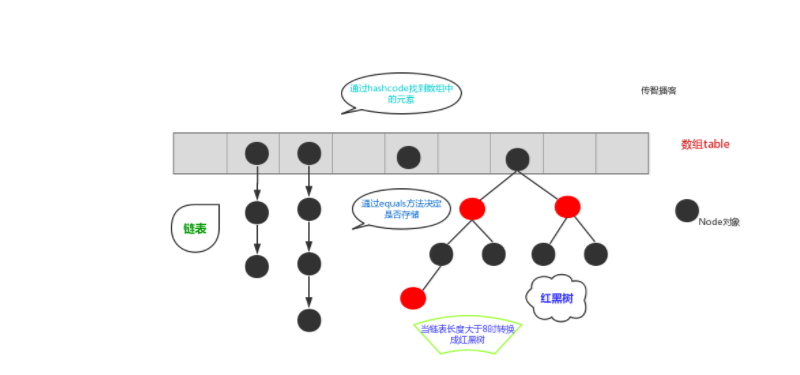


##### 6.2HashSet保证元素唯一原理

```Java
保证元素唯一的原理: 依靠hashCode和equals方法
1.存储元素的时候,会调用该元素的hashCode方法计算该元素的哈希值
2.判断该哈希值对应的位置上是否有元素（哈希值%16，结果范围：【0-15】）
3.如果该哈希值对应的位置上没有元素,就直接存储
4.如果该哈希值对应的位置上有元素,说明产生了哈希冲突
5.产生了哈希冲突就会调用该元素的equals方法与该哈希值对应的位置上的所有元素进行一一比较:
5.1 如果比较完之后,没有一个元素与该元素相等,就直接存储
5.2 如果比较完之后,有任意一个元素与该元素相等,就不存储
    
注意:
1.hashCode和equals方法属于Object类的
2.任意类的对象都拥有hashCode和equals方法
3.Object类中的hashCode方法是主要根据地址值计算哈希值
4.Object类中的equals方法是比较地址值
```

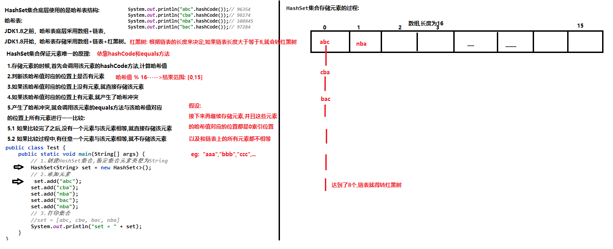


##### 6.3HashSet存储自定义类型元素

==注意：==HashSet存储自定义类型元素，要求该元素所属的类要**重写hashCode和equals方法**。

否则会导致相同属性值的两个对象都会被打印出来（一般所有属性值相同的对象视为一个对象，所以没有必要打印出两个对象）。

```Java
public class Test1 {
    public static void main(String[] args) {
        HashSet<Person> set=new HashSet<>();
        Person p1 = new Person(15,"张三1");
        Person p2 = new Person(25,"张三2");
        Person p3 = new Person(15,"张三1");
        Person p4 = new Person(35,"张三3");
        Collections.addAll(set,p1,p2,p3,p4);
        System.out.println(set);//[Person{age=15, name='张三1'}, Person{age=35, name='张三3'}, Person{age=25, name='张三2'}]
        for (Person p : set) {
            System.out.println("p = " + p);
        }
    }
}
class Person{
    private int age;
    private String name;

    public Person() {
    }

    public Person(int age, String name) {
        this.age = age;
        this.name = name;
    }

    @Override
    public String toString() {
        return "Person{" +
                "age=" + age +
                ", name='" + name + '\'' +
                '}';
    }

    @Override
    //根据所有属性值来比较两个对象是否相同
    public boolean equals(Object o) {
        //如果两个对象地址值相同，直接返回true结束方法
        if (this == o) return true;
        //如果参数为null，或者两个对象的类（getClass()是获取类）不同，直接返回false结束方法
        if (o == null || getClass() != o.getClass()) return false;
        //执行到这里，说明地址值相同，类相同，不为null。于是比较所有属性是否相同
        //多态的向下转型，访问子类的独有成员
        Person person = (Person) o;
        return age == person.age &&
            //注意是Objects工具类的equals方法
                Objects.equals(name, person.name);
    }

    @Override
    public int hashCode() {
        //根据所有属性值（age、name）来计算哈希值，所有属性值相同，哈希值就会相同，此时再继续equals比较
        return Objects.hash(age, name);
    }
}
```

补充：

Objects工具类的equals方法和object的equals方法有什么不一样... →点击查看智谱清言智能体「AI搜索」的回答https://chatglm.cn/share/Fj1HE（具体可看day4  1.5）

1. **空值处理**：`Objects.equals`方法可以安全地处理`null`值，如果两个参数都是`null`，则返回`true`；如果其中一个参数是`null`，而另一个不是，则返回`false`。而`Object`类中的`equals`方法默认是调用`==`操作符，如果任一参数是`null`，则直接返回`false`。

2. **可重写性**：`Objects.equals`方法是一个**静态方法**，**不能**被**重写**。而`Object`类中的`equals`方法是一个**实例方法**，可以在子类中被重写以提供自定义的相等性比较逻辑。

3. object的equals方法

   public boolean equals(Object anObject)：
       将此字符串与指定对象进行比较。由于我们比较的是字符串对象，所以参数直接传递一个字符串


#### 7.LinkedHashSet集合

1.概述

java.util.LinkedHashSet 是HashSet的一个子类，底层采用链表+哈希表

2.特点

- 元素没有索引,元素唯一,元素存取顺序一致
- 存储结构采用的是哈希表+链表结构,由哈希表保证元素唯一,由链表保证元素存取顺序一致
- 如果集合中存储的是自定义类型的元素,那么就要求该元素所属的类要重写hashCode和equals方法（若不重写，会导致取出的元素有重复的，这样便无法保证set集合元素唯一性。）


#### 8.TreeSet集合

##### 8.1概述

TreeSet集合是Set接口的一个实现类，底层依赖于TreeMap,是一种基于红黑树的实现

##### 8.2特点

- 元素没有索引,元素唯一,**可以**对元素进行**排序**
- 存储结构采用的是红黑树结构,由红黑树保证元素唯一,由比较器来对元素进行排序

##### 8.3排序规则

