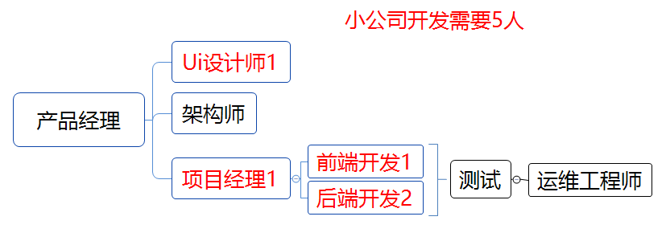
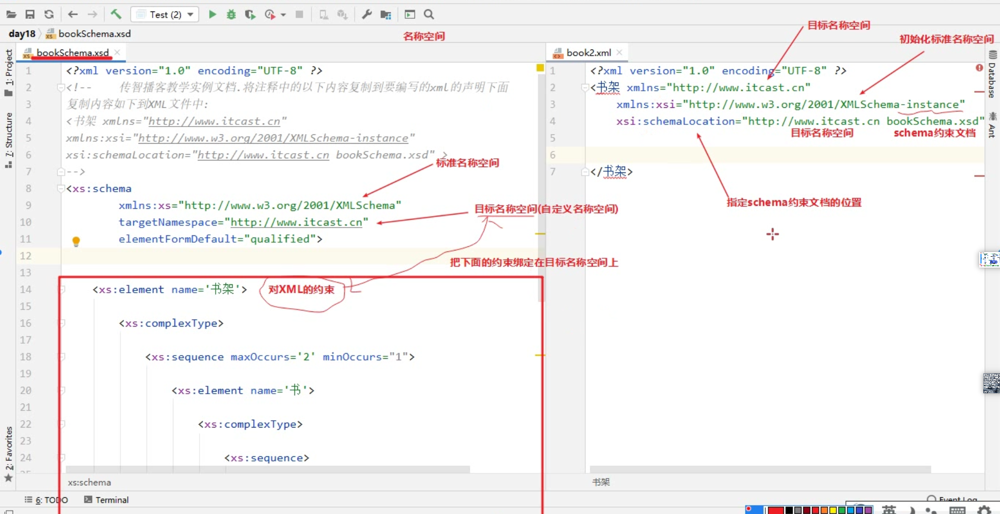

# 项目一

## day1

### 补充知识点

#### 1.dao接口

#### 2.启动类添加@mapperscaner

#### 3.CRUD

selectById（）根据id查询单条记录

selectBatchIds（）根据id批量查询

selectOne（）查询返回单条记录

#### 4.Lambda表达式

#### 5.瑞吉外卖技术选型

网关层使用nginx（能管理tomcat，tomcat访问量：300~500/s）

开发工具：git、maven、==junit==

### 项目知识点

#### 1.软件开发完整流程

**<font color='red'>项目立项</font>** --**<font color='red'>立项审评</font>** --需求分析--设计（ui界面、数据库、架构、接口等设计）--编码--测试--上线--运维（软件环境安装、配置，项目上线）--**<font color='red'>复盘</font>** 

#### 2.角色返工



#### 3.Axure--浏览器上打开原型图插件

#### 4.maven+springboot项目开发环境搭建

##### 4.1.数据库环境搭建

1.先创建数据库，再执行sql文件

①命令提示符（管理员身份）方法：

登录mysql数据库

```
mysql -uroot -proot
create database reggie
use reggie;
source D:\reggie.sql
```

②图形化界面方法：

右击选择“run sql script运行sql脚本“，选择sql文件

##### 4.2.maven项目搭建

①统一编码设置 utf-8

②maven仓库地址配置

③jdk配置 1.8版本

##### 4.3搭建项目的基础环境

④配置依赖关系 pom.xml

⑤导入项目配置文件 application.yml

⑥编写启动类在src\main\java中  ReggieApplication.java

##### 4.4导入静态资源

⑦将前端资源复制粘贴在resource目录下

⑧创建WebMvcConfig.java，设置静态资源映射

（由于在Springboot项目中, 默认静态资源的存放目录为 : "classpath:/resources/", "classpath:/static/", "classpath:/public/" ; 而在我们的项目中静态资源存放在 backend, front 目录中, 那么这个时候要想访问到静态资源, 就需要设置静态资源映射。）


==注意：==不能直接在resource目录下新建static目录，并将前端资源放入static目录下，因为如果后面还需要对SpringMVC做配置修改，则会导致SpringBoot（SpringBoot会自动做静态资源配置）中关于SpringMVC的一些自动配置失效  就会导致访问404。

## day2

### 补充知识点

#### 1.SpringBoot中的SpringMVC做自动配置

#### 2.快捷键

alt+insert  重构

ctrl+D 复制上一行

ctrl+shift+v == ctrl+alt+v == 在对象后+ .var回车 自动补全返回值（自动生成=左边的变量）


typora中快捷键

左右==  高亮

**<font color='red'>有色字体</font>**

ctrl+shift+k  代码


xmind

将左边内容进行总结  选中内容后点击概要

### 项目知识点

#### 1.springboot项目报错Whitelabel Error Page

[springboot项目入门级报错Whitelabel Error Page - 掘金 (juejin.cn)](https://juejin.cn/post/7339526709421817875)

## day3

### 补充知识点

#### 1.XML文件的约束

##### 1.1DTD约束

##### 1.2Schema约束



# 个人知识体系搭建

1.信息的收入与收集

2.碎片化知识的加工--提取关键字分类

3.理解建立知识脉络（通过多渠道深入学习）

4.思维导图--建立知识之间的联系（稳固基础知识）

5.重复梳理和延续思考（与人进行分享、实践）
