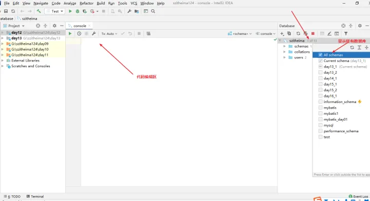

## 一、MySQL卸载

### 1.关闭服务

点击win，输入服务，找到MySQL的服务，右击停止该服务

### 2.删除服务

点击win，输入cmd，选择管理员身份运行。打开cmd，输入sc delete mysql

### 3删除配置的MySQL环境变量

MySQLHOME和PATH里的mysql内容

### 4.删除解压后mysql文件夹

如果不记得路径了，可以根据环境变量里的路径找过去，所以可以先截屏记住环境变量里的路径

## 二、MySQL安装

### 1.官网下载MySQL5.7.29软件压缩包

### 2.解压【解压到没有中文和空格的目录下】

配置环境变量:MySQL_HOME、path
计算机右键--属性--高级系统设置--环境变量--系统变量--找到path编辑--新建
MySQL_HOME:D:\czbk\software\mysql-5.7.29-winx64

【注意：路径配置到MySQL解压目录【bin目录的上一级】】
path:%MySQL_HOME%\bin

### 3.将my.ini配置文件，放入到MySQL解压包下【my.ini和bin目录同级】

### 4.在解压包bin目录下打开dos窗口【注意：以管理员身份运行】

可以win+r进入dos窗口，但是最好从win里搜索cmd以管理员身份进入。注意最好在dos窗口进入bin目录。cd 文件夹名

#### 4.1：初始化服务(自动创建data文件夹)

mysqld --initialize-insecure --user=mysql

#### 4.2：安装服务

mysqld -install

#### 4.3：启动服务测试

net start mysql

#### 4.4：设置root账号密码 【第一次安装时没有密码，所以如果有说有误直接回车复制4.5内容即可】

mysqladmin -u root -p password "root"

#### 4.5：登录数据库，开始操作

mysql -u root -proot

到这一步就结束安装数据库了，可以开始连接idea。

## 三、连接idea

#### 1.创建MySQL数据库链接,点击左上角的+之后选择DataSource(选择数据源)之后选择创建MySQL数据源.

 

#### 2.导入MySQL驱动JAR包,找到左边列表Drivers下的刚安装的MySQL版本

#### 3.回到刚开始链接信息定义的位置继续输入MySQL服务器的相关信息

#### **4.如果没有问题点击Test Connection,如果现实Success即可成功.**

#### 5.如果有问题，可以根据提示下载driver，下载完后配置时区

## 四、连接界面部分说明

#### **1.连接界面部分说明 [显示所有数据库方式/SQL语句编辑区/数据库选择]**

#### **2.试MySQL数据库的SQL语句执行能力,通过快捷键Ctrl + Enter即可执行被淡紫色框选中的SQL语句会在下面弹出执行结果信息**

#### 3.到这个地方基本就可以对数据库进行操作了.