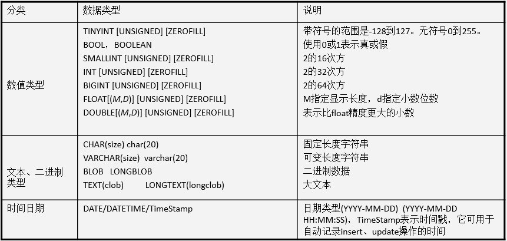

## 第一部分：基础

### DDL操作数据库

- 语法:

  ```sql
  创建数据库: create database 数据库名 [character set 字符编码][collate 校对规则];-- []表示可选
  查看数据库:
  	查看所有数据库: show databases;
  	查看数据库结构: show create database 数据库名;
  删除数据库: drop database 数据库名;
  修改数据库: alter database 数据库名 character set 字符编码; 注意:1.数据库名不能修改 2.只能修改数据库的编码,是utf8,不是utf-8
  其他操作:
  	切换数据库:  use 数据库名;
  	查看正在使用的数据库: select database();
  ```

- 案例:

  ```sql
  -- 练习:创建一个名字为day17_1的数据库,默认编码utf-8
  create database day17_1;
  -- 练习:创建一个名字为day17_2的数据库,指定编码为gbk
  create database day17_2 character set gbk;
  -- 练习: 查询所有的校对规则
  show collation;
  -- 练习:查询所有的数据库
  show databases;
  -- 练习:查询day17_1和day17_2数据库的定义结构
  show create database day17_1;
  show create database day17_2;
  -- 练习:删除day17_1数据库
  drop database day17_1;
  -- 练习:修改day17_2数据库的编码为utf8
  alter database day17_2 character set utf8;-- 注意这里是utf8,不是utf-8
  -- 练习:切换到day17_1数据库
  use day17_1;
  -- 练习:查询正在使用的数据库
  select database();
  
  ```

  

### 第一章-DDL操作表

#### 1.1 创建表【重点】

##### 1.语法

```sql
create table 表名(
   字段名 字段类型 [约束],
   字段名 字段类型 [约束],
   ........
   字段名 字段类型 [约束]
);
-- 注意: 小括号中最后定义的字段后面不要加逗号
```

##### 2. 类型 



1. **整型  一般使用int 或者bigint**

2. 浮点/双精度型  

   - **默认的范围  float或者double**（字母详情可看上表）
   - 指定范围     float(M,D)  eg: float(4,2)  表达的范围:  -99.99~99.99

3. 字符串

   - 固定长度  char(n)  	eg: char(20), 最大能存放20个字符.  ‘aaa      ’, 还是占20个字符的空间
   - **可变长度  varchar(n) eg:varchar(20), 最大能存放20个字符.  ‘aaa’, 占3个字符的空间**

   > 一般使用varchar(n) 节省空间;  如果长度(eg:身份证)是固定的话 可以使用char(n) 性能高一点 

4. 关于大文件

   - 一般在数据库里面很少存文件的内容, 一般存文件的路径
   - 一般不使用二进制存, 使用varchar(n)存文件的路径

5. 日期

   - **DATE         只有日期**
   - **DATETIME 日期和时间**

##### 3. 约束  

- 即规则,规矩 限制;  
- 作用：保证用户插入的数据保存到数据库中是符合规范的

| 约束 | 约束关键字  |
| ---- | ----------- |
| 主键 | primary key |
| 唯一 | unique      |
| 非空 | not null    |

**约束种类:** 

- **not null: 非空** ;  eg:  username varchar(40)  not null    username这个字段不能为空，必须要有数据，否则会添加失败
- **unique:唯一约束**, 后面的数据不能和前面重复;  eg: cardNo varchar(18) unique;    cardNo字段不能出现重复的数据

- **primary key；主键约束(非空+唯一)**;    一般用在表的id列上面.  每一张表基本上都有id列的, id列作为记录的唯一标识的 
- **auto_increment: ==自动增长**,必须是设置了primary key之后,才可以使用auto_increment==（它会自增，所以可以设置数据值为null，也并不会冲突）
- `id int  primary key   auto_increment` id不需要我们自己维护了, 插入数据的时候直接插入null, 自动的增长进行填充进去, 避免重复了.  

注意:

1. 先设置了primary key 再能设置auto_increment
2. 只有当设置了auto_increment 才可以插入null 自己维护 否则插入null,会报错
3. 一般开发中id主键会设置为自动增长

##### 4.练习

- 创建一张学生表(含有id字段,姓名字段,性别字段. id为主键自动增长)

  ```sql
  create table student(
  	id int primary key auto_increment,
  	name varchar(70),
  	sex varchar(13)
  );
  
  ```

  

#### 1.2 查看表【了解】

- 语法:

  ```java
  查看所有的表: show tables;
  查看表的定义结构: desc  表名；
  ```

- 案例:

  ```sql
  -- 练习:查看day17_1数据库中所有的表
  show tables;
  -- 练习:查看day17_1数据库中student表的结构
  desc student;
  
  ```

  

#### 1.3 修改表【掌握】

##### 1.语法

- 增加一列:  `alter table 表名 add 字段名 字段类型 字段约束;`
- 修改列的类型约束:`alter table 表名 modify 字段名 字段类型 字段约束;`
- 修改列的名称，类型，约束:`alter table 表名 change 旧字段名  新列名 字段类型 字段约束;`
- 删除一列: `alter table 表名 drop 字段名;`
- 修改表名: `rename table 旧表名 to 新表名;`

##### 2.练习

```sql
-- 练习:给学生表增加一个grade字段
alter table student add grade varchar(40);

-- 练习:给学生表的sex字段改成字符串类型 
alter table student modify sex varchar(23);

-- 练习:给学生表的grade字段修改成class字段
alter table student change grade class varchar(20);

-- 练习:把class字段删除
alter table student drop class;

-- 练习:把学生表修改成老师表(了解)
rename table student to teacher;

```


#### 1.4 删除表【掌握】

- 语法:  `drop table 表名;`

- 案例:

  ```sql
  -- 练习: 删除teacher表
  drop table teacher;
  ```

  

### 第二章-DML操作表记录-增删改【重点】

- 准备工作: 创建一张商品表(商品id,商品名称,商品价格,商品数量.) 

```sql
create table product(
	pid int primary key auto_increment,  -- 只有设置了auto_increment id列才可以赋值为null
	pname varchar(40) not null,
	price double,
	num int
);
```

#### 2.1 插入记录

- 语法:

  ```java
  插入指定列: insert into 表名(列名,列名,...)  values(值,值,...);
  插入所有列: insert into 表名 values(值,值,...);
  -- 注意:
  -- - 字段名与值的类型、个数、顺序要一一对应。
  -- - 值不要超出列定义的长度。
  -- - 插入的日期和字符串，使用引号括起来。 
  -- - 插入特定的列:没有赋值的列,系统自动赋为null(前提是当前列没有设置not null 约束,否则会报错)
  -- - 默认所有列插入,values里面必须给表中每一个字段赋值,一般主键给一个null
  ```

  

- 案例:

  ```sql
  -- 练习: 指定pname,price列插入记录
  insert into product(pname,price) values('Mac',11000);
  
  -- 练习: 指定price列插入记录---错误的需求
  insert into product(price) values(20000);-- 报错
  
  -- 练习: 指定所有列插入记录
  insert into product values(null,"MacBook",20000,3);
  
  ```

- 数据准备:  **批量插入记录**

  ```sql
  方式一:
  insert into product values(null,'苹果电脑',18000.0,10);
  insert into product values(null,'华为5G手机',30000,20);
  insert into product values(null,'小米手机',1800,30);
  insert into product values(null,'iPhonex',8000,10);
  insert into product values(null,'苹果电脑',8000,100);
  insert into product values(null,'iPhone7',6000,200);
  insert into product values(null,'iPhone6s',4000,1000);
  insert into product values(null,'iPhone6',3500,100);
  insert into product values(null,'iPhone5s',3000,100);
  insert into product values(null,'方便面',4.5,1000);
  insert into product values(null,'咖啡',11,200); 
  insert into product values(null,'矿泉水',3,500);
  
  方式二:
  insert into product values(null,'苹果电脑',18000.0,10),
  (null,'华为5G手机',30000,20),
  (null,'小米手机',1800,30),
  (null,'iPhonex',8000,10),
  (null,'苹果电脑',8000,100),
  (null,'iPhone7',6000,200),
  (null,'iPhone6s',4000,1000),
  (null,'iPhone6',3500,100),
  (null,'iPhone5s',3000,100),
  (null,'方便面',4.5,1000),
  (null,'咖啡',11,200),
  (null,'矿泉水',3,500);
  ```

  

- 命令行插入中文数据报错:-----了解

 

- 关闭服务,  net stop MySql
- 在数据库软件的安装目录下面, 修改配置文件 my.ini中客户端的编码为gbk


- 重新打开命令行,开启服务, net start MySql


#### 2.2 更新记录

- 语法:  `update  表名 set 字段名=值,字段名=值,... where 条件; `

- 练习

  - 将所有商品的价格修改为5000元

  - 将商品名是Mac的价格修改为18000元

  - 将商品名是Mac的价格修改为17000,数量修改为5

  - 将商品名是方便面的商品的价格在原有基础上增加2元

    ```sql
    --   - 将所有商品的价格修改为5000元
    update product set price = 5000;
    
    --   - 将商品名是Mac的价格修改为18000元
    update product set price = 18000 where pname='Mac';
    
    --   - 将商品名是Mac的价格修改为17000,数量修改为6
    update product set price = 17000,num=6 where pname='Mac';
    
    --   - 将商品名是方便面的商品的价格在原有基础上增加2元
    update product set price = price + 2  where pname='方便面';
    
    ```

    


#### 2.3 删除记录

- 语法

  - 方式一:  `delete from 表名 where 条件;`
  - 方式二:  `truncate table 表名;`

  

- 练习

  - 删除表中名称为’Mac’的记录

  - 删除价格小于5001的商品记录

  - 删除表中的所有记录

    ```sql
    --   - 删除表中名称为’Mac’的记录
    delete from product where pname='Mac';
    
    --   - 删除价格小于5001的商品记录
    delete from product where price < 5001;
    
    --   - 删除表中的所有记录
    delete from product;-- 一条一条记录删除,再添加记录,id是从之前最后一条记录的id+1开始
    truncate table product;-- 直接删除整张表,然后再创建一张一模一样的新的空表,再添加记录,id就是从1开始
    
    ```

    

- 注意:

  delete  和truncate区别【面试题】  

  - DELETE 删除表中的数据，表结构还在;  删除记录后再新增数据，id会续上。（ 删除的记录可以找回）
  - TRUNCATE 删除是把表直接DROP掉，然后再创建一个同样的新表(空)。删除的记录不可以找回，id不会续上，会重新从1开始。

  工作里面的删除 

  - 物理删除: 真正的删除了, 数据不在, 使用delete就属于物理删除
  - 逻辑删除: 没有真正的删除, 数据还在. 搞一个标记, 其实逻辑删除是更新  eg: state字段   1 启用   0禁用
  - 工作里面一般使用逻辑删除用的多 


### 第三章-DQL操作表记录-查询【重点】

#### 3.1 基本查询

- 语法:

  - 查询所有的列:  `select * from 表名;`
  - 查询某张表特定列: `select 字段名,字段名,... from 表名;`
  - 去重查询:  `select distinct 字段名 from 表名;`
  - 别名查询:   `select 字段名 as 别名,字段名 as 别名,...  from 表名  as 别名;`  -- as是可以省略的
  - 列运算查询(+,-,*,/等):  `select 列运算 from 表名;`
  - 基本条件查询:   `select  ...  from 表名 where  条件;`
    - 比较运算符: `>   >=   <    <=    =  <>`
    - between...and...  范围
    - in(值,值,...)   范围
    - like   模糊
      - _  :  匹配一个字符
      - %:   匹配0个到多个字符(大于等于0个)
    - 逻辑运算符
      - and
      - or
      - not

- 案例:

  ```sql
  -- 练习:查询product表中所有的信息
  select * from product;
  
  -- 练习:查询product表中pname,price字段的值
  select pname,price from product;
  
  -- 练习:去重查询pname字段的值
  select distinct pname from product;
  -- 注意:去重查询distinct前面不能有其他字段名
  select id,distinct pname from product;-- 报错
  
  -- 练习:对pname,price取别名查询
  select pname as 商品名称,price as 商品价格 from product as p;
  select pname  商品名称,price 商品价格 from product p;
  
  -- 练习: 查询每件商品的总金额
  select price * num as 总金额 from product;
  
  
  -- 练习: 查询price大于4000的商品信息
  select * from product where price > 4000;
  select * from product where price <> 4000;
  
  -- 练习: 查询price在4000到8000之间的商品信息
  select * from product where price between 4000 and  8000;
  
  
  -- 练习: 查询pid为1,3,5,7,9,11,13的商品信息
  select * from product where pid in(1,3,5,7,9,11,13);
  
  -- 练习: 查询商品名称为iPh开头的所有商品信息
  select * from product where pname like 'iPh%';
  -- 练习: 查询商品名称含有手机的所有商品信息
  select * from product where pname like '%手机%';
  -- 练习: 查询商品名称为iPh开头,然后iPh后面有4位的所有商品信息
  select * from product where pname like 'iPh____';
  
  
  -- 练习: 查询price在4000到8000之间的商品信息
  select * from product where price >= 4000 and  price <= 8000;
  
  -- 练习: 查询price大于4000或者小于1000之间的商品信息
  select * from product where price > 4000 or  price < 1000;
  
  -- 练习: 查询pid不为1,3,5,7,9,11,13的商品信息
  select * from product where not(pid in(1,3,5,7,9,11,13));
  
  ```

  **！！！最后一个重点！！！**

  

- 练习

  - 查询商品价格>3000的商品

  - 查询id=1的商品

  - 查询id<>1的商品

  - 查询价格在3000到6000之间的商品

  - 查询id在1，5，7，15范围内的商品

  - 查询商品名以iPho开头的商品(iPhone系列) 

  - 查询商品价格大于3000并且数量大于20的商品   (条件 and 条件 and...)

  - 查询id=1或者价格小于3000的商品 

    ```sql
    -- - 查询商品价格>3000的商品
    select * from product where price > 3000;
    
    -- - 查询id=1的商品
    select * from product where pid=1;
    
    -- - 查询id<>1的商品
    select * from product where pid<>1;
    select * from product where pid!=1;
    
    -- - 查询价格在3000到6000之间的商品
    select * from product where price >= 3000 and  price <= 6000;
    select * from product where price between 3000 and 6000;
    
    
    -- - 查询id在1，5，7，15范围内的商品
    select * from product where pid in(1,5,7,15);
    
    -- - 查询商品名以iPho开头的商品(iPhone系列) 
    select * from product where pname like 'iPho%';
    
    -- - 查询商品价格大于3000并且数量大于20的商品   (条件 and 条件 and...)
    select * from product where price > 3000 and num > 20;
    
    -- - 查询id=1或者价格小于3000的商品 
    select * from product where pid = 1 or price < 3000;
    
    ```

    

#### 3.2 排序查询

- 环境的准备

  ```sql
  # 创建学生表(有sid,学生姓名,学生性别,学生年龄,分数列,其中sid为主键自动增长)
  CREATE TABLE student(
  	sid INT PRIMARY KEY auto_increment,
  	sname VARCHAR(40),
  	sex VARCHAR(10),
  	age INT,
    score DOUBLE
  );
  
  INSERT INTO student VALUES(null,'zs','男',18,98.5);
  INSERT INTO student VALUES(null,'ls','女',18,96.5);
  INSERT INTO student VALUES(null,'ww','男',15,50.5);
  INSERT INTO student VALUES(null,'zl','女',20,98.5);
  INSERT INTO student VALUES(null,'tq','男',18,60.5);
  INSERT INTO student VALUES(null,'wb','男',38,98.5);
  INSERT INTO student VALUES(null,'小丽','男',18,100);
  INSERT INTO student VALUES(null,'小红','女',28,28);
  INSERT INTO student VALUES(null,'小强','男',21,95);
  ```

  

- 语法:

  ```sql
  方式一: select ... from 表名 order by 字段名 [asc|desc];
  方式二: select ... from 表名 order by 字段名 [asc|desc],字段名 [asc|desc];
  注意:asc:升序,desc:降序,不指定默认是升序
  ```

  

- 练习

  1. 练习: 以分数降序查询所有的学生

  2. 练习: 以分数降序查询所有的学生, 如果分数一致,再以age降序

     ```sql
     -- 1. 练习: 以分数降序查询所有的学生
     select * from student order by score desc;
     
     -- 2. 练习: 以分数降序查询所有的学生, 如果分数一致,再以age降序
     select * from student order by score desc,age desc;
     ```

     


#### 3.3 聚合函数   

| 聚合函数        | 作用                   |
| --------------- | ---------------------- |
| max(列名)       | 求这一列的最大值       |
| min(列名)       | 求这一列的最小值       |
| avg(列名)       | 求这一列的平均值       |
| **count(列名)** | 统计这一列有多少条记录 |
| sum(列名)       | 对这一列求总和         |

1. 语法（**聚合函数会忽略null值，一般加上  ifnull(参数1,参数2)**  ）

```sql
SELECT 聚合函数(列名) FROM 表名;
```

2. 练习

```sql
-- 练习:求出学生表里面的最高分数
select max(score) from student;

-- 练习:求出学生表里面的最低分数
select min(score) from student;

-- 练习:求出学生表里面的分数的总和
select sum(score) from student;

-- 练习:求出学生表里面的平均分
select avg(score) from student;

-- 练习:统计学生的总人数 
select count(score) from student;-- 9

-- 修改: 把sname为wb的score修改为null
update student set score = null where sname='wb';

-- 练习:统计学生的总人数 
select count(score) from student;-- 8
-- 结论: 说明聚合函数会忽略null值
-- 解决: 使用ifnull(参数1,参数2)函数,如果参数1的值为null,那么ifnull函数的结果就取参数2的值,否则就取参数1的值
-- 练习:统计学生的总人数 
select count(ifnull(score,0)) from student;-- 9

-- 思考: 计算该表中的平均分
select avg(score) from student;-- 计算8个人的平均分
select avg(ifnull(score,0)) from student;-- 计算9个人的平均分
```

> 注意:  聚合函数会忽略空值NULL
>
> 如果不想忽略空值null,就使用ifnull(参数1,参数2)函数,进行判断
>
> 如果参数1为null,就取参数2的值,如果参数1不为null,就取参数1的值


#### 3.4 分组查询

1. 分组语法

   ```java
   select ... from 表名 [where 条件] [group by 分组字段] [having 条件]
   ```

   

2. 练习

   1. 练习:根据性别分组,统计男生的总人数和女生的总人数

   2. 练习根据性别分组, 统计每一组学生的总人数> 5的(分组后筛选)

      ```sql
      -- 1. 练习:根据性别分组,统计男生的总人数和女生的总人数
      -- 单独分组 没有意义,因为 返回每一组的第一条记录（5.5版本才有返回结果，5.7版本会报错）
      select * from student group by sex;
      -- 分组的目的一般为了做统计使用, 所以经常和聚合函数一起使用
      select count(*) from student group by sex;
      -- 结果只有两行，一行男生人数数字，一行女生人数数字，如下：
      	1  3
      	2  6
      -- 分组查询如果不查询出分组字段的值,就无法得知结果属于那组
      select sex,count(*) from student group by sex;
      -- 结果增加了性别字段名，如下：
      	1  女  3
      	2  男  6
      
      -- 2. 练习根据性别分组, 统计每一组学生的总人数 > 5的(分组后筛选)
      select sex,count(*) from student group by sex having count(*)>5;
      -- 结果如下：
      	1  男  6
      ```

      

3. 注意事项

   **单独分组 没有意义,因为 返回每一组的第一条记录**

   **分组的目的一般为了做统计使用, 所以经常和聚合函数一起使用**

   **分组查询如果不查询出分组字段的值,就无法得知结果属于那组**

4. where和having的区别【面试】

| 子名       | 作用                                                         |
| ---------- | ------------------------------------------------------------ |
| where 子句 | 1) 对查询结果进行分组前，将不符合where条件的行去掉，即在分组之前过滤数据，即**先过滤再分组**。2) **where后面不可以使用聚合函数** |
| having字句 | 1) having 子句的作用是筛选满足条件的组，即在分组之后过滤数据，即**先分组再过滤**。2) **having后面可以使用聚合函数** |


#### 3.5 分页查询  

1. 语法

```sql
select ... from 表名 limit a,b; 
a:从哪里开始查询, 从0开始计数 ,省略a不写,默认就是从0开始
b:查询的数量【固定的,自定义的】
分页查询规律:  limit (页码-1)*每页显示的记录数,每页显示的记录数
```

2. 练习:

   -- 练习: 查询sid为1到4--->第1页
   -- 练习: 查询sid为5到8--->第2页
   -- 练习: 查询sid为9到12--->第3页

   ```sql
   -- 练习: 查询sid为1到4--->第1页
   select * from student limit 0,4;
   select * from student limit 4;
   
   -- 练习: 查询sid为5到8--->第2页
   select * from student limit 4,4;
   
   -- 练习: 查询sid为9到12--->第3页
   select * from student limit 8,4;
   
   -- 规律: limit (页码-1)*每页显示的记录数,每页显示的记录数
   ```

   

3. 应用场景

   如果数据库里面的数据量特别大, 我们不建议一次查询出来. 为了提升性能和用户体验, 使用分页

### 查询的语法小结

```sql
select ... from 表名 [where...][group by...having...][order by...][limit...]

select ... from ...
select ... from ... where ...
select ... from ... group by ...having...
select ... from ... order by ...
select ... from ... limit ...
....


软件的半成品

```


### 命令行窗口打开使用mysql

win+R

```
登录启动：mysql -uroot -proot
使用的数据库：use day14_1;
展示数据库下的表：show tables;
输入查询语句：XXX
```


## 第二部分：进阶

### 第四章-多表间的关系

#### 4.1 外键约束【重点】

##### 外键约束作用

- **用来维护多表之间关系**

外键: 从表中的某个字段,该字段的值是引用主表中主键的值
主表： 约束别人的表
副表/从表： 被别人约束的表


##### 外键的语法

##### 添加外键

```sql
1. 新建表时增加外键：
[CONSTRAINT] [外键约束名称] FOREIGN KEY(外键字段名) REFERENCES 主表名(主键字段名)
关键字解释：
CONSTRAINT -- 约束关键字
外键约束名称 -- 名称可随意，一般为见名知意可：从表名简写_主表名简写_外键字段名简写
FOREIGN KEY(外键字段名) -- 某个字段作为外键
REFERENCES -- 主表名(主键字段名) 表示参照主表中的某个字段

2. 已有表增加外键：
ALTER TABLE 从表名 ADD [CONSTRAINT] [外键约束名称] FOREIGN KEY (外键字段名) REFERENCES 主表(主键字段名);
-- 需要注意：添加外键时从表、主表内的数据必须合理正确（从表中有主表中不存在的数据是不合理非法的），否则会添加外键失败

```

```sql
-- 创建员工表
CREATE TABLE employee (
	id INT PRIMARY KEY AUTO_INCREMENT,
	NAME VARCHAR(20),
	age INT,
	dep_id INT,
	constraint emp_dep_fk1 foreign key(dep_id) references department(id)
);

-- 添加员工,dep_id表示员工所在的部门
INSERT INTO employee (NAME, age, dep_id) VALUES 
('张三', 20, 1), 
('李四', 21, 1), 
('王五', 20, 1), 
('老王', 20, 2),
('大王', 22, 2),
('小王', 18, 2);

-- 往员工信息表中插入一条不存在的部门员工
INSERT INTO employee (NAME, age, dep_id) VALUES ('赵六', 20, 6); -- 报错,添加不了
```


##### 删除外键

- `alter table 表 drop foreign key 外键名称;`

  ```sql
  -- 删除外键:  alter table 表 drop foreign key 外键名称;
  alter table employee drop foreign key emp_dep_fk1 ;
  -- 往员工信息表中插入一条不存在的部门员工
  INSERT INTO employee (NAME, age, dep_id) VALUES ('赵六', 20, 6); -- 可以添加
  ```

  

- **为已存在的表添加外键,注意:外键字段上不能有非法数据**

- `alter table 表名 add constraint 外键名称 foreign key(外键字段名) reference 主表(主键名)`

  ```sql
  -- 为employee表重新添加外键,注意employee表的dep_id字段中有非法数据
  alter table employee add constraint emp_dep_fk1 foreign key(dep_id) references department(id);-- 添加不成功,因为外键字段上有非法数据
  
  -- 解决办法: 需要删除非法数据
  delete from employee where id = 8;
  
  -- 为employee表重新添加外键,employee表的dep_id字段中没有非法数据
  alter table employee add constraint emp_dep_fk1 foreign key(dep_id) references department(id);-- 添加成功
  
  -- 往员工信息表中插入一条不存在的部门员工
  INSERT INTO employee (NAME, age, dep_id) VALUES ('赵六', 20, 6); -- 报错,不可以添加
  
  ```

  

  

##### 外键的级联

- 要把部门表中的id值2，改成5，能不能直接修改呢？

  ```sql
  UPDATE department SET id=5 WHERE id=2;
  ```

  不能直接修改:Cannot delete or update a parent row: a foreign key constraint fails 如果副表(员工表)中有引用的数据,不能直接修改主表(部门表)主键

  要删除部门id等于1的部门, 能不能直接删除呢？

  ```sql
  DELETE FROM department WHERE id = 1;
  ```

  不能直接删除:Cannot delete or update a parent row: a foreign key constraint fails 如果副表(员工表)中有引用的数据,不能直接删除主表(部门表)数据

  **什么是级联操作**：
  在修改和删除主表的主键时，同时更新或删除副表的外键值，称为级联操作
  `ON UPDATE CASCADE` -- 级联更新，主表主键发生更新时，外键也会更新
  `ON DELETE CASCADE` -- 级联删除，主键主键发生删除时，外键也会删除

  具体操作：

  - 删除employee表
  - 重新创建employee表，添加级联更新和级联删除

  ```sql
  CREATE TABLE employee (
  	id INT PRIMARY KEY AUTO_INCREMENT,
  	NAME VARCHAR(30),
  	age INT,
  	dep_id INT,
  	CONSTRAINT employee_dep_fk FOREIGN KEY (dep_id) REFERENCES department(id) ON UPDATE CASCADE ON DELETE CASCADE
  );
  ```

- 再次添加数据到员工表和部门表

```sql
  INSERT INTO employee (NAME, age, dep_id) VALUES ('张三', 20, 1);
  INSERT INTO employee (NAME, age, dep_id) VALUES ('李四', 21, 1);
  INSERT INTO employee (NAME, age, dep_id) VALUES ('王五', 20, 1);
  INSERT INTO employee (NAME, age, dep_id) VALUES ('老王', 20, 2);
  INSERT INTO employee (NAME, age, dep_id) VALUES ('大王', 22, 2);
  INSERT INTO employee (NAME, age, dep_id) VALUES ('小王', 18, 2);
```

- 把部门表中id等于2的部门改成id等于5--->员工表中部门id为2的员工的部门id也会改为5

```sql
  UPDATE department SET id=5 WHERE id=2; -- 成功
```

- 删除部门id为1的部门---员工表中部门id为1的员工也会删除

```sql
  DELETE FROM department WHERE id=1;-- 成功
```


#### 4.2 多表间关系

##### 一对多

例如：班级和学生，部门和员工，客户和订单

一的一方: 班级  部门  客户  

多的一方:学生  员工   订单   

**一对多建表原则**: 在从表(多的一方)创建一个字段,该字段作为外键指向主表(一的一方)的主键


#### 多对多

多对多（m:n）
例如：老师和学生，学生和课程，用户和角色

一个老师可以有多个学生,一个学生也可以有多个老师  多对多的关系

一个学生可以选多门课程,一门课程也可以由多个学生选择 多对多的关系

一个用户可以有多个角色,一个角色也可以有多个用户 多对多的关系

多对多关系建表原则: **需要创建一张中间表，中间表中至少两个字段，这两个字段分别作为外键指向各自一方的主键。**


#### 一对一

一对一（1:1）: 公司和地址, 老公和老婆

例如: 一个公司只能有一个注册地址，一个注册地址只能对应一个公司。 

例如: 一个老公可以有一个老婆,一个老婆只能有一个老公

在实际的开发中应用不多.因为**一对一可以创建成一张表**。
两种建表原则：

- 外键唯一：主表的主键和从表的外键（唯一），形成主外键关系，外键唯一`UNIQUE`
- 外键是主键：主表的主键和从表的主键，形成主外键关系
  

#### 多表设计之多表分析及创建

- 需求:完成一个学校的选课系统，在选课系统中包含班级，学生和课程这些实体。

- 分析:

  - 分析多表间关系
    - 班级表和学生表属于一对多
    - 学生表和课程表属于多对多
  - 明确多表建表原则
    - 一对多:  在多的一方设置一个外键指向一的一方的主键
    - 多对多: 创建一张中间表,中间表至少有2个字段,分别作为外键指向各自一方的主键

- 实现:

  ```mysql
  create table class(
  	cid int primary key auto_increment,
  	cname varchar(30)
  );
  
  create table student(
  	sid int primary key auto_increment,
  	sname varchar(30),
  	cid int,
  	constraint stu_cls_fk1 foreign key(cid) references class(cid)
  );
  
  create table course(
  	cid int primary key auto_increment,
  	cname varchar(30)
  );
  
  create table cou_stu(
  	cno int,
  	sno int,
  	constraint cou_stu_fk1 foreign key(cno) references course(cid),
  	constraint cou_stu_fk2 foreign key(sno) references student(sid)
  );
  
  ```

  

