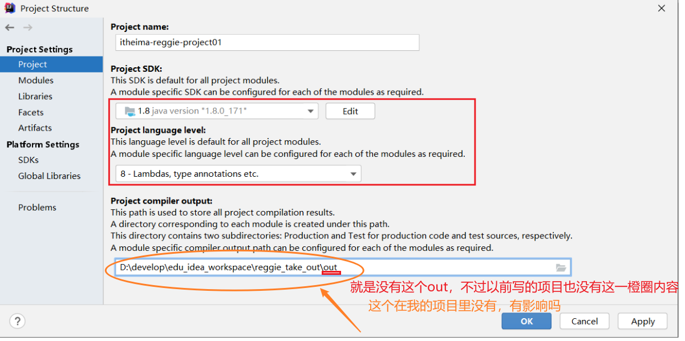

## 开发环境搭建

### 1 数据库环境搭建

1.可查看MySQL卸载、安装与使用文档。

2.涉及的mysql驱动位置如下


### 2数据库表导入

项目的数据库创建好了之后, 可以直接将 资料/数据模型/db_reggie.sql 直接导入到数据库中, 也可以通过两种方式实现:

**1).图形界面**


2).命令行==（注意以管理员身份运行）==

```
1.
C:\Windows\system32>mysql -uroot -proot
......
2.
mysql> create database reggie;
Query OK, 1 row affected (0.00 sec)
3.
mysql> use reggie;
Database changed
4.
mysql> source D:\code\JavaWeb\JavaWeb2023y\db_reggie.sql
```


## Maven项目搭建

### 1.创建maven项目

1.1检查项目编码（UTF-8）

1.2检查maven配置（maven资源路径）

1.3检查JDK版本



1.4在idea中创建maven project

### 2.搭建基础环境

编写pom.xml和application.yml配置文件，编写启动类

```java
import lombok.extern.slf4j.Slf4j;
import org.springframework.boot.SpringApplication;
import org.springframework.boot.autoconfigure.SpringBootApplication;

@Slf4j
@SpringBootApplication
public class ReggieApplication {
    public static void main(String[] args) {
        SpringApplication.run(ReggieApplication.class,args);
        log.info("项目启动成功...");
    }
}
```


#### 问题1：application.yml

大小驼峰

```
mybatis-plus:
  configuration:
    # 在映射实体或者属性时，将数据库中表名和字段名中的下划线去掉，按照驼峰命名法映射
    #address_book==>AddressBook is_deleted==>idDeleted
    map-underscore-to-camel-case: true
```

雪花算法

```
global-config:
    db-config:
      # 主键生成策略全局设置，用到了雪花算法
      id-type: ASSIGN_ID
```


### 3.上传到git仓库

create--add--commit（添加仓库地址）--push


### 4.前端静态资源导入

```
添加静态资源到项目中
方式一：【后续使用会有问题】
1.1：直接在resources目录下创建static目录  将静态资源放入static目录中即可   
原理：
	就是SpringBoot自动配置，因为SpringBoot自动做了静态资源处理  
	如果发现你请求的是静态资源 会自动的去到static目录下找对应的资源
不推荐原因：
如果后面还需要对SpringMVC做配置修改，则会导致SpringBoot中关于SpringMVC的一些自动配置失效  就会导致访问404	

访问路径：
localhost:8080/backend/page/login/login.html
```

#### 问题1：springboot和springmvc

```java
2.1：直接将静态资源放到resources目录下 【此时当你访问静态资源时SpringBoot并不知道去哪里找】 
2.2：配置静态资源映射处理  告诉静态资源请求 去哪里找到对应的资源
	@Slf4j
	@Configuration
	public class WebMvcConfig extends WebMvcConfigurationSupport {
	//配置静态资源映射
	@Override
	protected void addResourceHandlers(ResourceHandlerRegistry registry) {
	//log对象是Lombok中的内置对象可以直接使用 前提：1.类上打上@Slf4j 2.idea安装Lombok插件
	log.info("开启静态资源映射...");
	//将静态资源编译到target的class下					registry.addResourceHandler("/backend/**").addResourceLocations("classpath:/backend/");
						registry.addResourceHandler("/front/**").addResourceLocations("classpath:/front/");
					}
				}
```

