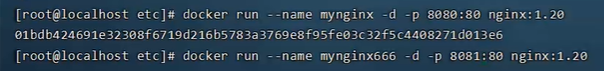
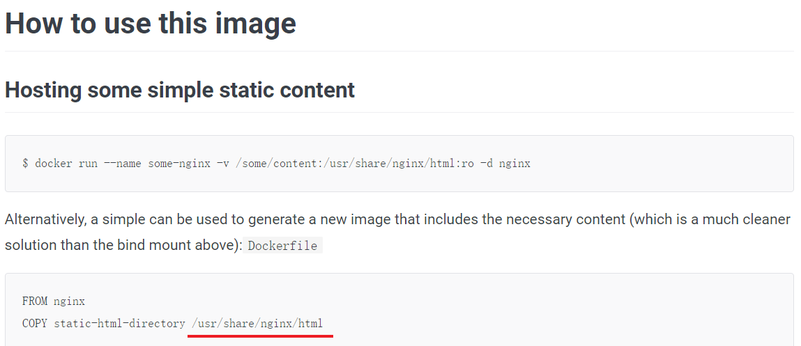
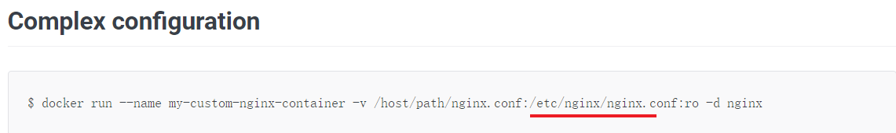
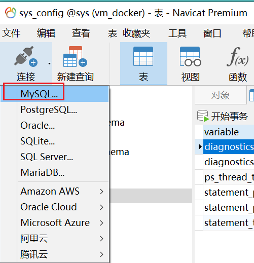
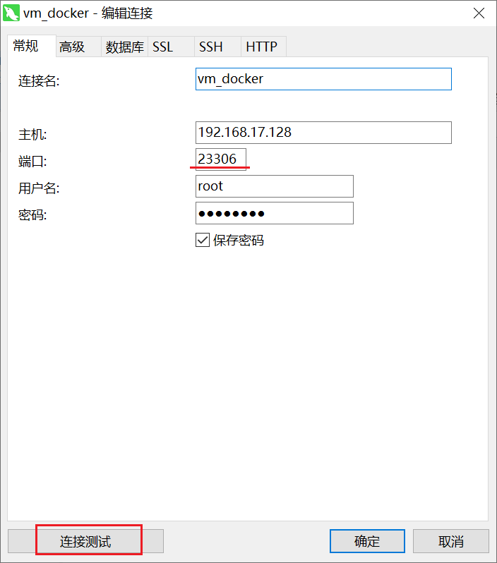
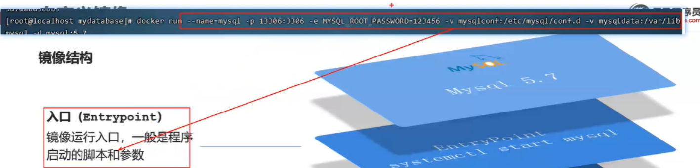

### 1.Docker知识点

[(4条消息) Docker容器数据卷详解_Code0cean的博客-CSDN博客_docker 数据卷](https://blog.csdn.net/huangjhai/article/details/119860628)

#### 1.同一台服务器里的两个容器内部端口号相同，却不会起冲突

原因：

两个容器的镜像各自有操作系统，因此不会占用最外面的操作系统，不会影响最外层操作系统的端口进程。

Docker将用户程序与所需要调用的系统(比如Ubuntu)函数库一起打包，形成可移植镜像。

lDocker运行到不同操作系统时，直接基于打包的库函数，借助于操作系统的Linux内核来运行

但是！1015 11:45 的时候又说端口号不能相同，会起冲突



#### 2.什么是镜像？

答：将应用程序及其依赖、函数库、配置打包在一起，形成镜像


#### 3.什么是容器？

答：镜像运行起来就是容器，一个镜像可以运行多个容器，每个容器就是一个进程，容器之间相互隔离


#### 4.Nginx在Linux中的操作命令

Ctrl+C：查看日志时退出

exit：进入容器后退出

```
镜像：
docker pull mynginx:1.20  拉取

docker images  查看拉取到的镜像

docker save --help  查看相关命令

docker save -o [保存的目标文件名称] [镜像名称]

docker load -i mynginx.tar  解压安装nginx镜像

docker rmi mynginx:1.20  删除镜像


容器：
docker run --name containerName -p 8080:80 -d nginx  运行

docker stop containerName/（或者id） 停止运行

docker start containerName/（或者id）让一个停止的容器再次运行

docker ps -a  查看正在运行或已停止的容器

docker ps -a -q  查看所有容器id

docker logs -f nginxkkk  查看容器日志

退出日志 exit

docker rm Id号  删除id所属的容器

docker rm `docker ps -a -q`  删除所有容器

docker exec -it mynginx /bin/bash  进入nginx容器内部查看目录（除了容器名，其他固定）
或者：docker exec -it mynginx bash
```


##### 补充1：创建并运行nginx容器的命令：

http://192.168.17.128:8080

```sh
docker run --name containerName -p 8080:80 -d nginx
```

命令解读：

- docker run ：创建并运行一个容器
- --name : 给容器起一个名字，比如叫做mn，随意
- -p ：将宿主机端口与容器端口映射，冒号左侧是宿主机端口（随意），右侧是容器端口
- -d：后台运行容器
- nginx：镜像名称，例如nginx


##### 补充2进入容器修改index.html的内容：

1）进入容器。进入我们刚刚创建的nginx容器的命令为：

```sh
docker exec -it mn bash
```

命令解读：

- docker exec ：进入容器内部，执行一个命令
- -it : 给当前进入的容器创建一个标准输入、输出终端，允许我们与容器交互
- mn ：要进入的容器的名称
- bash：进入容器后执行的命令，bash是一个linux终端交互命令

2）进入html目录，可pwd查看当前所在绝对路径

```
cd /usr/share/nginx/html/
```

3）修改index.html的内容

容器内没有vi命令，无法直接修改，我们用下面的命令来修改：将标题的Welcome to nginx修改成传智教育欢迎您

```sh
sed -i -e 's#Welcome to nginx#传智教育欢迎您#g' -e 's#<head>#<head><meta charset="utf-8">#g' index.html
```


#### 5.什么是宿主机？

  宿主机就是主机，这个概念是相对于子机而言的，比如你安装有虚拟机的话，那么相对于虚拟机而言，你正在使用的计算机就是宿主机，虚拟机是安装在主机上的，必须在主机上才能运行，主机就是一个“宿主”。


#### 6.进入nginx容器内部查看目录

```
docker exec -it mynginx /bin/bash
```

##### 6.1查看nginx的html文件

先在官网查看，然后cd XXX

[nginx - Official Image | Docker Hub](https://hub.docker.com/_/nginx)

```
cd /usr/share/nginx/html
```




##### 6.2.查看nginx配置

```
cd /etc/nginx/
```




#### 7.运行redis

```
docker run --name redis -p 6379:6379 -d redis:5.0.2 redis-server --appendonly yes
```

后面的redis-server --appendonly yes也可以不加，这后段的意思是数据持久化


#### 8.数据卷操作的基本语法如下：

```sh
docker volume [COMMAND]
```

docker volume命令是数据卷操作，根据命令后跟随的command来确定下一步的操作：

- create 创建一个volume
- inspect 显示一个或多个volume的信息
- ls 列出所有的volume
- prune 删除未使用的volume
- rm 删除一个或多个指定的volume

操作步骤：

```
docker ps -a
先把容器删掉
docker rm -f nginxkkk

运行容器并创建目录映射
docker run --name nginxqqq -v html:/usr/share/nginx/html -p 8080:80 -d nginx:1.20
创建数据卷html，跟容器内目录建立关系:/usr/share/nginx/html

查看html所在目录
docker volume inspect html

进入目录
cd /var/lib/docker/volumes/html/_data

查看
ls

#即可看到多了如下两个本不存在的文件
#50x.html  index.html

修改文件
vi index.html
```


```
数据卷虚拟目录：
/usr/share/nginx/html

真实存在的目录（访问修改用这个目录）：
/var/lib/docker/volumes/html/_data
```


#### 9.创建并运行一个MySQL容器，**目录**挂载

##### 9.1在虚拟机中创建并运行一个MySQL容器

```sh
# 1.创建mysql.cnf文件，且内容为[mysql]，&&是且的意思
#mkdir mysql新建文件mysql，echo（回波）用于字符串的输出，注意这一步是必须的，否则后面新建的只是目录
[root@localhost ~]#mkdir mysql && echo [mysql] > mysql/mysql.cnf

#无关紧要步骤
[root@localhost ~]# ls
mynginx.tar mysql
#查看mysql.cnf里的内容
[root@localhost mysql]# more mysql.cnf
[mysql]

# 2.使用直接挂载的方式来创建mysql容器，-e是环境的意思
#-v /root/mysql/mysql.cnf:/etc/mysql/conf.d/mysql.cnf 是 映射容器的文件
#宿主机下的/root/mysql/mysql.cnf与容器里的/etc/mysql/conf.d/mysql.cnf做映射
#-v /root/mysql/data:/var/lib/mysql
#映射宿主机下的/root/mysql目录与容器里的/var/lib/mysql
[root@localhost mysql]# docker run -di --name=mysql2 -e MYSQL_ROOT_PASSWORD=123456 -p 23306:3306 \
> -v /root/mysql/mysql.cnf:/etc/mysql/conf.d/mysql.cnf \
> -v /root/mysql/data:/var/lib/mysql \
> mysql:5.7

```


##### 9.2连接Navicat

第一步



第二步，记得点击测试连接




第三步，点击左栏新建的项目vm_docker即可连接成功


##### 9.3数据卷挂载

```sh
mysql容器中的数据文件
/var/lib/mysql
mysql容器的配置文件
/etc/mysql/conf.d

#使用卷挂载，这一步可不用
docker volume create mysqlconf
docker volume create mysqldata

# 只这一步就行：创建mysql容器
[root@localhost ~]# docker run --name=mysql -p 13306:3306 \
> -e MYSQL_ROOT_PASSWORD=123456 \
> -v mysqlconf:/etc/mysql/conf.d \
> -v mysqldata:/var/lib/mysql \
> -d mysql:5.7

```

```sh
#在上一步是基础上查看相关信息，涉及
[root@localhost ~]# ls
mynginx.tar  mysql
#查看镜像
[root@localhost ~]# docker volume ls
DRIVER    VOLUME NAME
local     223ead06b259d40444a199b0fdf3f6c182f60857bc4bfec6c28539952fd7731e
local     html
local     html2
local     mysqlconf
local     mysqldata
[root@localhost ~]# docker volume inspect mysqlconf
[
    {
        "CreatedAt": "2022-10-29T17:48:28+08:00",
        "Driver": "local",
        "Labels": null,
        "Mountpoint": "/var/lib/docker/volumes/mysqlconf/_data",
        "Name": "mysqlconf",
        "Options": null,
        "Scope": "local"
    }
]
[root@localhost ~]# cd /var/lib/docker/volumes/mysqlconf/_data
[root@localhost _data]# ls
docker.cnf  mysql.cnf  mysqldump.cnf
[root@localhost _data]# docker volume inspect mysqldata
[
    {
        "CreatedAt": "2022-10-29T17:48:52+08:00",
        "Driver": "local",
        "Labels": null,
        "Mountpoint": "/var/lib/docker/volumes/mysqldata/_data",
        "Name": "mysqldata",
        "Options": null,
        "Scope": "local"
    }
]

[root@localhost _data]# cd /var/lib/docker/volumes/mysqldata/_data
#注意此时有数据库中的mysql、performance_schema、sys（可去Navicat看）
[root@localhost _data]# ls
auto.cnf    client-cert.pem  ibdata1      ibtmp1              private_key.pem  server-key.pem
ca-key.pem  client-key.pem   ib_logfile0  mysql               public_key.pem   sys
ca.pem      ib_buffer_pool   ib_logfile1  performance_schema  server-cert.pem
#注意此时有数据库中加多了mydatabase1库（此步需先在Navicat中创建库、表、列表）
[root@localhost _data]# ls
auto.cnf    client-cert.pem  ibdata1      ibtmp1       performance_schema  server-cert.pem
ca-key.pem  client-key.pem   ib_logfile0  mydatabase1  private_key.pem     server-key.pem
ca.pem      ib_buffer_pool   ib_logfile1  mysql        public_key.pem      sys
[root@localhost _data]# cd mydatabase1/
#userinfo111是新建的表名
[root@localhost mydatabase1]# ls
db.opt  userinfo111.frm  userinfo111.ibd

```

Docker应用需要用到各种端口，逐一去修改防火墙设置。非常麻烦，因此建议大家直接关闭防火墙！

启动docker前，一定要关闭防火墙后！！

```sh
# 关闭
systemctl stop firewalld
# 禁止开机启动防火墙
systemctl disable firewalld

systemctl start docker  # 启动docker服务
systemctl stop docker  # 停止docker服务
systemctl restart docker  # 重启docker服务

#出现问题
[root@localhost ~]# docker run --name nginxxx -p 8080:80 -d nginx:1.20
WARNING: IPv4 forwarding is disabled. Networking will not work.
#解决，但是好像不太成功
[root@localhost ~]# systemctl stop firewalld
[root@localhost ~]# systemctl disable firewalld
[root@localhost ~]# systemctl start docker
[root@localhost ~]# docker run --name nginxxx -p 8080:80 -d nginx:1.20
```


#### 10.自定义镜像




##### 10.1本地测试

```
在docker-demo.jar的目录下cmd再：
java -jar docker-demo.jar
```

本地路径：

[localhost:8090/hello/count](http://localhost:8090/hello/count)


##### 10.2docker中自定义镜像

Dockerfile    构建镜像所需要的脚本文件
jdk8.tar.gz    jdk环境
centos7.tar  基本镜像环境
docker-demo.jar  项目

```sh
[root@localhost ~]# pwd
/root

#第一步：新建docker-demo文件
[root@localhost ~]# mkdir docker-demo

[root@localhost ~]# ls
docker-demo  mynginx.tar  mysql

#第二步：进入docker-demo目录
[root@localhost ~]# cd docker-demo/
[root@localhost docker-demo]# pwd
/root/docker-demo

#第三步：拷贝课前资料中的docker-demo.jar、jdk8.tar.gz、Dockerfile、centos7.tar文件到docker-demo这个目录

#第四步：启动centos7.tar
[root@localhost docker-demo]# docker load -i centos7.tar 
174f56854903: Loading layer  211.7MB/211.7MB
Loaded image: centos:7
[root@localhost docker-demo]# ls
centos7.tar  docker-demo.jar  Dockerfile  jdk8.tar.gz

#补充：修改Dockerfile的 指定基础镜像
[root@localhost docker-demo]# more Dockerfile
# 指定基础镜像，注意这个需要改
FROM centos:7
...

#第五步：构建镜像
#注意-t 名称后要空格+.  注意. 。点的意思代表去查找Dockerfile脚本文件
[root@localhost docker-demo]# docker build -t javaweb:1.0 .
Sending build context to Docker daemon  422.8MB
Step 1/9 : FROM centos:7
...

#第六步：使用docker run创建容器并运行
docker run -di --name=myweb -p 8090:8090 javaweb:1.0
下面10.3是记录问题
```

访问路径：

http:192.168.17.128:8090/hello/count


##### 10.3问题：运行自定义的镜像，却提示IPV4已禁用

```sh
[root@localhost docker-demo]# docker run -di --name=myweb -p 8090:8090 javaweb:1.0
WARNING: IPv4 forwarding is disabled. Networking will not work.
9e3ac671f3a8554e2b6ac59a18b852b23a288c1aedec918c41f6308feb4ec727
docker: Error response from daemon: driver failed programming external connectivity on endpoint myweb (e46b6d2f1dc6d553713cc9e2e3701da961f96f1903710fe6fc572b1bd2e9cfdb):  (iptables failed: iptables --wait -t nat -A DOCKER -p tcp -d 0/0 --dport 8090 -j DNAT --to-destination 172.17.0.5:8090 ! -i docker0: iptables: No chain/target/match by that name.
 (exit status 1)).
[root@localhost docker-demo]# docker ps -a
CONTAINER ID   IMAGE         COMMAND                  CREATED          STATUS                      PORTS                                                    NAMES
9e3ac671f3a8   javaweb:1.0   "/bin/sh -c 'java -j…"   33 seconds ago   Created                                                                              myweb
b6b38fff36a5   nginx:1.20    "/docker-entrypoint.…"   2 hours ago      Created                                                                              nginxxx
077b236fb959   nginx:1.20    "/docker-entrypoint.…"   2 hours ago      Up 2 hours                  0.0.0.0:8080->80/tcp, :::8080->80/tcp                    nginx2333
a2fc9c4d2f57   mysql:5.7     "docker-entrypoint.s…"   4 hours ago      Up 4 hours                  33060/tcp, 0.0.0.0:13306->3306/tcp, :::13306->3306/tcp   mysql
6890d0305fa7   mysql:5.7     "docker-entrypoint.s…"   7 hours ago      Up 7 hours                  33060/tcp, 0.0.0.0:23306->3306/tcp, :::23306->3306/tcp   mysql2
7c34b9271bee   redis:5.0.2   "docker-entrypoint.s…"   6 days ago       Exited (255) 30 hours ago   0.0.0.0:6379->6379/tcp, :::6379->6379/tcp                redis

```


最后用的方法，

```sh
[root@localhost docker-demo]# docker run -di --name=myweb -p 8090:8090 javaweb:1.0
WARNING: IPv4 forwarding is disabled. Networking will not work.
9e3ac671f3a8554e2b6ac59a18b852b23a288c1aedec918c41f6308feb4ec727
docker: Error response from daemon: driver failed programming external connectivity on endpoint myweb (e46b6d2f1dc6d553713cc9e2e3701da961f96f1903710fe6fc572b1bd2e9cfdb):  (iptables failed: iptables --wait -t nat -A DOCKER -p tcp -d 0/0 --dport 8090 -j DNAT --to-destination 172.17.0.5:8090 ! -i docker0: iptables: No chain/target/match by that name.
 (exit status 1)).

```


```sh
[root@localhost docker-demo]# systemctl stop firewalld
[root@localhost docker-demo]# docker ps -a
CONTAINER ID   IMAGE         COMMAND                  CREATED         STATUS                      PORTS                                                    NAMES
9e3ac671f3a8   javaweb:1.0   "/bin/sh -c 'java -j…"   3 minutes ago   Created                                                                              myweb
b6b38fff36a5   nginx:1.20    "/docker-entrypoint.…"   2 hours ago     Created                                                                              nginxxx
077b236fb959   nginx:1.20    "/docker-entrypoint.…"   2 hours ago     Up 2 hours                  0.0.0.0:8080->80/tcp, :::8080->80/tcp                    nginx2333
a2fc9c4d2f57   mysql:5.7     "docker-entrypoint.s…"   4 hours ago     Up 4 hours                  33060/tcp, 0.0.0.0:13306->3306/tcp, :::13306->3306/tcp   mysql
6890d0305fa7   mysql:5.7     "docker-entrypoint.s…"   7 hours ago     Up 7 hours                  33060/tcp, 0.0.0.0:23306->3306/tcp, :::23306->3306/tcp   mysql2
7c34b9271bee   redis:5.0.2   "docker-entrypoint.s…"   6 days ago      Exited (255) 30 hours ago   0.0.0.0:6379->6379/tcp, :::6379->6379/tcp                redis
[root@localhost docker-demo]# systemctl disable firewalld
[root@localhost docker-demo]# docker ps -a
CONTAINER ID   IMAGE         COMMAND                  CREATED         STATUS                      PORTS                                                    NAMES
9e3ac671f3a8   javaweb:1.0   "/bin/sh -c 'java -j…"   4 minutes ago   Created                                                                              myweb
b6b38fff36a5   nginx:1.20    "/docker-entrypoint.…"   2 hours ago     Created                                                                              nginxxx
077b236fb959   nginx:1.20    "/docker-entrypoint.…"   2 hours ago     Up 2 hours                  0.0.0.0:8080->80/tcp, :::8080->80/tcp                    nginx2333
a2fc9c4d2f57   mysql:5.7     "docker-entrypoint.s…"   4 hours ago     Up 4 hours                  33060/tcp, 0.0.0.0:13306->3306/tcp, :::13306->3306/tcp   mysql
6890d0305fa7   mysql:5.7     "docker-entrypoint.s…"   7 hours ago     Up 7 hours                  33060/tcp, 0.0.0.0:23306->3306/tcp, :::23306->3306/tcp   mysql2
7c34b9271bee   redis:5.0.2   "docker-entrypoint.s…"   6 days ago      Exited (255) 30 hours ago   0.0.0.0:6379->6379/tcp, :::6379->6379/tcp                redis
[root@localhost docker-demo]# systemctl restart docker
[root@localhost docker-demo]# docker ps -a
CONTAINER ID   IMAGE         COMMAND                  CREATED         STATUS                      PORTS                                       NAMES
9e3ac671f3a8   javaweb:1.0   "/bin/sh -c 'java -j…"   4 minutes ago   Created                                                                 myweb
b6b38fff36a5   nginx:1.20    "/docker-entrypoint.…"   2 hours ago     Created                                                                 nginxxx
077b236fb959   nginx:1.20    "/docker-entrypoint.…"   2 hours ago     Exited (0) 12 seconds ago                                               nginx2333
a2fc9c4d2f57   mysql:5.7     "docker-entrypoint.s…"   4 hours ago     Exited (0) 10 seconds ago                                               mysql
6890d0305fa7   mysql:5.7     "docker-entrypoint.s…"   7 hours ago     Exited (0) 10 seconds ago                                               mysql2
7c34b9271bee   redis:5.0.2   "docker-entrypoint.s…"   6 days ago      Exited (255) 30 hours ago   0.0.0.0:6379->6379/tcp, :::6379->6379/tcp   redis
[root@localhost docker-demo]# docker run -di --name=myweb -p 8090:8090 javaweb:1.0
docker: Error response from daemon: Conflict. The container name "/myweb" is already in use by container "9e3ac671f3a8554e2b6ac59a18b852b23a288c1aedec918c41f6308feb4ec727". You have to remove (or rename) that container to be able to reuse that name.
See 'docker run --help'.

```


```sh
[root@localhost docker-demo]# docker stop 9e3ac671f3a8
9e3ac671f3a8
[root@localhost docker-demo]# docker rm 9e3ac671f3a8
9e3ac671f3a8
[root@localhost docker-demo]# docker ps -a
CONTAINER ID   IMAGE         COMMAND                  CREATED       STATUS                      PORTS                                       NAMES
b6b38fff36a5   nginx:1.20    "/docker-entrypoint.…"   2 hours ago   Created                                                                 nginxxx
077b236fb959   nginx:1.20    "/docker-entrypoint.…"   2 hours ago   Exited (0) 5 minutes ago                                                nginx2333
a2fc9c4d2f57   mysql:5.7     "docker-entrypoint.s…"   4 hours ago   Exited (0) 5 minutes ago                                                mysql
6890d0305fa7   mysql:5.7     "docker-entrypoint.s…"   7 hours ago   Exited (0) 5 minutes ago                                                mysql2
7c34b9271bee   redis:5.0.2   "docker-entrypoint.s…"   6 days ago    Exited (255) 30 hours ago   0.0.0.0:6379->6379/tcp, :::6379->6379/tcp   redis
[root@localhost docker-demo]# docker run -di --name=myweb -p 8090:8090 javaweb:1.0
34c128c07df45568f0ff84aba422296522fe99d8091903d68e88a79db8a6c190

```


#### 11.基于java8构建Java项目

构建java项目的镜像，可以在已经准备了JDK的基础镜像基础上构建。

需求：基于java:8-alpine镜像，将一个Java项目构建为镜像

实现思路如下：

​        0检查有没有java:8，如果没有就

```
docker pull java:8-alpine
```

- ① 新建一个空的目录，然后在目录中新建一个文件，命名为Dockerfile

- ② 拷贝课前资料提供的docker-demo.jar到这个目录中

- ③ 编写Dockerfile文件：

  - a ）基于java:8-alpine作为基础镜像

  - b ）将app.jar拷贝到镜像中

  - c ）暴露端口

  - d ）编写入口ENTRYPOINT

    内容如下：

    ```dockerfile
    FROM java:8-alpine
    COPY ./app.jar /tmp/app.jar
    EXPOSE 8090
    ENTRYPOINT java -jar /tmp/app.jar
    ```

    

- ④ 使用docker build命令构建镜像

- ⑤ 使用docker run创建容器并运行


#### 12.通过指令定义集群中的每个容器运行

```sh
version: "3.5"
services:
  nacos:
    image: nacos/nacos-server:1.4.1  这一步需要此前下载好了nacos镜像
    container_name: nacos            自定义容器名
    ports:                           端口号
      - 8848:8848
    environment:
      - MODE=standalone              有单机和集群两种方式，此时是单机
      - JVM_XMS=512m                 运行时所需要的内存，一般一个G，但是现在这样也可以
      - JVM_XMX=512m
      - JVM_XMN=256m
  web:                               自定义容器名
    build: .                         自己找到Dockerfile脚本文件启动
    ports:
      - 8090:8090
```


```sh
#删除文件（无关步骤）
rm -f dockeraa.yml 

#正式开始
[root@localhost docker-demo]# ls
centos7.tar  docker-demo.jar  Dockerfile  jdk8.tar.gz
#1.进入yml文件，并编写内容，如果该文件不存在会自动生成
[root@localhost docker-demo]# vi docker-compose.yml

#2.复制粘贴如下
version: "3.5"
services:
  nacos:
    image: nacos/nacos-server:1.4.1
    container_name: nacos
    ports:
      - 8848:8848
    environment:
      - MODE=standalone
      - JVM_XMS=512m
      - JVM_XMX=512m
      - JVM_XMN=256m
  web:
    build: .
    ports:
      - 8090:8090
#可查看yml文件内容
[root@localhost docker-demo]# more docker-compose.yml
#关闭其他容器
[root@localhost docker-demo]# docker rm `docker ps -a -q`
c8d883f4e78c

#3.后台运行docker-compose，-d的意思是不霸屏启动
[root@localhost docker-demo]# docker-compose up -d
Creating network "dockerdemo_default" with the default driver
...
Creating nacos ... done
Creating dockerdemo_web_1   ... done

```

