#### 1.REST

[REST](https://baike.baidu.com/item/REST/6330506?fromModule=lemma_inlink)（英文：**Representational State Transfer**，简称REST）描述了一个架构样式的网络系统，比如 web 应用程序。

REST 指的是一组架构[约束条件](https://baike.baidu.com/item/约束条件?fromModule=lemma_inlink)和原则。满足这些约束条件和原则的应用程序或设计就是 RESTful。


#### 2.SpringCloud

SpringCloud是目前国内使用最广泛的微服务技术栈。官网地址：https://spring.io/projects/spring-cloud。

SpringCloud集成了各种微服务功能组件，并**基于SpringBoot**实现了这些组件的自动装配，从而提供了良好的开箱即用体验:


#### 3.RestTemplate

RestTemplate 是spring家族中一款基于http协议的组件(HttpURLConnection)，他的作用就是：用来实现基于http的协议方式的服务之间的通信（也就是远程服务调用）。

RestTemplate 采用同步方式执行 HTTP 请求，底层使用 JDK 原生 HttpURLConnection API 。

#概念总结:RestTemplate是spring提供的一个用来模拟浏览器发送请求和接收响应的一个类,它能基于Http协议实现远程调用。


#### 4.细粒度

粒度运算是一种新兴的信息处理运算模型。它涉及到复杂信息实体（即信息粒，英语：Information Granule）的处理，包括数据的抽象化还有从信息推导知识的过程。一般来说，信息粒通常是数值层面上的实体集合，它们以相似性、功能的近似性、不可辨别性及一致性等指标来进行整合。

目前，粒度运算只有较多的理论观点而尚未形成一套完整的方法。从理论观点看，它提倡通过不同的分辨率或尺度，对数据中出现的知识进行认知以及探索。

在这个意义上来讲，粒度运算包含了所有能够在提取及表示知识或信息的尺度中，提供灵活性和适应性的所有方法。


#### 5.服务拆分粒度如何？（注意事项）

不同微服务，不要重复开发相同业务
微服务数据独立，不要访问其它微服务的数据库
微服务可以将自己的业务暴露为接口，供其它微服务调用


#### 6.如何使用RestTemplate?

答：

```
第一步：注册RestTemplate
    @Bean
    public RestTemplate restTemplate(){
        return new RestTemplate();
    }

第二步：注入RestTemplate
    @Autowired
    private RestTemplate restTemplate;
    
    
第三步：调用api发送http请求
    String url = "http://localhost:18081/user/"+orderInfo.getUserId();
    User user = restTemplate.getForObject(url, User.class);
```


#### 7.负载均衡是什么

负载均衡是一项基本的网络服务，主要是为了解决公司业务的并发压力，增强网络处理能力，减轻单个设备的资源压力，提高整体服务性能。


总是提到负载均衡，它的作用是什么？

客户端的流量将首先到达负载均衡服务器。负载均衡服务器通过某种调度算法将流量分配到不同的应用程序服务器。同时，负载均衡服务器还将在应用程序服务器上执行定期运行状况检查。当发现故障节点时，它将动态从应用程序服务器群集中删除节点，以确保应用程序的高可用性。


#### 8.idea快捷键

Ctrl+R：替换

Ctrl+Alt+L：格式化

Ctrl+Shift+A：全局搜索


#### 9.新建注册中心-搭建EurekaServer

1.pom.xml引入依赖

创建项目`itheima-eurekaserver`，引入`spring-cloud-starter-netflix-eureka-server`的依赖

2.启动类

创建启动类com.itheima.EurekaServerApp

3.pom.xml

pom.xml文件介绍

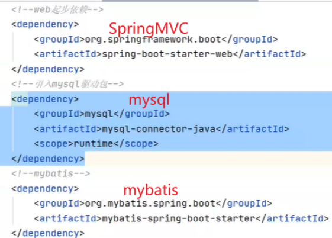


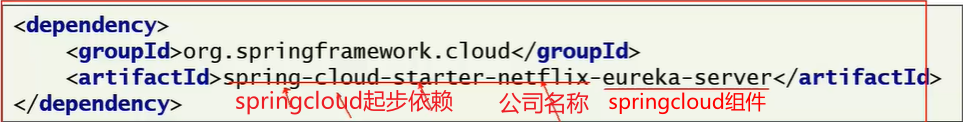


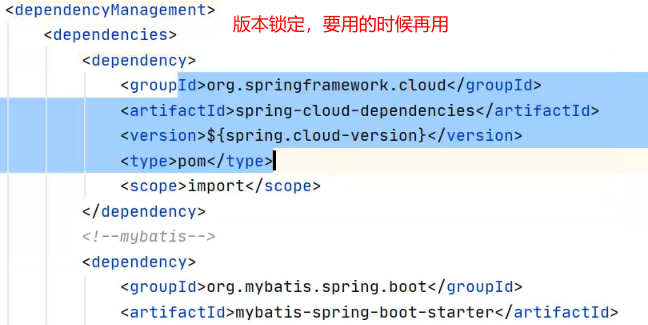

新建模块

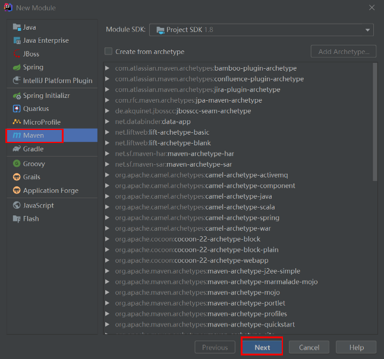


4.访问EurekaServer地址http://localhost:8001/

####  

#### 10.@Enable开头的注解都是启动注解


#### 11.服务提供者注册user

消费提供者注册order同样步骤代码

1.pom.xml

在`itheima-user`添加如下依赖：

2.修改application.yml

修改`itheima-user`的`application.yml`，添加如下配置：

```yaml
eureka:
  client:
    service-url:
      # EurekaServer的地址,服务地址,eureka是固定路径
      defaultZone: http://localhost:8001/eureka
  #非必要，不用也可以注册
  instance:
  	#以IP地址注册到服务中心
    prefer-ip-address: true  #如果不加是计算机名Jasper，如果改了是本地ip
    #服务向eureka注册时，注册名默认：“IP名:应用名:应用端口名”
    #现在配置：注册名：应用名:端口:项目版本号 如：itheima-user:18081:1.0-SNAPSHOT
    instance-id: ${spring.application.name}:${server.port}:@project.version@
```

3.启动

http://localhost:8001/

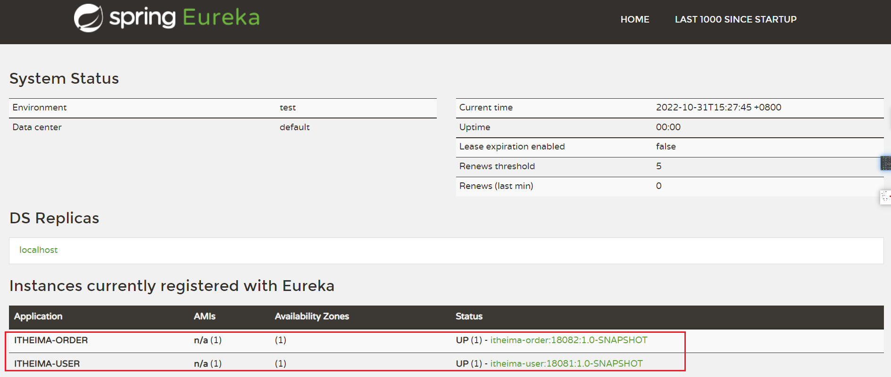


#### 12.在itheima-order完成服务拉取-补充

```
服务拉取是基于服务名称获取服务列表，然后在对服务列表做负载均衡
修改OrderServiceImpl的代码，修改访问的url路径，用服务名代替ip、端口：

//原来：String url="http://localhost:18081/user/"+orderInfo.getUserId();
//用上了eureka，ip与端口改为服务的名称。这个不是实际路径，http://localhost:18081/user/才是
String url="http://itheima-user/user/"+orderInfo.getUserId();
```


#### 12.启动多个服务

1.全部停用

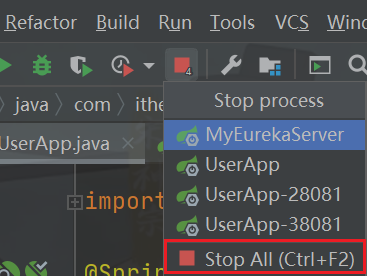

2.结束该服务（看情况，如果停用不成功就用这一操作）

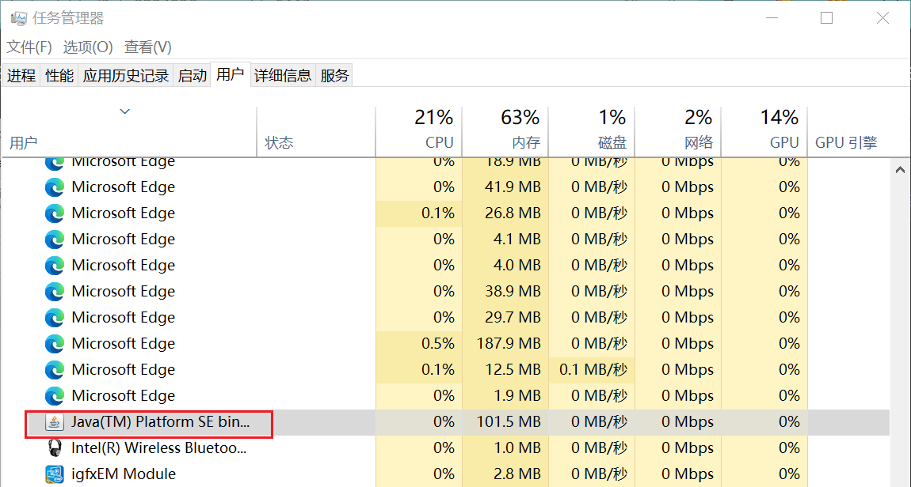


3.

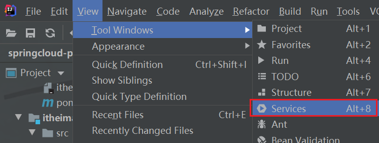


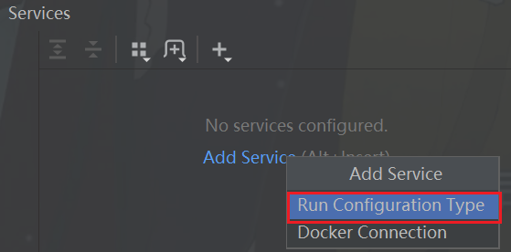


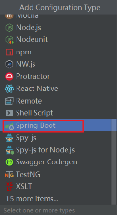


4.先启动MyEurekaServer，再UserApp，接着


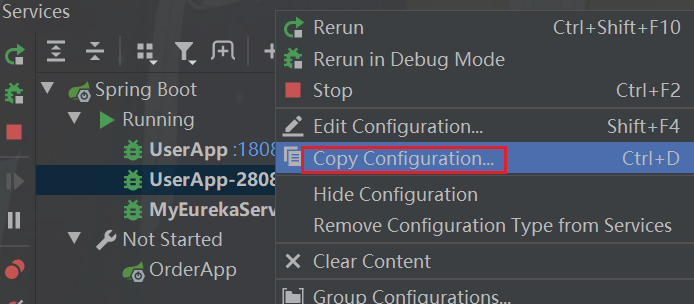


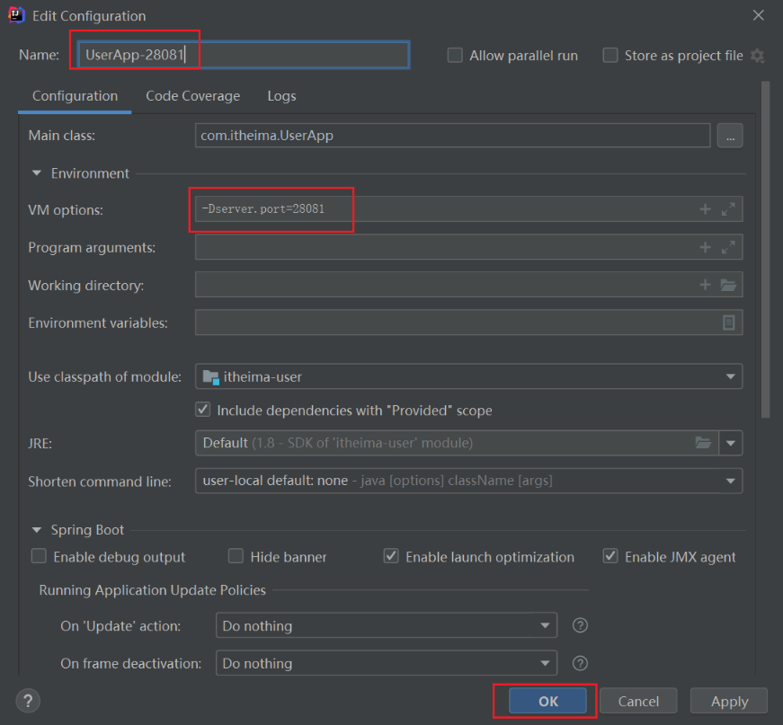


6.启用新复制的user服务，最后启动order服务


#### 13.取出当前微服务的端口

1.取出当前微服务的端口，

```
//取出当前微服务的端口
    @Value("${server.port}")
    private int port;
    
System.out.println("用户微服务，端口"+port+"被调用了...");
```

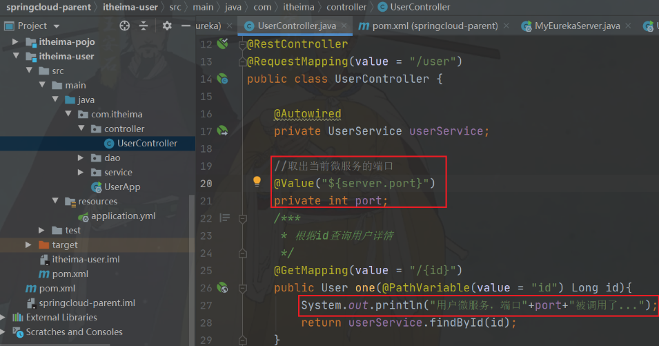


#### 14.@LoadBalanced  //开启负载均衡


#### 15.Ribbon.class


#### 16.负载均衡流程

http://localhost:18082/order/101

##### 1.OrderServiceImpl.java，下断点

在OrderServiceImpl.java中下断点

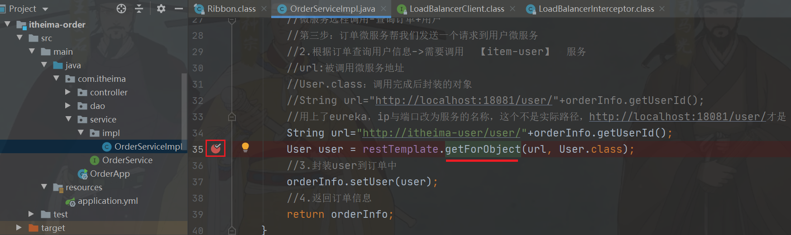

##### 2.LoadBalancerInterceptor.class，下断点，开始Debug

搜索LoadBalancerInterceptor.class，下断点，点击execute进入接口

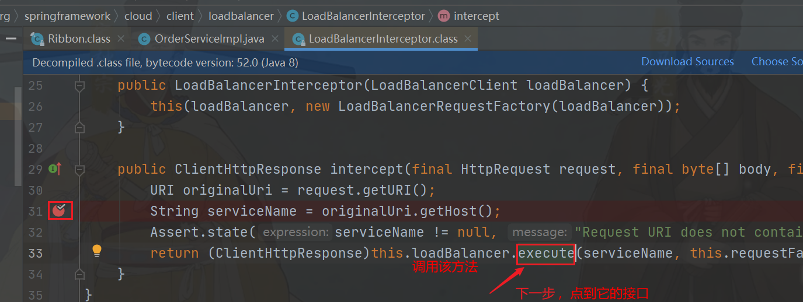

Debug：

1.先启动http://localhost:18082/order/101，接着点击左下角的F9，然后F7

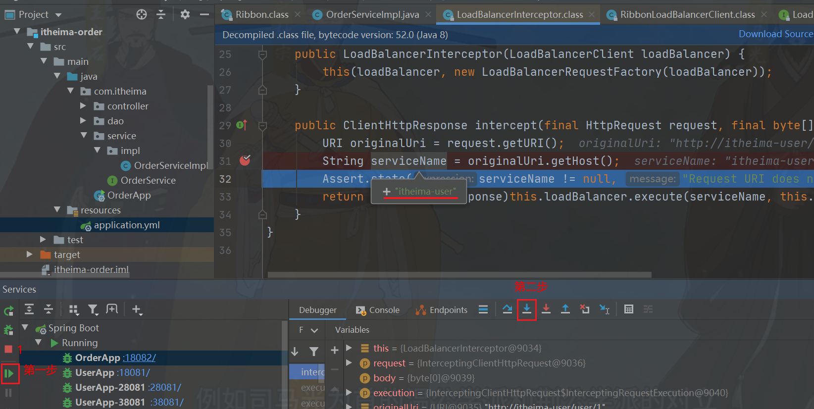


##### 3.RibbonLoadBlancerClient.class，下断点，Debug

进入接口后，点击实现类RibbonLoadBlancerClient.class

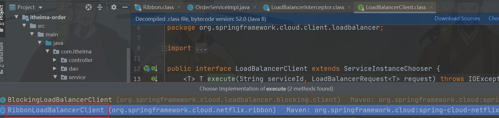

接着点击他的实现方法excute

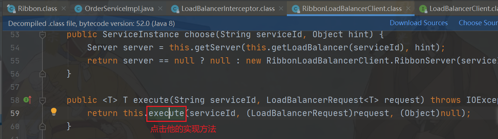

对应流程图就是到达DynamicServerListLoadBalancer（Dynamic动态），得到服务列表

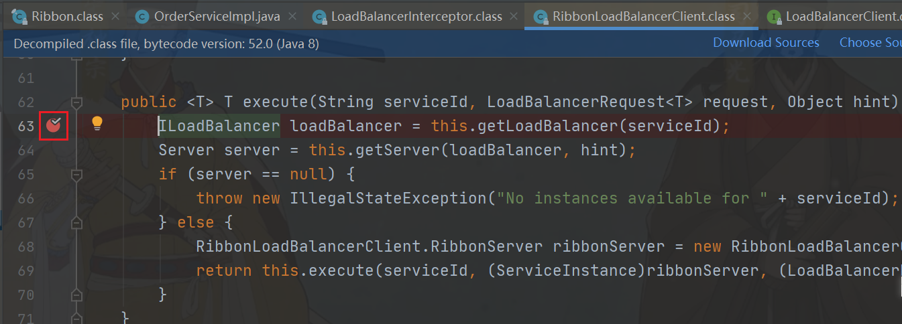

Debug：

1.左下角F9，拿到服务id（服务名）

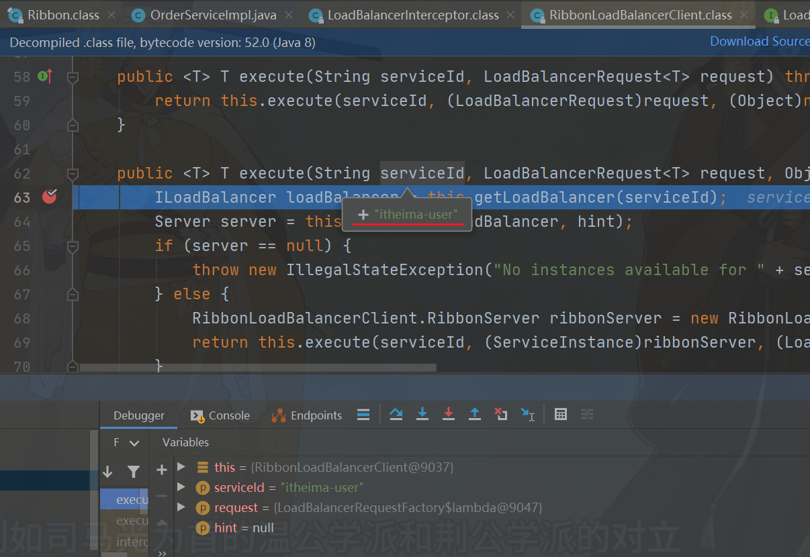


补充知识点：点击查看默认负载均衡策略


2.F8下一步，鼠标放在loadBalance上，获得服务名和服务列表地址。流程图位置为4

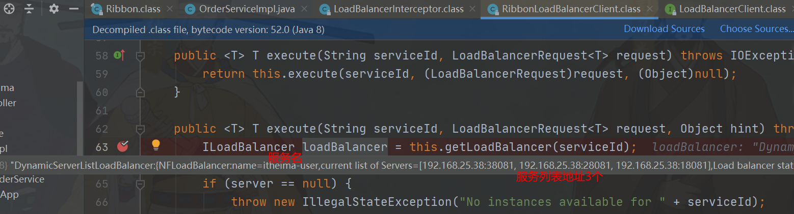

3.F8下一步，鼠标放在server上，显示一个服务列表。此时清空控制台日志，再F8下一步即可看到控制台打印该服务地址。流程图上已经过步骤5。

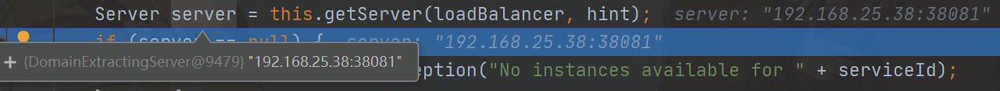

##### 4.URLConnection.java，下断点

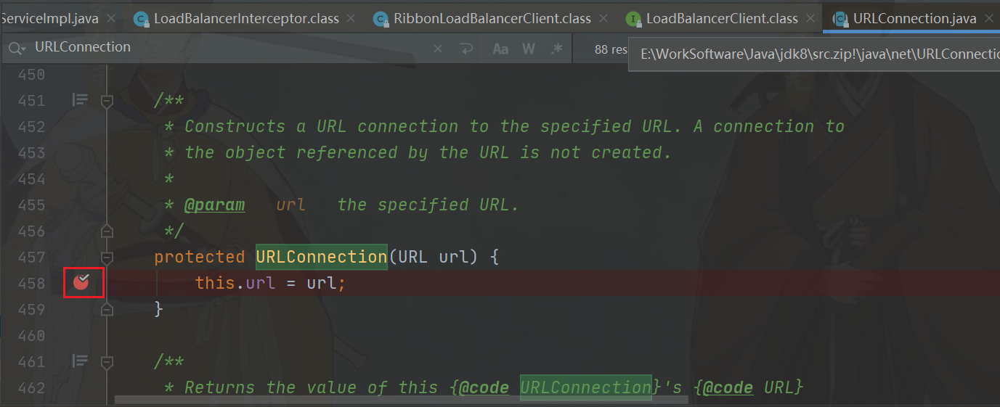

Debug：

F9断点后，流程图到达第7步

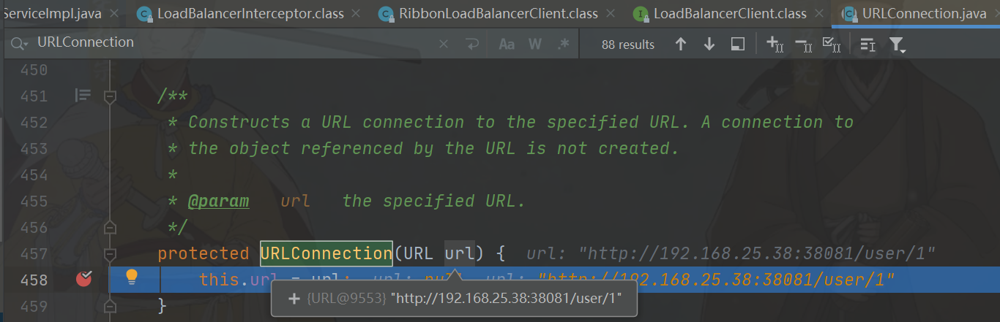


#### 17.Ribbon负载均衡底层原理分析

概念：

Ribbon是基于Http协议请求的客户端负载均衡器，能实现很丰富的负载均衡算法。

场景：
注册中心微服务、多个用户微服务、1个订单微服务
页面发起根据订单id查询订单对象和用户对象请求

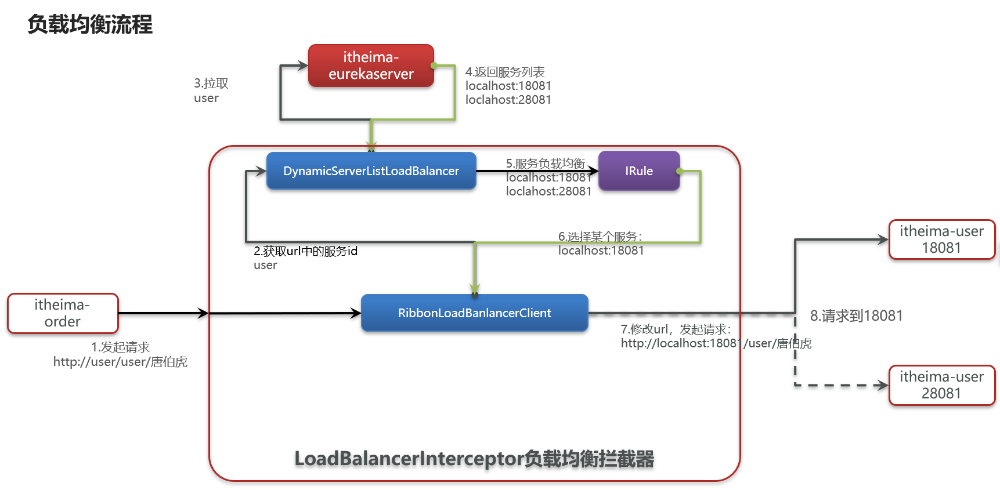

1.页面发起请求进入订单微服务
2.订单微服务要得到用户对象，发起http远程调用请求 http://itheima-user/user/用户id
3.开启Ribbon后，请求会被LoadBalancerInterceptor负载均衡拦截器拦截
4.通过RibbonLoadBanlanceClient获取url中的服务名itheima-user
5.通过DynamicServerListLoadBalnancer动态获取服务列表对象，根据服务名itheima-user连接eureka-server注册微服务，
  得到用户微服务地址列表：192.168.200.1:28081, 192.168.200.1:18081, 192.168.200.1:38081
6.根据Ribbon负载均衡策略（ZoneAvoidanceRule 默认轮询策略）选择一个服务地址，得到一个真实http地址192.168.200.1:38081
7.通过RibbonLoadBanlancerClient发送地址192.168.200.1:38081远程调用请求，调用JDK自带URLConnection(最底层对象)
8.页面就可以得到结果了


