http://heima-admin-java.itheima.net/#/login

#### 1.Ribbon与Nginx负载均衡

1、Nginx是服务器端负载均衡。

    Nginx是客户端所有请求统一交给Nginx，由Nginx进行实现负载均衡请求转发，属于服务器端负载均衡，即请求由Nginx服务器端进行转发。

2、Ribbon是客户端负载均衡。

    Ribbon是Eureka注册中心服务器端上获取服务注册信息服务列表，缓存到JVM本地，然后在本地实现rpc远程调用技术进行调用，轮询负载均衡策略，即在客户端实现负载均衡。


#### 2.为什么使用Gateway网关？

答： 
身份认证和权限校验 
服务路由、负载均衡 ok
请求限流 高级课程

```
Gateway网关入门案例(服务路由、负载均衡)？
服务路由：页面发送请求-网关微服务-通过网关转发请求-用户微服务
第一步：创建网关微服务 引入依赖
<dependencies>
        <!--网关依赖-->
        <dependency>
            <groupId>org.springframework.cloud</groupId>
            <artifactId>spring-cloud-starter-gateway</artifactId>
        </dependency><!--nacos服务发现依赖-->
        <dependency>
            <groupId>com.alibaba.cloud</groupId>
            <artifactId>spring-cloud-starter-alibaba-nacos-discovery</artifactId>
        </dependency>
</dependencies>

第二步：application.yml
注意：保证网关微服务和用户微服务是在同一个环境
#网关入门案例-服务路由第二步 配置（不要死记硬背）
server:
  port: 7001 #网关端口
spring:
  application:
    name: gateway #微服务名称
  cloud:
    nacos:
      server-addr: localhost:8848 #网关微服务注册nacos
      discovery:
        cluster-name: SZ
        namespace: 29d5db8e-4320-495e-9d3e-69be1ce7d725
    #网关路由配置
    gateway:
      #用户路由配置
      routes:
        - id: user-service #路由id 唯一即可
          #uri: http://127.0.0.1:18081 #写死http请求地址
          uri: lb://itheima-user #负载均衡 路由地址 进入网关-网关转到哪里去 被路由微服务一般都是集群
          predicates: #路由断言
            - Path=/user/** #根据页面访问路径匹配Path 如果匹配上，则访问uri

第三步：创建启动类
第四步：测试 先启动用户微服务，再启动网关微服务http://localhost:7001/user/xxx

```


#### 3.Nacos和Eureka注册中心

Nacos是SpringCloudAlibaba的组件，而SpringCloudAlibaba也遵循SpringCloud中定义的服务注册、服务发现规范。因此使用Nacos和使用Eureka对于微服务来说，并没有太大区别。

主要差异在于：

- 依赖不同
- 服务地址不同

Eureka工作原理

```properties
#1：消费者该如何获取服务提供者具体信息？
	服务提供者启动时向eureka注册自己的信息
	eureka保存这些信息
	消费者根据服务名称向eureka拉取提供者信息
	
#2：如果有多个服务提供者，消费者该如何选择？
	服务消费者利用负载均衡算法，从服务列表中挑选一个
	
#3：消费者如何感知服务提供者健康状态？
	服务提供者会每隔30秒向EurekaServer发送心跳请求，报告健康状态
	EurekaServer在90秒内没有接收到某个微服务节点的心跳,EurekaServer将会注销该微服务的节点
	消费者就可以拉取到最新的信息
```

### 

#### 4.RestTemplate和Feign--基于Http协议实现远程调用

```
RestTemplate是spring提供的一个用来模拟浏览器发送请求和接收响应的一个类,它能基于Http协议实现远程调用。

RestTemplate存在下面的问题：
- 代码可读性差，编程体验不统一
- 参数复杂URL难以维护

上面RestTemplate存在的问题可以使用Feign解决，那么什么是Feign？
```

Feign是一个声明式的http客户端，官方地址：https://github.com/OpenFeign/feign
其作用就是帮助我们优雅的实现http请求的发送，解决上面提到的问题。


#### 5.sentinel--保护服务的稳定性

随着微服务的流行，服务和服务之间的稳定性变得越来越重要。Sentinel 以流量为切入点，从流量控制、熔断降级、系统负载保护等多个维度保护服务的稳定性。

Sentinel 分为两个部分:

核心库（Java 客户端）不依赖任何框架/库，能够运行于所有 Java 运行时环境，同时对 Dubbo /Spring Cloud 等框架也有较好的支持。
控制台（Dashboard）基于 Spring Boot 开发，打包后可以直接运行，不需要额外的 Tomcat 等应用容器。
Sentinel 可以简单的分为 Sentinel 核心库和 Dashboard。核心库不依赖Dashboard，但是结合Dashboard 可以取得最好的效果。


#### 6.项目架构图

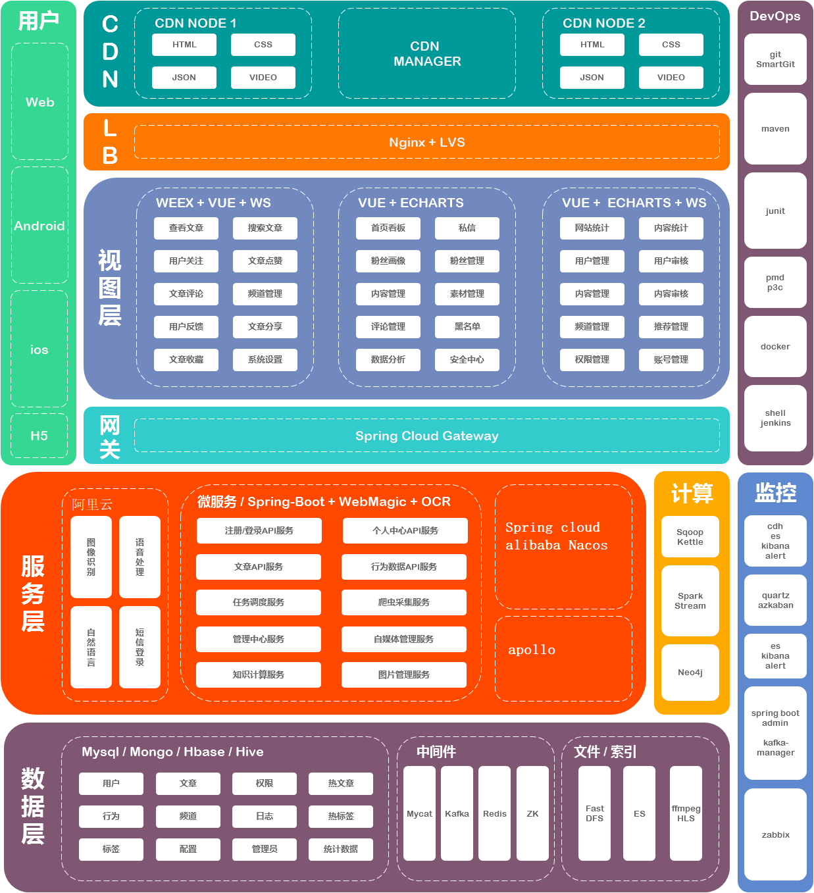


#### 7.流程图

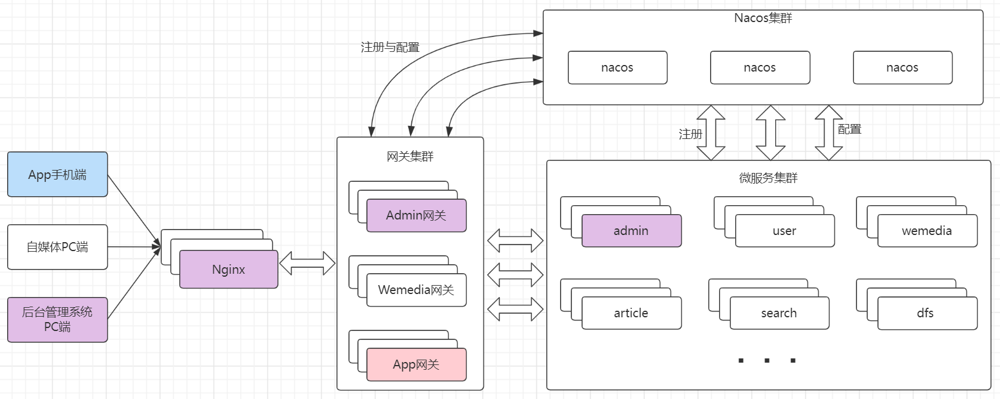


#### 8.common下的目录

##### 8.1constants常量配置

系统常量配置、业务常量配置

##### 8.2dto（Data Transfer Object）数据传输对象

提交请求中的参数、业务层、远程调用

##### 8.3vo

在controller中响应给客户端的请求

##### 8.4.？？？emums枚举

放固定写法，报错（包装？）等

##### 8.5exception全局异常处理

业务异常、系统异常、未知异常

##### 8.6util获取请求头封装请求

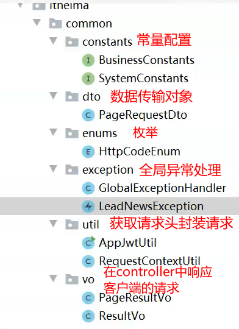

#### 9.工程结构说明

```
itheima-leadnews 为所有工程的父工程 打包方式为POM
itheima-leadnews-api 为所有微服务对应相关POJO及依赖的feign所在的聚合工程  打包方式为POM 
itheima-leadnews-common 所有的通用的工具类 依赖包 pojo 等的工程，打包方式为jar 
itheima-leadnews-common-db 所有需要用到的持久层相关 例如mybatis 等，打包方式为jar
itheima-leadnews-core 所有的核心抽取工程的聚合工程,用于抽取通用controller,feign等 打包方式为pom
itheima-leadnews-gateway 所有的网关微服务聚合工程 聚合所有的网关微服务便于统一管理 打包方式为pom
itheima-leadnews-service 所有微服务所在聚合工程 聚合所有的用到的微服务 便于统一管理 打包方式为pom
```


#### 10.解决更换网络IP地址变化方法

**同时注意：此时内存最好设置为4G或更高，反正day8会无法启动**

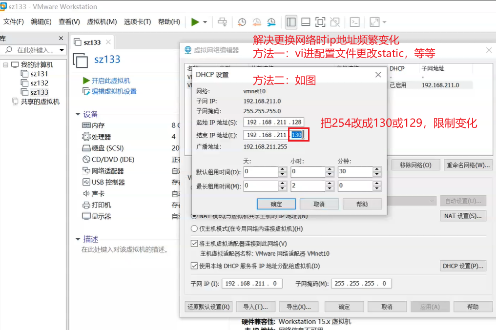


#### 11.docker中命令

```
删除所有容器：docker volume prune
```


#### 12.portainer--docker图形化界面的登录与使用

http://192.168.17.128:9000/

admin    密码：12345678

1.

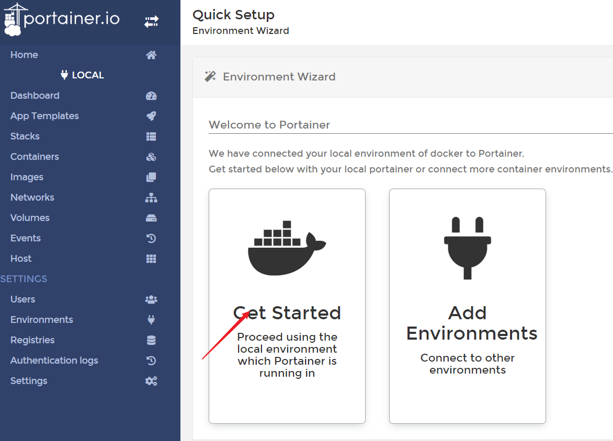

2.

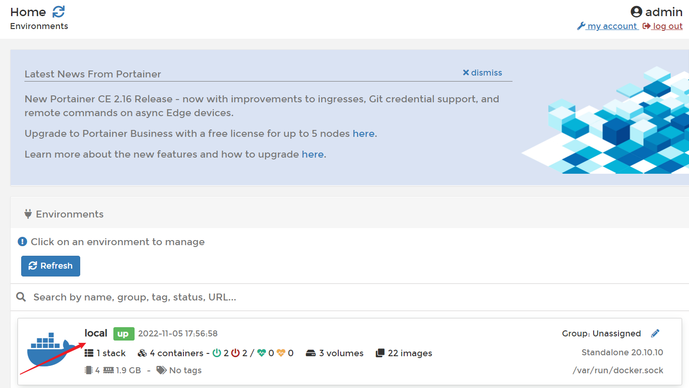

3.

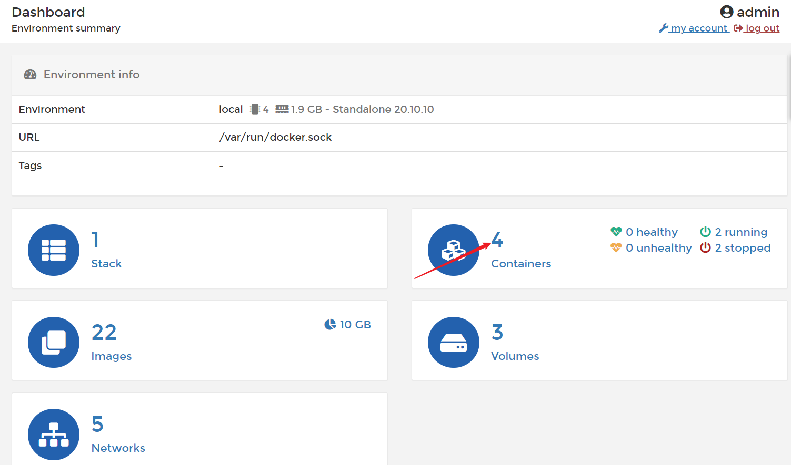

4.

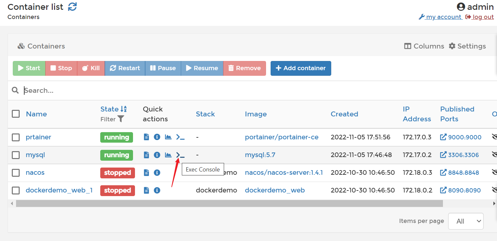

5.

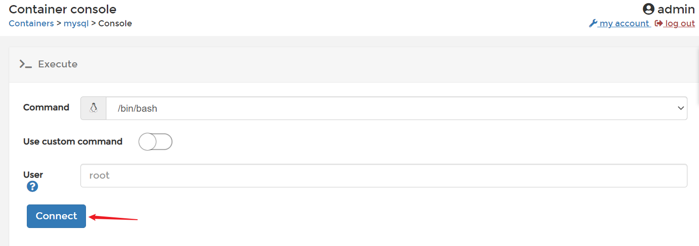

6.

```
登录：mysql -uroot -p123456
查看版本：select version();
```

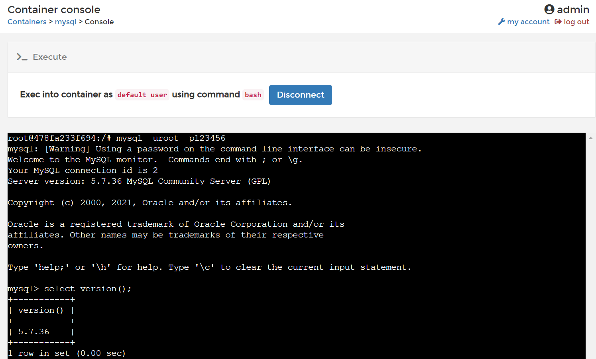


#### 13.？？？Navicat打开表设计--有问题

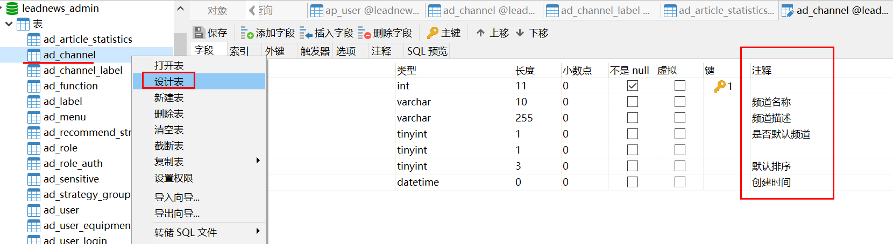


为什么数字可以搜索？？

搜索速度：

数字count(1)  >  星号count(*)  >  字段名count(name)

```
-- 分页：总数与分页结果集
-- 总数
select count(*) from ad_channel -- * 所有字段，所有字段为null，则不参与计算
select count(1) from ad_channel -- 常量
select count(80) from ad_channel -- 常量

-- id与name类似，不存在空值，主键不能为空，有索引，速度比较快
select count(id) from ad_channel

-- 表中字段，语法解析判断name是否在此表存在这个字段，如果表中无此字段则报错
-- name中有空值，空值不参与计算，得到的值有可能小于总记录数
-- 速度取决于name是有索引，如果没有索引，则速度比较慢
select count(name) from ad_channel

-- 每条记录是数1，使用主键索引
select count('ab') from ad_channel
select count('省钱神器') from ad_channel
select count(is_default) from ad_channel
```

```
-- 分页结果集
select ... from 表名 limit a,b; 
a:从哪里开始查询, 从0开始计数 ,省略a不写,默认就是从0开始
b:查询的数量【固定的,自定义的】
分页查询规律:  limit (页码-1)*每页显示的记录数,每页显示的记录数
-- 练习: 查询sid为9到12--->第3页
                      limit (3-1)*4,4
select * from student limit 8,4;

-- limit 每页2条记录，查询第2页
-- 开始（page-1）*size
select * from ad_channel limit 2,2
```


#### 14.新建maven模块后标识未点亮

```
若一开始删除新建的maven模块后又重新新建，
可能会导致在maven列表里没有点亮标识，
此时只需要将unIgnore Projects改成Ignore Projects即可
```

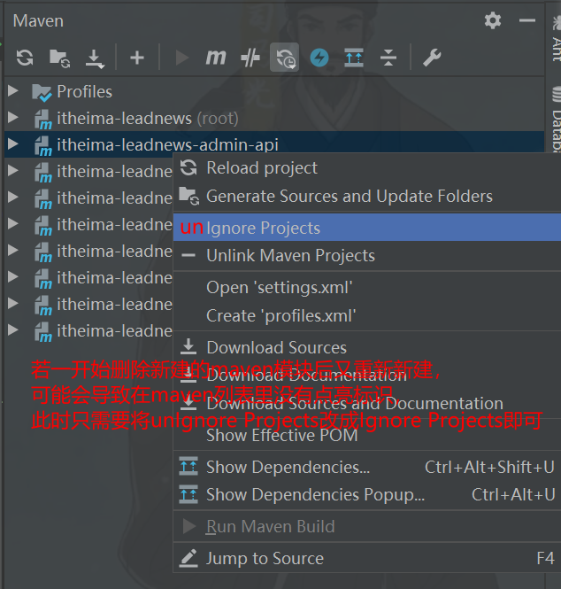


#### 15.getWrapper--为实例对象生成代理对象

#### 16.@TableFile（"status"）--跟表结构中的列名做映射，value列名

#### 17.属性描述器propertyDescription--有get、set方法


#### 18.pom.xml依赖的版本控制报红

如果是dependencyManagement标签下的依赖报红，是不会自动下载依赖的

```
解决方法：
1.把依赖复制到<dependencies>标签下
2.刷新maven，idea会自动触发下载
3.下载完后，把依赖还原回dependencyManagement的dependencies标签下（注意上面<dependencies>标签里的依赖记得移除）
```


#### 19.分页查询-后台用javabean或map对象接收请求

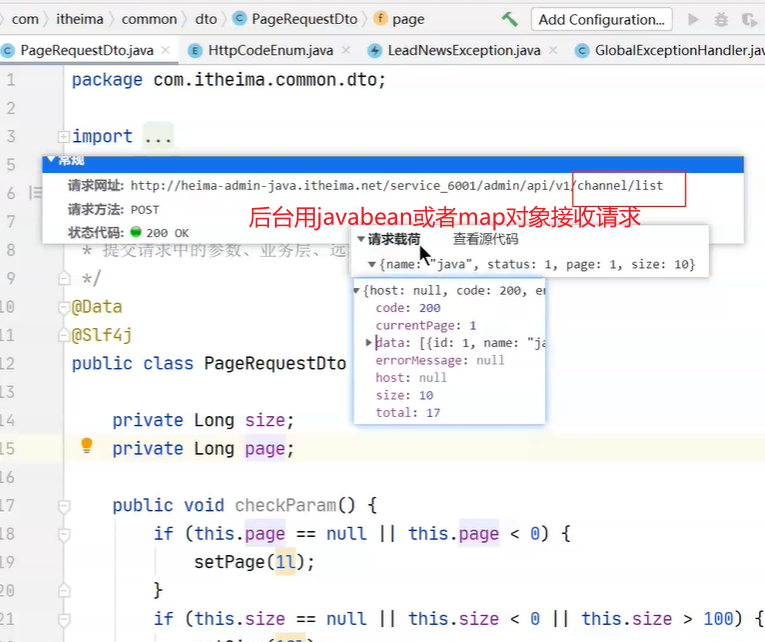


#### 20.vo、dto如果会被其他服务调用，就放到api服务下


#### 21.上传idea项目到gitee

先创建creat git资源

接着git add

接着git commit file

最后push上去就ok啦！


#### 22.idea快捷键

删除不需要的依赖 ：ctrl+alt+o

返回上一次看代码的地方（上一页）：ctrl+alt+左右键↔

打开启动微服务springboot窗口（左下角services）：alt+8

替换：ctrl+R


#### 23.频道列表完善

1.查看请求地址、请求载荷、响应数据

http://heima-admin-java.itheima.net/#/channel/index

当前页面直接访问的话，载荷会不完备，所以此时F12再搜索任意一个关键字如java，即可如图所示

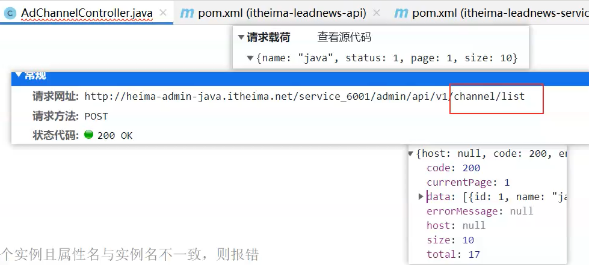

思路：

```properties
定义请求，并根据传递过来的 当前页页码 和每页显示行数以及请求参数 执行分页查询
得到分页结果 并统一返回给前端即可
```

请求地址：/channel/list

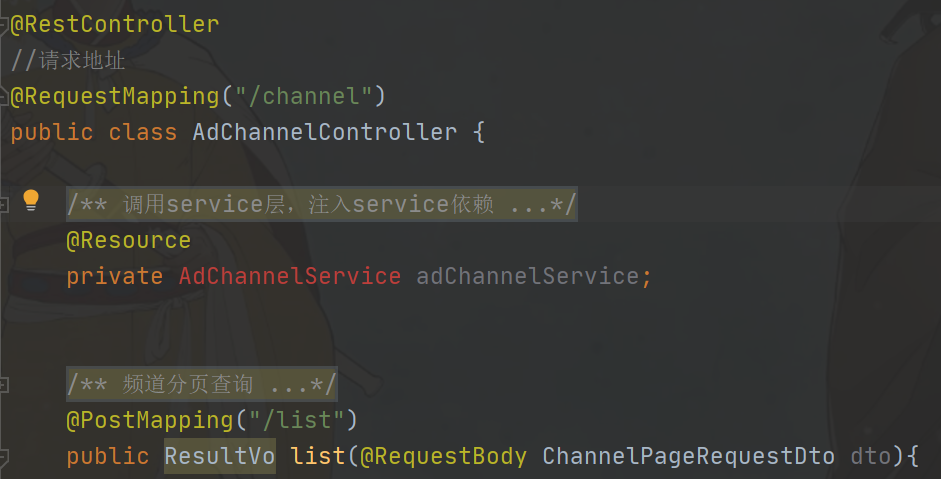


#### 24.service extends 继承、实体类

```
//继承mybaitisplus，加上实体类
public interface AdChannelService extends IService<AdChannel> {}

//指定mapper和实体类
public class AdChannelServiceImpl extends ServiceImpl<AdChannelMapper, AdChannel> implements AdChannelService {} 
```


#### 25.lambada表达式 带::双冒号

```
@Data
public class BannerItem {
private Long id;
private String name;
private String img;
private String keyword;
private Integer type;
private Long bannerId;
}
```


QueryWrapper
最基础的使用方式是这样

```
// 查询条件构造器
QueryWrapper<BannerItem> wrapper = new QueryWrapper<>();
wrapper.eq("banner_id", id);
// 查询操作
List<BannerItem> bannerItems = bannerItemMapper.selectList(wrapper);
```


然后我们可以引入lambda，避免我们在代码中写类似的于banner_id的硬编码

```
QueryWrapper<BannerItem> wrapper = new QueryWrapper<>();
wrapper.lambda().eq(BannerItem::getBannerId, id);
List<BannerItem> bannerItems = bannerItemMapper.selectList(wrapper);
```

LambdaQueryWrapper
为了简化lambda的使用，我们可以改写成LambdaQueryWrapper构造器，语法如下：

```
LambdaQueryWrapper<BannerItem> wrapper = new QueryWrapper<BannerItem>().lambda();
wrapper.eq(BannerItem::getBannerId, id);
List<BannerItem> bannerItems = bannerItemMapper.selectList(wrapper);
```


我们可以再次将QueryWrapper<BannerItem>.lambda()简化，变成这个样子

```
LambdaQueryWrapper<BannerItem> wrapper = new LambdaQueryWrapper<>();
wrapper.eq(BannerItem::getBannerId, id);
List<BannerItem> bannerItems = bannerItemMapper.selectList(wrapper);
```


#### 26.idea、postman启动

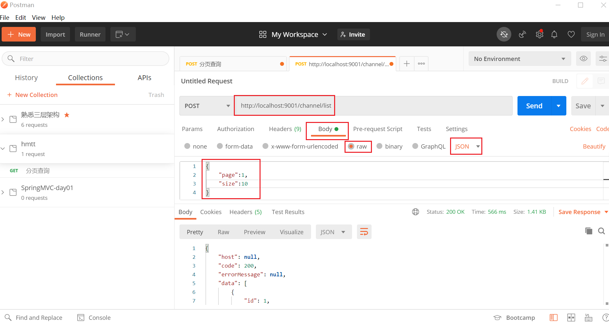

启动admin微服务，访问地址：http://localhost:9001/swagger-ui.html


#### 27.？？？频道分页查询PaginationInterceptor.java

多态组装sql语句，让人去调用，源码，没看懂

#### 28.Swagger 

Swagger 是一个规范和完整的框架，用于生成、描述、调用和可视化 RESTful 风格的 Web 服务(<https://swagger.io/>)。 它的主要作用是：

1. 使得前后端分离开发更加方便，有利于团队协作

2. 接口的文档在线自动生成，降低后端开发人员编写接口文档的负担

3. 功能测试 

   Spring已经将Swagger纳入自身的标准，建立了Spring-swagger项目，现在叫Springfox。通过在项目中引入Springfox ，即可非常简单快捷的使用Swagger。

#### 29.knife4j

knife4j是为Java MVC框架集成Swagger生成Api文档的增强解决方案,前身是swagger-bootstrap-ui,取名kni4j是希望它能像一把匕首一样小巧,轻量,并且功能强悍!

gitee地址：https://gitee.com/xiaoym/knife4j

官方文档：https://doc.xiaominfo.com/

效果演示：http://knife4j.xiaominfo.com/doc.html

(2)核心功能

该UI增强包主要包括两大核心功能：文档说明 和 在线调试

- 文档说明：根据Swagger的规范说明，详细列出接口文档的说明，包括接口地址、类型、请求示例、请求参数、响应示例、响应参数、响应码等信息，使用swagger-bootstrap-ui能根据该文档说明，对该接口的使用情况一目了然。
- 在线调试：提供在线接口联调的强大功能，自动解析当前接口参数,同时包含表单验证，调用参数可返回接口响应内容、headers、Curl请求命令实例、响应时间、响应状态码等信息，帮助开发者在线调试，而不必通过其他测试工具测试接口是否正确,简介、强大。
- 个性化配置：通过个性化ui配置项，可自定义UI的相关显示信息
- 离线文档：根据标准规范，生成的在线markdown离线文档，开发者可以进行拷贝生成markdown接口文档，通过其他第三方markdown转换工具转换成html或pdf，这样也可以放弃swagger2markdown组件
- 接口排序：自1.8.5后，ui支持了接口排序功能，例如一个注册功能主要包含了多个步骤,可以根据swagger-bootstrap-ui提供的接口排序规则实现接口的排序，step化接口操作，方便其他开发者进行接口对接

启动admin微服务，访问地址：http://localhost:9001/doc.html


#### 30.新增频道

1.分析

```
1.controller层保存返回结果
2.service层添加add方法
3.实现add方法，保存到数据库表（默认频道、创建时间）
```

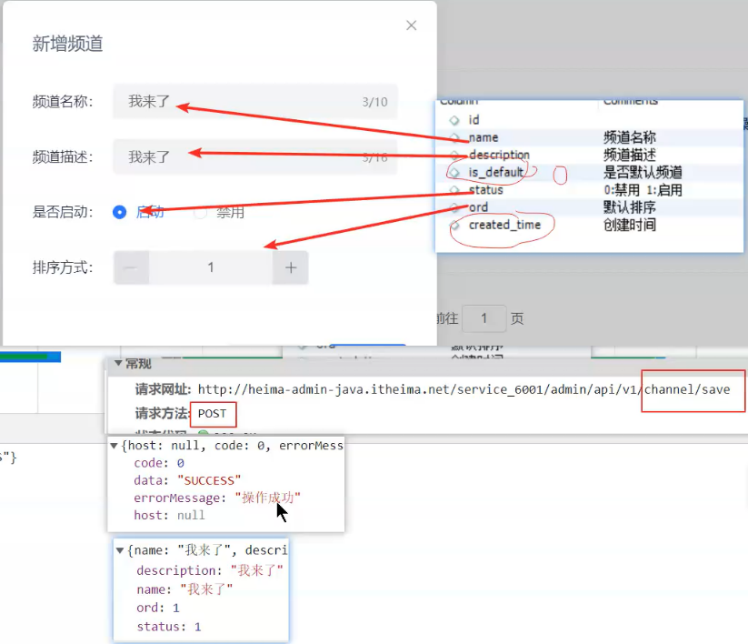

2.找到未实现的方法

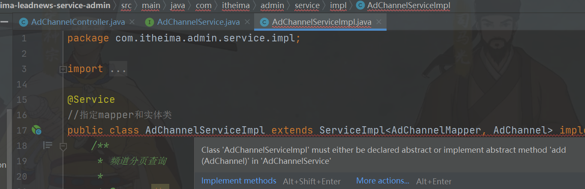


3.去实现方法

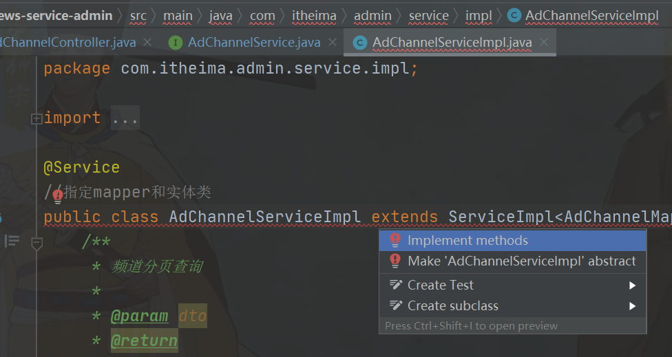


4.选择未实现的方法

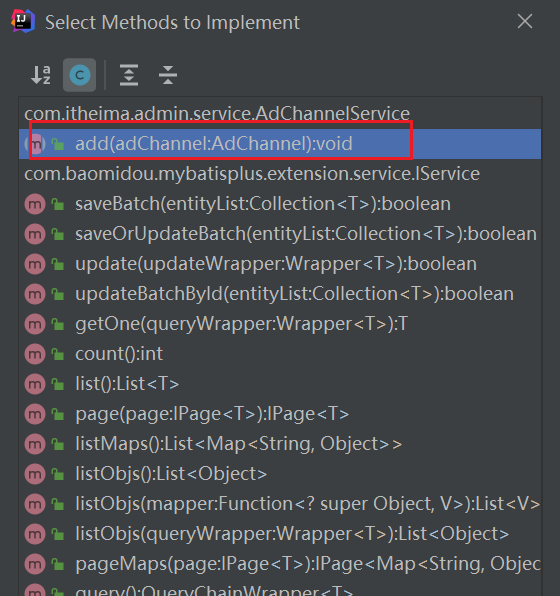


5.结果

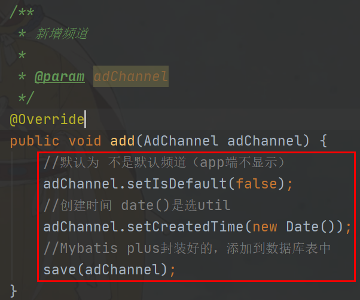


6.调试

http://localhost:9001/doc.html#/default/%E9%A2%91%E9%81%93%E7%AE%A1%E7%90%86/saveUsingPOST

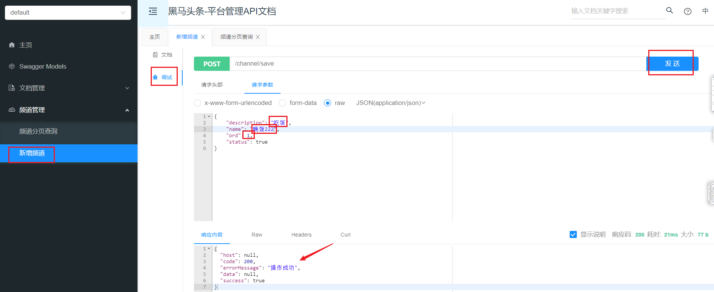


#### 31.？？？频道增删改查--为什么@GetMapping删除要加id，修改却不用

```java
@PostMapping("/save")
    @ApiOperation("新增频道")
    public ResultVo save(@RequestBody AdChannel adChannel){
        //保存
        adChannelService.add(adChannel);
        return ResultVo.ok("操作成功");
    }

    @GetMapping("/{id}")
    @ApiOperation("通过id查询")
    public ResultVo findById(@PathVariable(value = "id") Integer id){
        //调用MyBatisPlus封装好的通过id查询
        AdChannel channel = adChannelService.getById(id);
        return ResultVo.ok(channel);
    }

@PostMapping("/update")
    @ApiOperation("更新频道")
    public ResultVo update(@RequestBody AdChannel adChannel){
        // mybatis plus封装的更新对象的方法 要求：对象中的id主键必须有值
        adChannelService.updateById(adChannel);
        return ResultVo.ok("操作成功！");
    }


@PostMapping("/del/{id}")
    @ApiOperation("通过频道id删除")
    public ResultVo deleteById(@PathVariable(value = "id") Integer id){
        adChannelService.removeById(id);
        return  ResultVo.ok("操作成功！");
    }
    
    
```


#### 32.mybatis和mybatisplus区别

mybatis：查询精确，大型项目使用

mybatisplus：查询无法精准定位，但是速度快，所以中小型项目使用


#### 33.Hibernate

Hibernate是一个[开放源代码](https://baike.baidu.com/item/开放源代码/114160?fromModule=lemma_inlink)的[对象关系映射](https://baike.baidu.com/item/对象关系映射/311152?fromModule=lemma_inlink)框架，它对[JDBC](https://baike.baidu.com/item/JDBC/485214?fromModule=lemma_inlink)进行了非常轻量级的对象封装，它将POJO与数据库表建立映射关系，是一个全自动的orm框架，hibernate可以自动生成SQL语句，自动执行，使得Java程序员可以随心所欲的使用对象编程思维来操纵数据库。


#### 34.http状态返回代码

```
http状态返回代码 代码 说明
100 （继续） 请求者应当继续提出请求。 服务器返回此代码表示已收到请求的第一部分，正在等待其余部分。
101 （切换协议） 请求者已要求服务器切换协议，服务器已确认并准备切换。

http状态返回代码 2xx （成功）
表示成功处理了请求的状态代码。

http状态返回代码 代码 说明
200 （成功） 服务器已成功处理了请求。 通常，这表示服务器提供了请求的网页。
201 （已创建） 请求成功并且服务器创建了新的资源。
202 （已接受） 服务器已接受请求，但尚未处理。
203 （非授权信息） 服务器已成功处理了请求，但返回的信息可能来自另一来源。
204 （无内容） 服务器成功处理了请求，但没有返回任何内容。
205 （重置内容） 服务器成功处理了请求，但没有返回任何内容。
206 （部分内容） 服务器成功处理了部分 GET 请求。

http状态返回代码 3xx （重定向）
表示要完成请求，需要进一步操作。 通常，这些状态代码用来重定向。

http状态返回代码 代码 说明
300 （多种选择） 针对请求，服务器可执行多种操作。 服务器可根据请求者 (user agent) 选择一项操作，或提供操作列表供请求者选择。
301 （永久移动） 请求的网页已永久移动到新位置。 服务器返回此响应（对 GET 或 HEAD 请求的响应）时，会自动将请求者转到新位置。
302 （临时移动） 服务器目前从不同位置的网页响应请求，但请求者应继续使用原有位置来进行以后的请求。
303 （查看其他位置） 请求者应当对不同的位置使用单独的 GET 请求来检索响应时，服务器返回此代码。
304 （未修改） 自从上次请求后，请求的网页未修改过。 服务器返回此响应时，不会返回网页内容。
305 （使用代理） 请求者只能使用代理访问请求的网页。 如果服务器返回此响应，还表示请求者应使用代理。
307 （临时重定向） 服务器目前从不同位置的网页响应请求，但请求者应继续使用原有位置来进行以后的请求。
http状态返回代码 4xx（请求错误）
这些状态代码表示请求可能出错，妨碍了服务器的处理。

http状态返回代码 代码 说明
400 （错误请求） 服务器不理解请求的语法。
401 （未授权） 请求要求身份验证。 对于需要登录的网页，服务器可能返回此响应。
403 （禁止） 服务器拒绝请求。
404 （未找到） 服务器找不到请求的网页。
405 （方法禁用） 禁用请求中指定的方法。
406 （不接受） 无法使用请求的内容特性响应请求的网页。
407 （需要代理授权） 此状态代码与 401（未授权）类似，但指定请求者应当授权使用代理。
408 （请求超时） 服务器等候请求时发生超时。
409 （冲突） 服务器在完成请求时发生冲突。 服务器必须在响应中包含有关冲突的信息。
410 （已删除） 如果请求的资源已永久删除，服务器就会返回此响应。
411 （需要有效长度） 服务器不接受不含有效内容长度标头字段的请求。
412 （未满足前提条件） 服务器未满足请求者在请求中设置的其中一个前提条件。
413 （请求实体过大） 服务器无法处理请求，因为请求实体过大，超出服务器的处理能力。
414 （请求的 URI 过长） 请求的 URI（通常为网址）过长，服务器无法处理。
415 （不支持的媒体类型） 请求的格式不受请求页面的支持。
416 （请求范围不符合要求） 如果页面无法提供请求的范围，则服务器会返回此状态代码。
417 （未满足期望值） 服务器未满足”期望”请求标头字段的要求。

http状态返回代码 5xx（服务器错误）
这些状态代码表示服务器在尝试处理请求时发生内部错误。 这些错误可能是服务器本身的错误，而不是请求出错。

http状态返回代码 代码 说明
500 （服务器内部错误） 服务器遇到错误，无法完成请求。
501 （尚未实施） 服务器不具备完成请求的功能。 例如，服务器无法识别请求方法时可能会返回此代码。
502 （错误网关） 服务器作为网关或代理，从上游服务器收到无效响应。
503 （服务不可用） 服务器目前无法使用（由于超载或停机维护）。 通常，这只是暂时状态。
504 （网关超时） 服务器作为网关或代理，但是没有及时从上游服务器收到请求。
505 （HTTP 版本不受支持） 服务器不支持请求中所用的 HTTP 协议版本。
```


35.

```
只有对java封装的实体类有用，对mapper没用
1.通过id删除
2.新增频道信息，设置name不能为空
2.1在实体类的属性上添加注解
@NotNull(message = "频道名称不能为空!")
2.2controller方法的参数类型前添加注解 
@Valid AdChannel
```


#### 35.Hibernate-Validator:后端校验框架

[Hibernate Validator 使用介绍 - 简书 (jianshu.com)](https://www.jianshu.com/p/0bfe2318814f)

```
介绍：
Hibernate:冬眠 持久框架 早期mybatis
	程序不需要写sq1语句
	操作iava bean即操作数据库
		java bean的属性 进行监听(观察者模式)
		3美金 sql查询语句
	2006-2010左右 10之后 ibatis一代， 第二代mybatis
	2018之前:市场转给mybatis
	
SpringDataJPA->使用Hibernate持久化技术
	以方法命名规则来代替写sal，操作javaBean
	
sql与java代码高度耦合，dbA sql调优 
api复杂，招人成本。
mybatis 完全解耦: 
mapper接口类
mapper映射文件(大型项目 写sql)

小型项目为了提高效率 使用mybatisPlus
mybatisPlus 封装了mybatis的单表操作，比原生的mybatis性能差一些
```

```
 使用：
 1.实体类的属性上添加 @Size(min,max,message) @NotNull(message)
 2.Controller类的方法参数前 添加@Valid @Validated
```


#### 36.频道名称后端校验问题--已解决

注意：所有启动类要放到com.itheima下，否则异常处理不生效

```
1.原始情况是新增不符合实体类属性上的校验规则时（name不为空），前端响应返回数据类型与设置类型不一致。只有操作成功时，响应数据类型与设置一致。
2.解决方法为：将AdminApplication启动类的包名由com.itheima.admin改成com.itheima
```


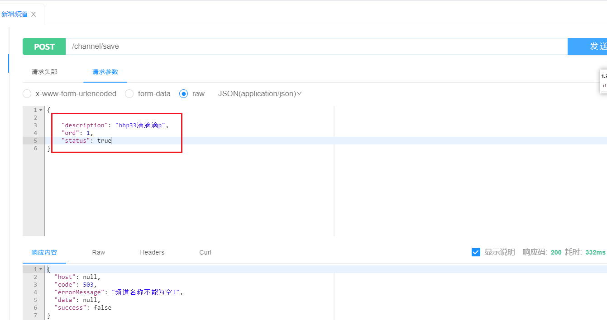


#### 37. 开发步骤

```
 开发步骤：
    1. 需求分析 表、字段、代表含义
    2. 找出请求的api
      * 请求地址
      * 请求方式
      * 请求参数、来源（queryString?,路径中pathValue,json请求体,上传文件MulitpartFile）
      * 响应的数据格式  
```


###### 18.构造方法是什么，配置类是什么？

###### 19.二进制反码与补码


