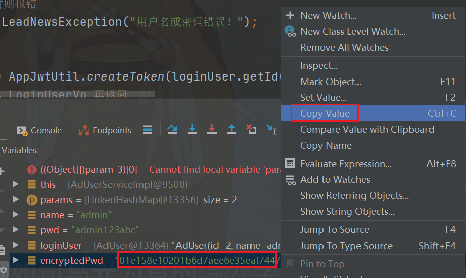
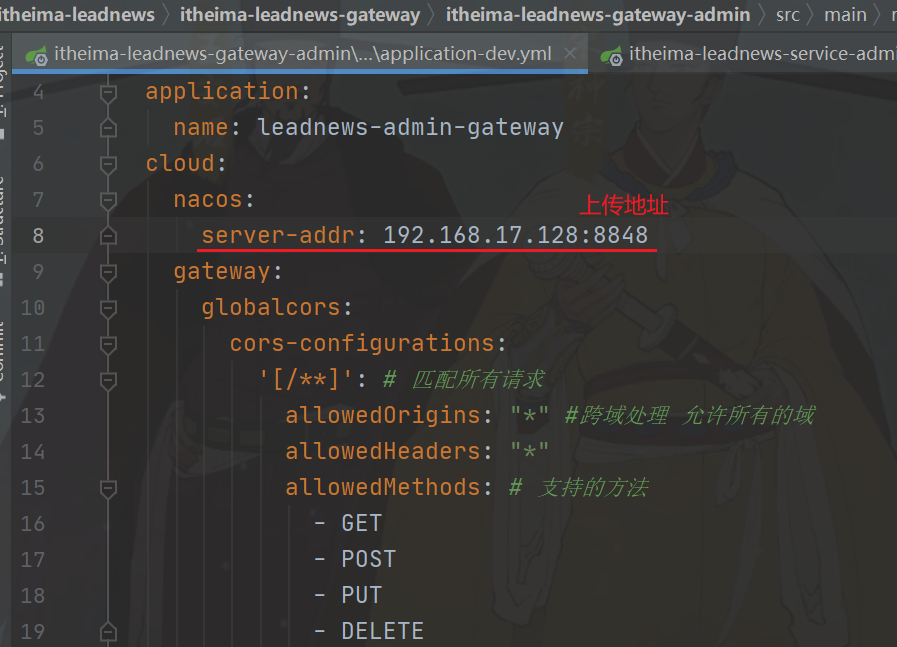
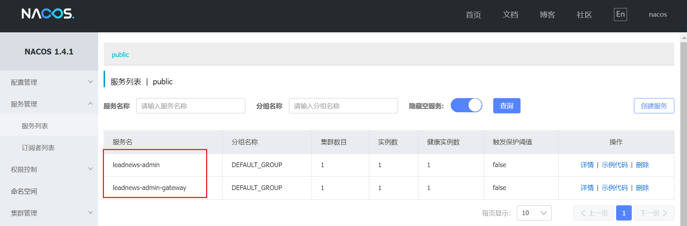

#### 1.通过controller抽取的方法实现敏感词的增删改查

##### 1.1操作步骤：

```
通过controller抽取的方法实现敏感词的增删改查：
1.创建核心接口ICoreController和CRUD分页5个接口和定义AbstractCoreController继承ICoreController
2.创建实体类pojo，AdSensitive
3.创建mapper映射，指定实体类，AdSensitiveMapper
4.创建service接口，AdSensitiveService
5.创建接口实现类AdSensitiveServiceImpl
6.创建AdSensitiveController
```


##### 1.2反射缓存


##### 1.3？？？子类要实现有参构造方法,把子类的service传给父类，子传父为什么

##### 1.4测试


#### 2.指定泛型类型，就知道操作的是哪个实体


#### 3.通用controller抽取

```
通用controller抽取  --  AbstractCoreController
  * 定义5个接口：CRUD+分页
  * 定义ICoreController接口,组合了5个接口
  * 定义AbstractCoreController对ICoreController实现
     通过bean对象获取查询条件 getWrapper()
        获取bean对象类型
        获取类下的所有属性
        遍历属性
           如果属性是主键或serialVersionUID则不处理
           BeanUtils通过属性名获取属性描述器, BeanUtils缓存反射过的类。
           通过属性描述器获取getter方法
           反射调用getter方法，获取属性的值
           获取属性上的注解(@TableFeild),得到它的value，就相当于得到列名
           有了列名与属性值，就可以构建QueryWrapper中的条件
  * 需要CRUD+分页，它的controller 继承AbstractCoreController
    子类要实现有参构造方法,把子类的service传给父类
   
```

```
PropertyDescriptor类：
PropertyDescriptor类表示JavaBean类通过存储器导出一个属性。主要方法：
    　　1. getReadMethod()，获得用于读取属性值的方法
    　　2.  getWriteMethod()，获得用于写入属性值的方法
注：避免使用拼装方法名，反射获取Method对象。如tId,方法名格式与其他不统一，拼装方法名会错误。
```

[(1条消息) JS对象属性中get/set与getter/setter是什么_CHENKAI188的博客-CSDN博客](https://blog.csdn.net/CHENKAI188/article/details/86540311)


#### 4.属性描述器PropertyDescriptor

```
判断方法是看有没有提供get、set方法。属性描述器不需要拼接方法名（"get"+feild.getName().substring(0,1).toUpperString() + field.getName.substring(1);）
```


#### 5.slf4j log4j logback关系详解和相关用法

1.slf4j是java的一个日志门面，实现了日志框架一些通用的api，log4j和logback是具体的日志框架。

2.他们可以单独的使用，也可以绑定slf4j一起使用。

- 单独使用。分别调用框架自己的方法来输出日志信息。
- 绑定slf4j一起使用。调用slf4j的api来输入日志信息，具体使用与底层日志框架无关（需要底层框架的配置文件）

3.log4j 、logback区别：

```
log4j是apache实现的一个开源日志组件。（Wrapped implementations）
logback同样是由log4j的作者设计完成的，拥有更好的特性，用来取代log4j的一个日志框架。是slf4j的原生实现。（Native implementations）
```

4.使用slf4j绑定日志系统的优势

- 软件工程的角度。抽象，解耦，便于维护。可以参考一下上面的例子。
- 语法设计角度。slf4j有{}占位符，而log4j需要用“+”来连接字符串，既不利于阅读，同时消耗了内存（heap memory）。
- 详细的描述可以参考：[slf4j log4j logback关系详解和相关用法 - Fururur - 博客园 (cnblogs.com)](https://www.cnblogs.com/Sinte-Beuve/p/5758971.html)


#### 6.knife4j

knife4j是为Java MVC框架集成Swagger生成Api文档的增强解决方案,前身是swagger-bootstrap-ui,取名kni4j是希望它能像一把匕首一样小巧,轻量,并且功能强悍。

使用步骤：

```
方法一（day1）：
1.引入依赖
2.创建Swagger配置文件
```

```
方法二（day2）：
1.工程复制到itheima-leadnews-core父工程下
2.itheima-leadnews-core的pom文件添加module
3.itheima-leadnews-service工程的pom文件中添加 knife4j起步依赖
4.admin工程的yml文件添加配置信息
最后把service-admin里的config-swagger文件删除
```


#### 7.验证生成token

```
生成token
1.新建main方法，
2.设置token内容：ID、签发时间、加密方式、过期时间戳、cla信息载荷
```


```
//验证有效性，解析
        Claims claims = Jwts.parser()
                .setSigningKey(generalKey())
                .parseClaimsJws(token).getBody();
        System.out.println(claims);
        String username = claims.get("username",String.class);
        Integer id = claims.get("id", Integer.class);
        System.out.println("username="+username+",id="+id);
```


#### 8.？？？文档注释

为什么老师的能自动生成，我的不行


#### 9.登录验证校验功能

##### 9.1实现步骤

```
登录验证功能步骤：
LoginUserVo
LoginController 登录校验 
AdUserService 业务接口 
AdUserServiceImpl 业务实现，详细： 
1.参数非空校验 
2.验证通过，通过用户名查询用户信息 
3.密码校验 
3.1把前端的密码进行 加盐 加密 处理 
3.2把前端的密码与后端数据库密码进行对比 
4.不相同时则报错 
5.生成token 
6.构建用户信息，LoginUserVo 再返回  一个是token，另一个是user用户信息  记得脱敏  
```

##### 9.2登录验证调试

1.准备

1.1前端发送登录请求


1.2控制台点F8进行调试


1.3数据库密码情况


2.F8下一步到3.2数据库密码对比处`if (!encryptedPwd.equals(loginUser.getPassword())){`，可看出与数据库密码不一致


3.复制加密后的密码，粘贴到数据库，记得更新修改后的数据库



4.重新从数据库中查询密码，点击Evaluate Expression评估表达，好像必须选择这一句`loginUser = query().eq("name", name).one()`，选择其他的会修改不成功


5.Evaluate评估


6.此时可看到密码都更正了


7.到`return loginUserVo;`时，点击F9跳出即可


8.此时前端方响应返回数据


#### 10.idea springboot启动配置


#### 11.启动nacos

```
启动nacos
1.最外层的pom.xml添加依赖，注意nacos版本和springboot对应
2.service-admin添加nacos地址配置
3.账号密码均为nacos
4.启动地址：192.168.17.128:8848/nacos
```

启动地址：http://192.168.17.128:8848/nacos

#### 12.网关校验--搭建网关

```
搭建网关：
创建itheima-leadnews-gateway-admin工程
1.pom.xml引入依赖
2.application.yml、application-dev、application-prod、application-test添加配置 --》跨域处理
   路由配置
3.创建启动类GatewayAdminApplication
 日志配置
```

测试postman：

启动网关和admin工程


#### 13.接口定义规范，抽象类用于通用抽取

#### 14.代码生成器

```
介绍代码生成器
  * 修改配置文件 module, 数据库，application.name
  * 运行CodeGenerator，其它java代码可以删除
  * 把pojo复制到api工程里pojo
  * 把controller service mapper复制到微服务工程
  * 把resource下的mapper目录下的映射文件复制微服务的resource的mapper目录下
```


#### 15.Token令牌

```
Token令牌
  有状态通讯：用户登录后，把登录用户信息保存在服务端,安全可靠。占用内存空间 （金融与保险行业）
  无状态通讯：用户登录后，服务端不存储登录用户信息，登录用户信息存在token里，用户每次请求时必须带上token。优点：不占空间，缺点：相对没那么安全 社交软件
```


#### 16.Jwt: Json Web Token

```
Jwt: Json Web Token, 对token令牌一种实现。实现无状态通讯一种工具
  组成：
    * Header(版本、id, 签名算法HS512)
    * Payload 载荷：自有的属性，自定义属性(map: 存放登录用户信息，不能包含敏感信息)
    * Signature签名：验证token的完整性，是否被修改过。头部中的签名算法对(base64(header)+base64(payload), 密钥) 进行加密，加密后得到 base64(header).base64(payload).signature 
  Jwt使用：
     登录成功: 生成token   
     验证：解析token而不报错，验证通过，即用户已经登录过了
     解析：获取header, Base64解码, 得到算法名称, 使用头中的算法(header+payload, 密钥) 得到加密后的字符串(signature签名), 与token中的签名对比，如果一样说明通过，如果不一样说明被修改了。签名一样，获取载荷的过期时间与当前系统时间进行对比,判断是否超时 
```


#### 17.后管理系统登录功能--网关统一鉴权

```
后管理系统登录功能
 * 需要分析：操作哪张表 ad_user表(name,password,salt,status)
 * 分析接口：/admin/login/in, 
        提交的参数{name:,password:} 
        请求体 响应的LoginUserVo(common工程vo包下)(token, user)
 * 实现:
前端提交的密码提交到LoginController 中，LoginController 定义一个方法来接收前端提交来的用户名和密码，他是一个json数据，通过map接收，使用的是@requestbody注解，接收后获取参数中的用户名和密码，接着进行参数非空校验，如下
   * LoginController ("/login") ("/in")loginCheck, 接收参数Map<String,String>
   * AdUserServiceImpl
    1.参数校验(非空校验)
    2.通过用户名查询用户信息
    3.用户信息不存在则报错
    4.存在
      4.1 判断用户的状态，如果不为9，联系管理员
      4.2 比较密码：把前端密码加盐加密
      4.3 与数据库的密码比较，如果不一样则报错
    5. 通过登录用户id生成token
    6. 构建LoginUserVo
    7. 登录用户信息脱敏(salt,password,phone设置为null)
    8. 返回vo
  【注意】数据库admin的密码是错的，得先自己手工运行生成密码，更新到数据库
```


#### 18.网关的作用


#### 19.网关统一鉴权处理流程图--登录


#### 20.通过网关分页查询--测试

##### 1.不携带token，通过网关查询

http://localhost:6001/admin/channel/search（6001是网关端口号，9001是admin端口号）

一直F8到“6.无效则放行”那一步，然后F9放行


postman测试，返回401


##### 2.携带token，通过网关查询list

http://localhost:6001/admin/channel/list


#### 21.网页响应状态码

```
500：网关的控制日志
503：1.service Unavailable服务不可用，转给微服务，找不到微服务
     2.路由的微服务没有启动
     微服务在重启后，nacos中尚没有，等30s后（每隔15s发送请求）
   解决：重启itheima-leadnews-service下的微服务时，把网关一起重启
502：网关没启动
```

503报错流程图：


1.从注册中心获取服务，且以lb(load-balance)负载均衡方式转发


2.nacos微服务地址



3.在nacos中查找微服务列表，如果有就正常启动使用，若没有就报503



#### 22.StripPrefix Filter

StripPrefix Filter 是一个请求路径截取的功能，我们可以利用这个功能来做特殊业务的转发。

```yml
server:
  port: 8769

#---         #三个横线表示再创建一个配置文件
spring:
  #profiles: predicate-path #配置文件名 和 spring.profiles.active 相对应
  #配置程序名为eureka-gateway-client
  application:
    name: eureka-gateway-client
  cloud:
    #设置路由规则
    gateway:
      discovery:
        locator:
          #是否与服务注册于发现组件进行结合，通过 serviceId 转发到具体的服务实例。
          #默认为 false，设为 true 便开启通过服务中心的自动根据 serviceId 创建路由的功能
          enabled: true
          ##表示将请求路径的服务名配置改成小写  因为服务注册的时候，向注册中心注册时将服务名转成大写的了
          lower-case-service-id: true
      routes:
      #我们自定义的路由 ID，保持唯一性
      - id: predicate_path
        #代表从注册中心获取服务，且以lb(load-balance)负载均衡方式转发
        uri: lb://eureka-client
        #uri: http://localhost:8762
        #断言
        predicates:
        #表示将以/HiController开头的请求转发到uri为lb://eureka-client的地址上
        #转发地址格式为 uri/HiController/**
        - Path=/hello/world/HiController/**
        filters:
        #过滤器 设置所有的 方法都会自动添加foo=bar
        #- AddRequestParameter=key, bar
        #当请求路径匹配到/hello/world/HiController/**会将包含hello和后边的字符串接去掉转发，
        #StripPrefix=2就代表截取路径的个数，这样配置后当请求/hello/world/HiController/aaa后端匹配到的请求路径，
        #就会变成http://localhost:8762/HiController/aaa
        - StripPrefix=2
logging:
  level:
    org.springframework.cloud.gateway: debug

eureka:
  client:
    #服务注册地址
    serviceUrl:
      #注意: Eureka Server 的注册地址
      #将服务提供者注册到三个Eureka Server中去
      #defaultZone: http://peer1:8001/eureka/,http://peer2:8002/eureka/,http://peer3:8003/eureka/
      #defaultZone: http://peer1:8001/eureka/
      defaultZone: http://localhost:8761/eureka/
```


#### 23.启动前端工程

1.在前端文件夹中cmd

```
start nginx.exe 进入web项目启动nginx

补充：
nginx -s stop停止nginx
nginx -t 检查配置文件是否有语法错误
nginx -s reload 重新加载
```

2.检查nginx是否启动成功，在任务资源管理器中查看，如果有两个nginx即是成功了，nginx有主副两个进程。


3.启动地址http://localhost:9090/

用户名密码admin


#### 24.cmd中nginx操作命令

```
start nginx.exe 进入web项目启动nginx
nginx -s stop停止nginx
nginx -t 检查配置文件是否有语法错误
nginx -s reload 重新加载
```


#### 25.git上传文件命令

```
1.git init
2.git add . （".“代表该目录下的所有文件，如果不想上传所有文件，把”."换成想要上传的文件名）
3.git commit -m ‘first’（first可任意换，相当于描述）
4.git remote add origin https://github.com/xxx/vvv.git
5.git push -u origin master

如果出现错误：
本地文件中没有库里已存在的项目，需要将本地没有的项目pull到本地文件
输入：git pull --rebase origin master
完成后再输入：git push origin master就行了
```


