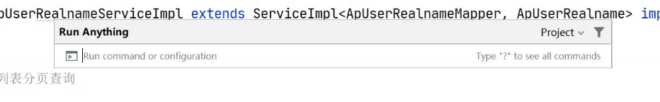

#### 1.idea快捷键：

alt+insert：生成toString方法、override重写、constructor构造方法等

ctrl+alt+T：生成surround包围类方法，如try catch方法

#### 2.？？？用户信息照片保存到os

#### 3.项目部署

复制粘贴子模块到itheima-leadnews-service、itheima-leadnews-api下，并添加pom.xml里的子模块地址

User微服务api查看地址：http://localhost:9002/doc.html

#### 4.问题：为什么中间会有/api/v1/?

实名认证请求网址

#### 5.这个是什么

#### 6.静态方法

**静态方法为类所有，可以通过对象来使用，也可以通过类来使用。**

但一般提倡通过类名来使用，因为静态方法只要定义了类，不必建立类的实例就可使用。

**静态方法和实例方法的区别主要体现在两个方面：**

1、在外部调用静态方法时，可以使用"**类名.方法名**"的方式，也可以使用"**对象名.方法名**"的方式。而实例方法只有后面这种方式。也就是说，**调用静态方法可以无需创建对象**。

2、**静态方法在访问本类的成员时，只允许访问静态成员（即静态成员变量和静态方法），而不允许访问实例成员变量和实例方法**；实例方法则无此限制。

**静态方法只能访问静态成员，实例方法可以访问静态和实例成员。**

之所以不允许静态方法访问实例成员变量，是因为实例成员变量是属于某个对象的，而静态方法在执行时，并不一定存在对象。

同样，因为实例方法可以访问实例成员变量，如果允许静态方法调用实例方法，将间接地允许它使用实例成员变量，所以它也不能调用实例方法。

**基于同样的道理，静态方法中也不能使用关键字this。**

#### 7.

