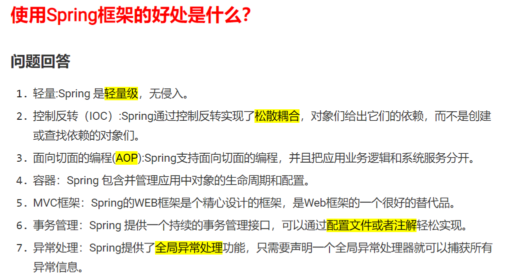
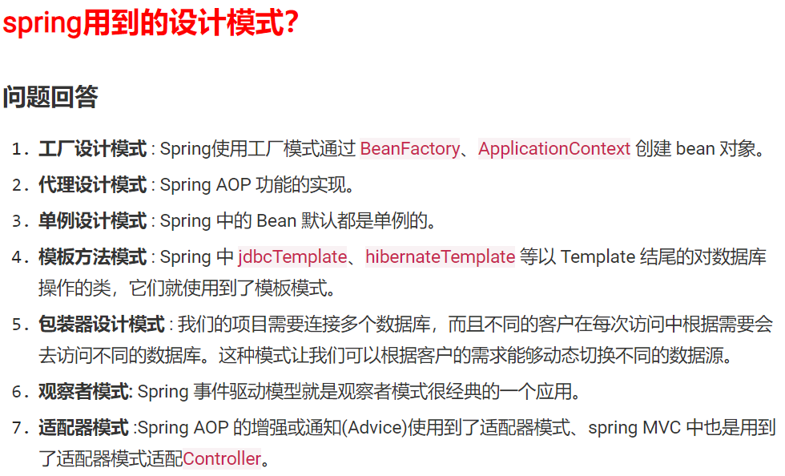
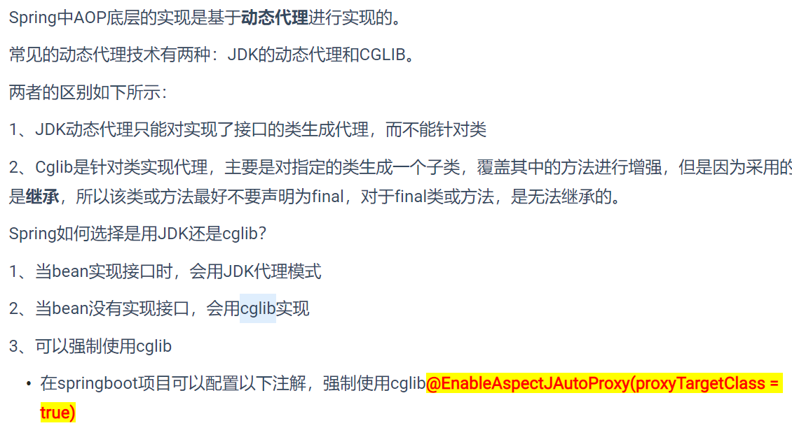
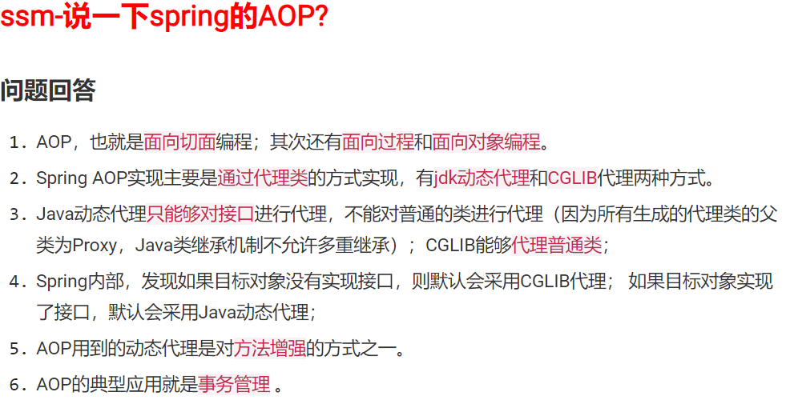

### 1.个人介绍

面试官您好 我叫雷碧玉来自于湖南衡阳，毕业于xxx学校，我今天想面试的是Java开发工程师岗位。我先介绍一下我的过往工作经验，目前有2年的工作经验，之前有走过2个项目，分别是瑞吉外卖和在线销售系统。最近负责的项目是在线销售系统，该项目提供的服务主要是辅助企业的销售人员对不同类型的客户进行筛选和有效沟通的，用以协助企业更好的管理客户信息。

我在这个项目中负责的模块有


  最近一个项目是瑞吉外卖，该项目主要从事的业务是餐饮企业。      项目主要采用xxx技术架构 ，项目分 前台web用户端    web后台    app客户端  app后台管理等
我在这个项目中承担了xxx  xxx  xxx 等模块的开发，主要用到的技术有xxx  xxx   xxx    我的自我介绍完毕了。

我对技术有着深厚的兴趣，专业知识丰富，责任心强，沟通能力比较好。平常有时间喜欢看看博客，并且自己也喜欢在知乎、CSDN上记录技术类的文章，与博友一起讨论。所以希望能在贵公司发展，学习更多的新技术，更好的提升个人能力。我的自我介绍基本上就是这些，谢谢面试官！


### 2.在线销售系统介绍

我最近的一个项目是在线销售系统，该项目提供的服务主要是辅助企业的销售人员对不同类型的客户进行筛选和有效沟通的。

我在这个项目中负责的项目有

#### 1.日志记录功能

用到的技术主要是：使用Spring的AOP+自定义注解

```
流程：1自定义注解（@Log注解）--2编写日志处理类--3异步方式存储日志--4业务方法调用日志。
```

自定义注解：模块、功能、 操作人类别、是否保存请求的参数

```
优势：代码独立于其他业务逻辑代码，不仅实现了解耦，而且避免了冗余代码。
```


#### 2.数据权限与角色进行绑定功能

使用的技术主要为：Spring的AOP+自定义注解

```
流程：1利用sql实现数据权限--2自定义数据权限注解@DataScope--3利用aop实现该注解--3.1确定切入点--3.2利用通知类型拼接sql
```

该怎么做好：

明确controller接口的访问权限，不同的人分配不同的角色。如果遇到一个功能是多个角色都可以访问，入口都 是 同一个controller，要求返回的数据不一样时，由业务层的逻辑代码来控制。


#### 3.批量线索导入

技术：使用EasyExcel

easyExcel操作exel文档。

读excel方式:

- 创建实体类（属性与excel列映射 @ExcelProperty)
- 创建监听器,invoke方法，每读取一条记录时，就执行一次
- 调用EasyExcel.read(文件，实体类，监听器).sheet().doRead()
- 优化：批量读取：不一条一条操作，累加起来达到一定数量后再操作；【注意】：在最的方法中 再次调用一下。批量值为5000为佳。
- 介绍mybatis的批量操作，sqlSessionFactory.openSession(ExecutorType.BATCH)
- 多线程 批量处理


#### 4.商机


#### 5.合同上传

技术：使用Minio实现

自己布署minio服务器(保存敏感，企业中重要的文件)

使用它的minio客户端上传文件(bucketName, 文件名, 文件流)


### 2.瑞吉外卖

该项目主要从事的业务是餐饮企业


**1). 用户层**

本项目中在构建系统管理后台的前端页面，我们会用到H5、Vue.js、ElementUI等技术。而在构建移动端应用时，我们会使用到微信小程序。

**2). 网关层**

Nginx是一个服务器，主要用来作为Http服务器，部署静态资源，访问性能高。在Nginx中还有两个比较重要的作用： 反向代理和负载均衡， 在进行项目部署时，要实现Tomcat的负载均衡，就可以通过Nginx来实现。

**3). 应用层**

SpringBoot： 快速构建Spring项目, 采用 "约定优于配置" 的思想, 简化Spring项目的配置开发。

Spring: 统一管理项目中的各种资源(bean), 在web开发的各层中都会用到。

SpringMVC：SpringMVC是spring框架的一个模块，springmvc和spring无需通过中间整合层进行整合，可以无缝集成。

SpringSession: 主要解决在集群环境下的Session共享问题。

lombok：能以简单的注解形式来简化java代码，提高开发人员的开发效率。例如开发中经常需要写的javabean，都需要花时间去添加相应的getter/setter，也许还要去写构造器、equals等方法。

Swagger： 可以自动的帮助开发人员生成接口文档，并对接口进行测试。

**4). 数据层**

MySQL： 关系型数据库, 本项目的核心业务数据都会采用MySQL进行存储。

MybatisPlus： 本项目持久层将会使用MybatisPlus来简化开发, 基本的单表增删改查直接调用框架提供的方法即可。

Redis： 基于key-value格式存储的内存数据库, 访问速度快, 经常使用它做缓存(降低数据库访问压力, 提供访问效率), 在后面的性能优化中会使用。

**5). 工具**

git: 版本控制工具, 在团队协作中, 使用该工具对项目中的代码进行管理。

maven: 项目构建工具。

junit：单元测试工具，开发人员功能实现完毕后，需要通过junit对功能进行单元测试。


#### 1.维护餐厅中的套餐信息，包含查、增、改、删、启售、停售等功能


#### 2.维护用户在移动端下的订单信息，包含查、取消、派送、完成


#### 3.订单报表下载等功能


### 3.熟悉技术

①    熟悉SpringBoot，SSM，Mybatis, SpringMVC等开源框架；

②    熟练使用Idea、Git、Navicat、Maven等管理工具；

③    熟悉使用Redis缓存数据库；

④    熟练操作Linux命令，了解Docker容器；

⑤    熟悉JWT安全验证等。


### 1.使用Spring框架的好处



### 2.Spring用到的设计模式



### 3.Spring中AOP底层的实现基于动态代理

#### 3.1JDK的动态代理-bean没有实现接口

#### 3.2cglib-bean实现接口



### 4.Spring注解：@Aspect，@Before，@After，@Around，[@Pointcut ]() - 用于切面编程（AOP） 


### 5.说一下spring的AOP

 


### 6.JWT

```
JSON Web token 简称 JWT， 是用于对应用程序上的用户进行身份验证的标记。
在身份验证过程中, 当用户使用其凭据成功登录时, 将返回 JSON Web token, 并且必须在本地保存 (通常在本地存储中)。
每当用户要访问受保护的路由或资源 (端点) 时, 用户代理(user agent)必须连同请求一起发送 JWT, 通常在授权标头中使用Bearer schema。后端服务器接收到带有 JWT 的请求时, 首先要做的是验证 token。
```


### 7.vo、dto和po的区别

vo是在controller层用的，dto在service层，po在dao层

数据从前端到数据库再返回前端，是vo -> dto -> po -> dto -> vo

controller层用vo接收参数，然后转成dto给service层，业务处理完后转成po给持久层


### 8.lombok

能以简单的注解形式来简化java代码，提高开发人员的开发效率。例如开发中经常需要写的javabean，都需要花时间去添加相应的getter/setter，也许还要去写构造器、equals等方法。


### 9.Swagger

可以自动的帮助开发人员生成接口文档，并对接口进行测试。


### 10.SpringBoot 

快速构建Spring项目, 采用 "约定优于配置" 的思想, 简化Spring项目的配置开发。


### 11.Spring

统一管理项目中的各种资源(bean), 在web开发的各层中都会用到。


### 12.MySQL

 关系型数据库, 本项目的核心业务数据都会采用MySQL进行存储。


### 13.MybatisPlus 

本项目持久层将会使用MybatisPlus来简化开发, 基本的单表增删改查直接调用框架提供的方法即可。


### 14.Redis

 基于key-value格式存储的内存数据库, 访问速度快, 经常使用它做缓存(降低数据库访问压力, 提供访问效率), 在后面的性能优化中会使用。


### 15.MyBatis 

MyBatis 可以使用简单的 XML 或注解来配置和映射原生类型、接
口和 Java 的 POJO（Plain Old Java Objects，普通老式 Java 对象）为数据库中的记录。


#### 16.项目一：省心养车

项目一：省心养车
开发工具：Idea、Postman、Git、Maven、Linux、Node
技术选型：Nginx + SpringBoot + SpringSession + Lombok + Swagger  + MybatisPlus + Redis + vue + elementUI等
项目描述：
省心养车是一个方便在线下单的汽车服务平台，车主用户可以通过该平台随时随地预约下单到店洗车、全车保养、汽车美容、道路救援等省心服务，既是一款车主生活必备的养护神器，也是提高商家工作效率的法宝。该平台采用B/S架构模式，系统包括面向消费者用户的前台系统和面向门店管理人员的后台系统。前台系统主要功能包括用户登录注册、资讯浏览、汽车服务栏、我的订单、个人中心等。后台系统主要包括用户信息管理、汽车服务管理、订单管理、资讯管理、员工管理等功能模块。
负责模块：

1.参与项目的需求分析与项目功能模块的确定；
2.实现首页汽车服务分类在前台页面中的展示，给用户提供查询选择操作；
3.负责后台对汽车服务分类进行管理维护，包含服务分类的缓存、同步等相关功能。

（对分类列表进行动态展示，因为数据变动不是很大，所以将数据缓存到Redis缓存中）

服务列表导入导出

当前服务报表，营业额、营业人数，ZTree数

4.负责店内基础数据、服务报表，营业额、营业人数等功能实现

4.负责后台店内汽车具体汽车服务浏览功能开发；
5.负责数据权限功能实现；
6.负责日志记录功能实现。

技术要点：

1.使用redis数据分布式缓存。
2.全程使用Linux系统部署项目；
3.使用nginx实现反向代理和负载均衡
4.使用Minio实现图片上传；
5.使用AOP以及异步方式实现日志功能；
6.使用MyBatisPlus持久层框架与数据库进行交互。


项目名称：乐享高效办公系统

开发工具: Idea、MySQL、Maven、Linux、RedisManager、Git、Postman

技术架构：Spring + SpringMVC + MybatisPlus + Redis + Elasticsearch Ztree

项目描述：

公司的信息化管理系统，为生产制造，财务管理，采购管理等提供支持，提高公司的运作效率，减少管理成本。此项目基于SSM框架开发，主要模块分有:办公、供应链、生产、财务、客户关系、人力资源，系统管理等。系统采用MVC架构模式进行设计开发，采用SSM作为整体后端架构，使用EasyUl作为前台框架实现数据的演染，对于菜单模块使用zTree树进行管理，对于报表信息的统计采用Echarts进行渲染。

负责模块：
1.负责接口资源鉴权实现；
2.权限控制：给角色赋予权限，使用Ztree进行权限树结构的构建，实现不同用户登录加载不同；
3.岗位管理，主要实现岗位的添加，更新、删除、查询，对数据库进行追踪操作；
4.权限拦截：获取用户权限列表校验用户访问地址是否在用户权限范围内；
5.负责系统bug维护工作。


#### 17.CS与BS架构

C/S模式（client客户端/Service服务端）：
看看下面的对比你就会明白了。
一般用javase编写
两层结构，三层结构等。

B/S模式（Browser浏览器/Service服务器）
简单来说就是一个网站，你点进去就能使用了。
用javaee编写