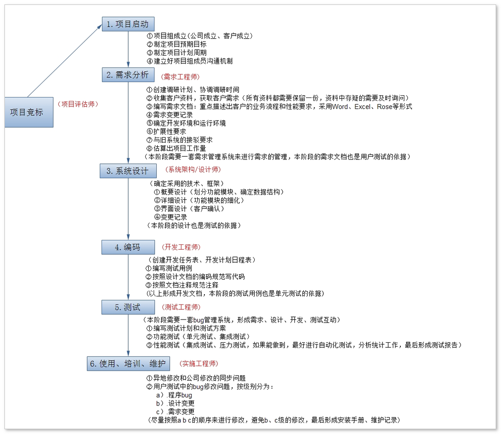
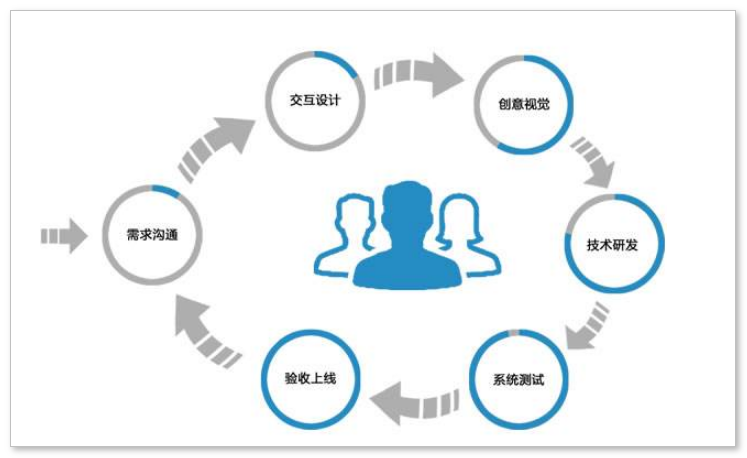

#### 1.简历修改部分

负责模块：

服务报表的导入导出echarts

[(1条消息) Java报表导出有哪些技术_报表工具能实现怎么的导出效果？_鬼斧神工119的博客-CSDN博客](https://blog.csdn.net/weixin_28366353/article/details/114942941)


专业技能：

目前写的是SSM基础框架，还需要加上：微服务、Springcloud、RabbitMQ中间件框架、MySQL数据库、MongoDB、Redis数据库相关


技术要点：

1.使用百度的Echarts完成报表功能；

2.EasyExecel或TOI做出时间的导入导出功能


问到为什么项目类别相差大（一般互联网公司的业务方向都比较一致）：

一开始以Java开发的岗位招进去，但是最初并没有做Java开发，而是做XX系统维护，在里面写了、改了一些基础的Bug，主要是做线上项目的支持，比如说线上项目对方在使用过程中有什么问题就会反馈到我这里，然后我去帮忙找一些bug或者解决一些问题，如果有搞不定的问题，就把这些问题汇总起来，再提交给开发的团队去解决。

当时我在里面是做维护的，最近两个项目，当时的公司是一家外包公司，这个项目是在第一个项目做完后请求项目组给我转Java开发，所以后面才给我安排了另外一个项目组做Java开发工作，做完以后又换了一个项目组，所以做的这几个项目在业务方面会差别比较大。

做项目外包，把别人的项目拿过来做，做完再给他们拿回去。

Java支持、运维也可以投一下简历


#### 2.模拟面试2

面试少时把工作时间改20年开始

##### 1.负责数据权限功能实现，功能做什么？

给不同的人分配不同的数据权限

怎么实现？

[(1条消息) 数据权限就该这么实现（实践篇），yyds！_飘渺Jam的博客-CSDN博客](https://jianzh5.blog.csdn.net/article/details/126169113?spm=1001.2101.3001.6650.2&utm_medium=distribute.pc_relevant.none-task-blog-2~default~BlogCommendFromBaidu~Rate-2-126169113-blog-116937203.pc_relevant_3mothn_strategy_and_data_recovery&depth_1-utm_source=distribute.pc_relevant.none-task-blog-2~default~BlogCommendFromBaidu~Rate-2-126169113-blog-116937203.pc_relevant_3mothn_strategy_and_data_recovery&utm_relevant_index=5)

通过Spring的AOP+自定义注解来实现， 

```
流程：
1利用sql实现数据权限--
2自定义数据权限注解@DataScope--
3利用aop实现该注解--
	3.1确定切入点--
	3.2利用通知类型拼接sql
```

该怎么做好：

明确controller接口的访问权限，不同的人分配不同的角色。如果遇到一个功能是多个角色都可以访问，入口都 是 同一个controller，要求返回的数据不一样时，由业务层的逻辑代码来控制。

这个注解的作用是什么？

```
1.将验证逻辑放在aop中，减少对业务代码的侵入。
2.自定义注解可以实现自定义化是否使用aop。
3.当然也可以将结果放在threadLocal里面存储。
```


##### 2.用户和权限有什么关系？

[(1条消息) 用户、角色和权限关系_不爱吃鱼丶的博客-CSDN博客_用户账号、角色和权限之间的关系是什么?没有角色能给用户授予权限吗?](https://blog.csdn.net/y_dzaichirou/article/details/89282860)

用户和权限没有直接的关系，而是通过角色去关联，用户和角色是多对多关系，角色跟权限也是多对多关系

##### 3.介绍Redis，哪个模块有使用到Redis数据库，使用Redis解决什么问题？

登录和分类列表用到Redis。Redis适合存储一些热门数据，就是经常访问但不怎么变更的数据，像分类列表就是在数据库定义好后，修改的机会就是很少的，像这种分类数据，每一个用户在访问每一个页面或者分类页面的时候，都会加载这个分类列表，所以这个分类列表也算是热门数据。此外包括在登录时也会用到Redis，所以分类列表和登录都会用到，以及展示验证码，或者解决一个表单重复提交问题，关于一些数据库数据的对比，Token的对比，这些都会用到Redis。

**redis的使用场景？**

```
1.缓存，将热点数据放到内存中。
2.计数器，可以对 String 进行自增自减运算，从而实现计数器功能。
3.队列，List 是一个双向链表，可以通过 lpush 和 rpop 写入和读取消息。不过最好使用 Kafka、RabbitMQ 等消息中间件。
4.分布式锁，在分布式场景下，无法使用单机环境下的锁来对多个节点上的进程进行同步。可以使用 Redis 自带的 SETNX 命令实现分布式锁，除此之外，还可以使用官方提供的 RedLock 分布式锁实现。
5.会话缓存，可以使用 Redis 来统一存储多台应用服务器的会话信息。
6.全页缓存（FPC），除基本的会话token之外，Redis还提供很简便的FPC平台。没接触过。
7.交集、差集、并集，Set 可以实现交集、差集、并集等操作，从而实现共同好友等功能。没接触过。
8.排行榜，ZSet 可以实现有序性操作，从而实现排行榜等功能。没接触过。
9.发布/订阅功能，用的少，没有MQ好。没接触过。
```


##### 4.介绍Redis持久化机制的特点？

**redis的持久化方式区别及其选择？**

1. ```
   1. 支持AOF（Append Only File）和RDB（Redis DataBase）两种持久化方式。
   2. RDB是默认的持久化方式。按照一定的时间将内存的数据以快照的形式保存到硬盘中，对应产生的数据文件为dump.rdb。通过配置文件中的save参数来定义快照的周期。
   3. AOF持久化(即Append Only File持久化)，则是将Redis执行的每次写命令记录到单独的日志文件中，当重启Redis会重新将持久化的日志中文件恢复数据。
   4. RDB，安全性低。RDB 是间隔一段时间进行持久化，如果持久化之间 redis 发生故障，会发生数据丢失。
   5. AOF，安全性高。即使中途服务器宕机，可以通过 redis-check-aof 工具解决数据一致性问题。
   6. RDB，性能好，fork 子进程来完成写操作，让主进程继续处理命令，所以是 IO 最大化。
   7. AOF比RDB更安全、更大，RDB比AOF性能更好。
   8. 可以同时两种方式，两个都配了优先加载AOF。AOF粒度更细
   9. 可以只使用RDB持久化，可以承受数分钟以内的数据丢失。
   10. 不推荐只使用AOF持久化，因为定时生成RDB快照（snapshot）非常便于进行数据库备份， 并且 RDB 恢复数据集的速度也要比AOF恢复的速度要快，除此之外，使用RDB还可以避免AOF程序的bug
   11. 不使用任何持久化方式，数据在服务器运行的时候存在
   ```

   

##### 5.介绍MySQL相关的，介绍MySQL内连接查询、左外连接、右外连接查询结果集成的区别是什么？

**MYSQL内连接和外连接的区别 ?**

```
内连接会取出连接表中匹配到的数据，匹配不到的不保留；

外连接会取出连接表中匹配到的数据，匹配不到的也会保留，其值为NULL。以某一个表为主表后，进行关联查询，不管能不能关联的上，主表的数据都会保留，关联不上的以NULL显示
 	左外连接，以左边的表为主表
 	右外连接，以右边的表为主表
```


**Mysql查询语句的执行顺序？**

- ```
  sql的编写顺序
  - select           字段列表
  - distinct		去重
  - from             表名列表
  - join on          表关联
  - where            条件列表
  - group by         分组字段列表
  - having           分组后的条件列表
  - order by         排序字段列表
  - limit            分页参数
  
  sql的执行顺序
  - from             表名列表
  - join on          表关联
  - where            条件列表
  - group by         分组字段列表
  - having           分组后的条件列表
  - select           字段列表
  - distinct		去重
  - order by         排序字段列表
  - limit            分页参数
  ```

  

举例:

​	sql1：select name ,age from tb_user where name = '张三' order by age limit 10;

​	给表起别名

​	sql2：select **u.name** ,**u.age** from tb_user **u** where name = '张三' order by **u.age** limit 10;

​	可以正常执行，如果from后不先执行，则select和order by无法引用

给sql的字段起别名

​	sql3：select u.name **uname** ,u.age **uage** from tb_user u where **uname**= '张三' order by u.age limit 10;

​	在where之后使用别名，执行报错，因为where在select 之前执行

​	sql4：select u.name **uname** ,u.age **uage** from tb_user u where u.name= '张三' order by **uage** limit 10;

​	在order by后面使用别名，可以正常执行，因为select执行完成后才会执行order by 

##### 6.介绍SpringMVC里常用的注解？

1. @Controller：用于定义控制器类
2. @ResponseBody：表示方法的返回结果直接写入HTTP response body中
3. @PathVariable：获取路径参数
4. @RequestParam：用在方法的参数前面
5. @RequestBody：请求的json转化为bean去接收
6. @RestController：是@Controller和@ResponseBody的合集
7. @RequestMapping：提供路由信息，负责URL到Controller中的具体函数的映射
8. @GetMapping：是@RequestMapping(method = RequestMethod.GET)的缩写。不支持
9. @RequestMapping的自定义属性。
10. @PostMapping：是@RequestMapping(method = RequestMethod.POST)的缩写。不支持
11. @RequestMapping的自定义属性。
12. @ControllerAdvice：统一处理异常。
13. @ExceptionHandler：用在方法上表示遇到这个异常就执行以下方法。

###### **你用过哪些重要的Spring注解**？

1、[@Component- ]() 用于服务类。 
@Service 、 @Repository 、@Controller 

2、[**@Autowired** ]()  - 用于在 spring bean 中自动装配依赖项。通过类型来实现自动注入bean。和@Qualifier注解配合使用可以实现根据name注入bean。

3、[@Qualifier ]() - 和@Autowired一块使用，在同一类型的bean有多个的情况下可以实现根据name注入的需求。 

4、[@Scope ]() - 用于配置 spring bean 的范围。 

5、@Configuration，[@ComponentScan ]() 和 [@Bean ]() - 用于基于 java 的配置。 

6、@Aspect，@Before，@After，@Around，[@Pointcut ]() - 用于切面编程（AOP） 


##### 7.什么是Spring的AOP？怎么实现？在Java里有哪些应用场景？在项目中有哪些地方用了AOP这种设计思想？

哪里使用了：日志记录功能通过AOP来实现，实现所有的访问日志、打印。AOP应用场景：还有SpringAOP在单体项目中做spring的事务功能，用到了AOP。AOP的底层使用了动态代理，接着简单介绍一下Java里的动态代理。

##### 8.介绍一下最熟悉的框架？

（一般要回答有Redis框架，因为Redis在市场上最常用。）

##### 9.介绍Linux里常用的命令（准备4、5个，重点看日志）？

```
docker ps -a  查看正在运行或已停止的容器
docker ps -a -q  查看所有容器id
docker logs -f nginxkkk  查看容器日志
docker rm `docker ps -a -q`  删除所有容器


```


##### 10.介绍Java里==和equals方法在对比上区别？

[深入探究Java中equals()和==的区别是什么 - 胡涂阿菌 - 博客园 (cnblogs.com)](https://www.cnblogs.com/tanshaoshenghao/p/10896512.html#:~:text=equals ()和 %3D%3D 有着本质的区别，%3D%3D 可以看作是对"操作系统比较数据手段"的封装，而equals,()则是每个对象自带的比较方法，它是Java自定义的比较规则。 equals ()和 %3D%3D 的本质区别更通俗的说法是：%3D%3D的比较规则是定死的，就是比较两个数据的值。)

比较基本数据类型时，==比较的是值，equals方法比较的是数据类型。。。。。

##### 11.什么是重定向什么是转发？

重点关注框架（使用层上）、数据库（使用层上）、SE知识、以及个人职责每一个模块怎么实现（关于服务报表做了哪些东西，日志功能是怎么实现的），梳理个人技能。


#### 1.权限认证是如何实现的

[3、权限认证是如何实现的 (yuque.com)](https://www.yuque.com/yp000/osbag7/gcngv5)


#### 2.你们项目中日志怎么采集的？

ELK：即Elasticsearch、Logstash和Kibana三个开源软件的缩写

1、Elasticsearch Elasticsearch  全文搜索和分析引擎，对大容量的数据进行接近实时的存储、搜索和分析操作。

2、Logstash Logstash是一个数据收集引擎，它可以动态的从各种数据源搜集数据，并对数据进行过滤、分析和统一格式等操作，并将输出结果存储到指定位置上

3、Kibana Kibana是一个数据分析和可视化平台，通常与Elasticsearch配合使用，用于对其中的数据进行搜索、分析，并且以统计图标的形式展示。


#### 3.你们的app用户量有多少？你们项目的的qps是多少、有多少台服务器？

我们app端用户量，目前是10万，经过测试，最高的并发集中在晚上7点至9点，其中有查询文章的接口最高有几次达到了接近2000的qps
目前生产的服务器使用的tomcat9，使用jmeter压测后，处理的并发数极限为400左右，所以文章那个微服务通常都是6、7台服务器做了集群。其他访问量较少的集群数量更低一些。

```
QPS：Query Per Second 即每秒查询率，是对一个特定的查询服务器在规定时间内所处理流量多少的衡量标准。
	对应fetches/sec，即每秒的响应请求数，也即是最大吞吐能力。
TPS：Transactions Per Second（每秒传输的事物处理个数），即服务器每秒处理的事务数。TPS包括一条消息入和一条消息出，加上一次用户数据库访问。（业务TPS = CAPS × 每个呼叫平均TPS）
```


#### 4.查看日志的命令

[(1条消息) 认识Tomcat的日志：catalina.out、localhost、manager、localhost_access_log_琦彦的博客-CSDN博客_catalina日志](https://blog.csdn.net/fly910905/article/details/78463909)

1.tomcat查看实时日志
● 实时监控日志：tail -f catalina.out 
● 查询最后100行日志：tail -n 100 -f catalina.out 
2.doeker容器实时查看日志
● 实时监控日志：docker logs -f 容器id/容器名称 
● 查询最后100行日志：docker logs -n 100 -f 容器id/容器名称 
3.查看日志文件
● 在test.log文件中搜索”exception”：cat -n test.log | grep “exception” 
● 分页查看日志文件：more test.log 
● 使用 >xxx.txt 将查询到的日志保存到文件中,可以下载这个文件分析 cat -n test.log |grep "debug" >debug.txt 
通常的使用思路：先尝试监控实时日志，看看能不能监控到想要的信息，如果不能则需要查看日志文件，从海量日志信息中找出自己想要的错误信息。

##### Tomcat中catalina.out和catalina.log的区别和用途是什么

```
catalina.out
catalina.out其实是tomcat的标准输出(stdout)和标准出错(stderr)，
这是在tomcat的启动脚本里指定的，如果没有修改的话stdout和stderr会重定向到这里。所以我们在应用里使用System.out打印的东西都会到这里来。
另外，如果我们在应用里使用其他的日志框架，配置了向Console输出的，则也会在这里出现。
比如以logback为例，如果配置ch.qos.logback.core.ConsoleAppender则会输出到catalina.out里。
```

```
catalina.Y-M-D.log    （Y-M-D是路径，应该是相对路径）
是tomcat自己运行的一些日志，这些日志还会输出到catalina.out，
但是应用向console输出的日志不会输出到catalina.{yyyy-MM-dd}.log
```


###### 1.catalina.out

catalina.out其实是tomcat的标准输出(stdout)和标准出错(stderr)，这是在tomcat的启动脚本里指定的，如果没有修改的话stdout和stderr会重定向到这里。所以我们在应用里使用System.out打印的东西都会到这里来。另外，如果我们在应用里使用其他的日志框架，配置了向Console输出的，则也会在这里出现。比如以logback为例，如果配置ch.qos.logback.core.ConsoleAppender则会输出到catalina.out里。

###### 2.cataliana.{yyyy-MM-dd}.log和localhost.{yyyy-MM-dd}.log

这两个日志都是通过logging.properties配置的(默认情况下，启动脚本里指定了java.util.logging.config.file和java.util.logging.manager两个变量)。一个典型的logging.properties可能如下所示:

```
handlers = 1catalina.org.apache.juli.FileHandler, 2localhost.org.apache.juli.FileHandler, java.util.logging.ConsoleHandler
.handlers = 1catalina.org.apache.juli.FileHandler, java.util.logging.ConsoleHandler
 
1catalina.org.apache.juli.FileHandler.level = INFO
1catalina.org.apache.juli.FileHandler.directory = ${catalina.base}/logs
1catalina.org.apache.juli.FileHandler.prefix = catalina.
 
2localhost.org.apache.juli.FileHandler.level = FINE
2localhost.org.apache.juli.FileHandler.directory = ${catalina.base}/logs
2localhost.org.apache.juli.FileHandler.prefix = localhost.
 
java.util.logging.ConsoleHandler.level = INFO
java.util.logging.ConsoleHandler.formatter = java.util.logging.SimpleFormatter
 
org.apache.catalina.core.ContainerBase.[Catalina].[localhost].level = INFO
org.apache.catalina.core.ContainerBase.[Catalina].[localhost].handlers = 2localhost.org.apache.juli.FileHandler
```

这个文件大致的意思是，root输出到catalina和console。而这里的catalina按照配置对应的是catalina.{yyyy-MM-dd}.log，这里的console最终会输出到catalina.out。这就是我们看到catalina.{yyyy-MM-dd}.log和catalina.out的日志很多都是一样的原因。

配置文件中还有一个localhost，所有logname或parent logname为org.apache.catalina.core.ContainerBase.[Catalina].[localhost]的都会输出到localhost.{yyyy-MM-dd}.log文件。而这个logname又代表着什么呢？在tomcat中有一个server.xml的配置文件，其中有这么一个片段:

```
<Engine name="Catalina" defaultHost="localhost">
  <Host name="localhost"  appBase="webapps"
        unpackWARs="false" autoDeploy="false">
  </Host>
</Engine>
```

我们可以这么简单的理解: 一个Tomcat进程对应着一个Engine，一个Engine下可以有多个Host(Virtual Host)，一个Host里可以有多个Context，比如我们常常将应用部署在ROOT下还是webapps里其他目录，这个就是Context。

这其中Engine对应着tomcat里的StandardEngine类，Host对应着StandardHost类，而Context对应着StandardContext。这几个类都是从ContainerBase派生。这些类里打的一些跟应用代码相关的日志都是使用ContainerBase里的getLogger，而这个这个logger的logger name就是: org.apache.catalina.core.ContainerBase.[current container name].[current container name]...

而我们一个webapp里listener, filter, servlet的初始化就是在StandardContext里进行的，比如ROOT里有一个listener初始化出异常了，打印日志则logger name是org.apache.catalina.core.ContainerBase.[Catalina].[localhost].[/]。

这其中Catalina和localhost是上面xml片段里的Engine和Host的name，而[/]是ROOT对应的StandardContext的name。所以listener, filter, servlet初始化时的日志是需要看localhost.{yyyy-MM-dd}.log这个日志的。比如现在我们使用Spring，Spring的初始化我们往往是使用Spring提供的一个listener进行的，而如果Spring初始化时因为某个bean初始化失败，导致整个应用没有启动，这个时候的异常日志是输出到localhost中的，而不是cataina.out中。所以有的时候我们应用无法启动了，然后找catalina.out日志，但最后也没有定位根本原因是什么，就是因为我们找的日志不对。但有的时候catalina.out里也有我们想要的日志，那是因为我们的应用或使用的一些组件自己捕获了异常，然后将其打印了，这个时候如果恰好这些日志被我们配置成输出到console，则这些日志也会在catalina.out里出现了。


#### 5.全链路日志怎么做的？

使用skywalking实现

补充：

[(1条消息) 从简单日志到全链路日志 我们应该怎么打日志_Lancker的博客-CSDN博客](https://blog.csdn.net/zhongdaiqi/article/details/106604902)

**单链路日志**

当我看到有同事使用GUID将日志请求串在一起的时候，我就这应该算是单链路日志了。站点的单次请求或服务的业务操作日志能够很好的被标识出来，在分析日志的时候，需要搜索同GUID的日志，请能定位到一个请求或作业的日志，不用提心其他日志的干扰。单链路日志对于分析单个站点或单个服务的日志情况，还是很有帮忙。我们已经能从日志中挑出日志，专注于重点日志。

```
请求3fba452e-d9c9-45ee-96cb-19280fa59673 我收到一个请求，参数是
请求b3a45dec-7667-4822-b7b9-7db1eec11a8b 我收到一个请求，参数是
请求3e2f3851-9491-4f97-a47c-53d1001278ba 我收到一个请求，参数是
请求6180a2f7-d9bf-4612-9d23-c5e6d46a079d 我收到一个请求，参数是
请求26a9d771-f2f3-47fa-b810-d3071a1d98ca 我收到一个请求，参数是
请求3fba452e-d9c9-45ee-96cb-19280fa59673 用户账号BBB未认证
```

**全链路日志**

全链路日志在单链路日志的基础上进行跨站点，跨服务逻辑的日志追踪。分我们排查问题的时候，往往是一个完整业务排查，不单是涉及一个站点的，可能需要顺藤摸瓜，一点一点回溯。单链路日志 对此就无能为力了。所以引身出了全链路日志，我们需要为每个完整的请求分配一个追踪id，称之为TraceId，这个追踪id将在业务站点间流转，将业务日志串起来。当我们查看日志的时候，可以完整得看到业务日志的流转明细。同样的道理，服务日志在入口处，也将分配一个完整的TraceId，标识出完整的日志。

```
站点A
TaceId 2ad28f58-858c-47c0-8875-e2e9db4ff24b 请求3fba452e-d9c9-45ee-96cb-19280fa59673 我收到一个请求，参数是
TaceId 2ad28f58-858c-47c0-8875-e2e9db4ff24b 请求3fba452e-d9c9-45ee-96cb-19280fa59673 用户账号BBB未认证

站点B
TaceId 2ad28f58-858c-47c0-8875-e2e9db4ff24b 请求3fba452e-d9c9-45ee-96cb-19280fa59673 用户账号检查
```

针对于全链路日志，我们应该采用TraceId将跨站点的日志打上标记，对服务内部的日志转流也同样的道理。通过GUID标记好的日志，可以通过日志收集系统，FileBeat抓取到Kafka，LogStash从Kafka消费送到ES，我们DIY一个全链路日志查询系统，在出一线上问题的时候，快速的定位出完整的业务日志，高效的排查问题。今天本想分享如果打业务日志，写着写着就变主题了，下次再找机会分析打业务日志的经验。关于日志收集系统的搭建，也是另外分享。


#### 6.你们开发业务的流程是什么？还不明白？？？

1，产品经理说需求--》后端+前端+测试
2，定接口（后端主导 |  前端主导  |  **前后端协调**）
	●mock测试
3，后端的工作：设计（技术选型，数据库表[原型或PRD]）+ 编码；前端 开发页面
	●基于原型或PRD(需求文档)
	●命名规范（参考阿里规约）
	●字段类型（合适类型--->根据存储的内容决定）
	●实体与实体之间的关系（主外键约束）
	●表设计没有不变的
4，部署测试环境
5，接口联调 --->前后端联调
6，测试 --> 提bug 专门的bug管理工具(禅道)
	每个人都会开通一个禅道账号     个人修复bug以后，提交为 已解决———》 测试人员回归测试
7，部署正式环境


补充：

接口联调：当后端还没有提供接口的时候，前端需要的数据从哪里来呢，就只能自己造假数据写死了。当后端接口做好后，前端所需要的数据就需要替换成后端提供的数据了。这个时候就需要进行一个前后端的调试，我们会把这个过程叫做前后端接口联调。

怎么去实现前后端接口联调呢？
有些公司Swagger去做接口文档的，当我们拿到后端的swagger的时候，我们首先去更新接口中swagger自动生成的json文件，然后把包先换到自己的本地文件中先来使用看看是否可以用，当可以使用的时候在把包更新上去给别人用。
当我们更新完包后，接下来就是要在本地项目中调用接口了。
根据swagger地址去src下的providers寻找相应的文件，如果是新建的文件，那么久需要在index.js中导入导出相应的接口。
如果已存在文件则需要写入调用方法的接口如：

```
 // 新增工程  -->方法名为create，传入的参数为dto
 //createUsingPOST是swagger写到的方法
  create: dto => {
    return HttpClient.ProjectApi.createUsingPOST(dto);
  },
```


当接口在本地写完以后就可以在相应的界面使用了。
如：

当接口在本地写完以后就可以在相应的界面使用了。
如：

```
//首先在本界面导入接口
import {labelingSetApi} from "@/providers";
//
 async create(id) {
      this.isFormLoading = true;
      let res = await labelingSetApi.create(id);
      const { code, object, msg, errorMsg } = res.data;//接口中得到的数据
      if (code === 0) {//接口调用成功
      //赋值
        this.formData = object;
      } else {//接口调用失败，报错提示
        this.$notify({
          title: "错误",
          message: errorMsg || msg,
          type: "error"
        });
      }
    },
```


#### 7.项目的开发流程怎样的

1.了解需要做什么 

​	a产品或者老大提需求，给我需求文档，或者效果图，或者接口文档，让我明确我需要做什么

2.我分析需求 

​	a分析需要什么技术，然后技术选型，遇到需要用到的不懂的需要进行技术的研究

3.分步骤完成 

​	a实际开发就是一步一步的去做就完事儿了

4.测试 

​	a开发过程中我们会自己测试

​	b功能差不多了，需要交给专业的测试去测试

5.修复测试提交的bug清单 

​	a修复bug，直到没有问题，那就可以上线了

 辅助理解
 1、看图 

项目启动

项目组成立(公司成立,客户成立)

制定项目预期目标

制定项目计划周期

建立好项目组成员沟通机制

2.需求分析

(需求工程师)

创建调研计划,协调调研时间

收集客户资料,获取客户需求(所有资料都需要保留一份,资料中存疑的需要及时询问

(项目评估师)

编与需求文档:重点描述出客户的业务流程和性能要求,采用WORD,EXCEL,ROSE等形式

项目竞标

需求变更记录

确定开发环境和运行环境

R扩展性要求

与旧系统的接驳要求

估算出项目工作量

(本阶段需要一套需求管理系统来进行需求的管理,本阶段的需求文档也是用户测试的依据)

(系统架构/设计师)

3.系统设计

(确定采用的技术,框架)

概要设计(划分功能模块,确定数据结构)

详细设计(功能模块的细化)

界面设计(客户确认)

@变更记录

(本阶段的设计也是测试的依据)

4.编码

(开发工程师)

(创建开发任务表,开发计划日程表)

编写测试用例

按照设计文档的编码规范写代码

按照文档注释规范注释

(以上形成开发文档,本阶段的测试用例也是单元测试的依据)

5.测试

(测试工程师)

(本阶段需要一套BUG管理系统,形成需求,设计,开发,测试互动)

编写测试计划和测试方案

功能测试(单元测试,集成测试)

D性能测试(集成测试,压力测试,如果能做到,最好进行自动化测试,分析统计工作,最后形成测试报告)

6.使用,培训,维护

(实施工程师)

异地修改和公司修改的同步问题

用户测试中的BUG修改问题,按级别分为:

A).程序BUG

B).设计变更

C).需求变更

(尽量按照ABC的顺序来进行修改,避免B,C级的修改,最后形成安装手册,维护记录)




交互设计

创意视觉

记了

需求沟通

技术研发

验收上线

系统测试




若有收获，就点个赞吧