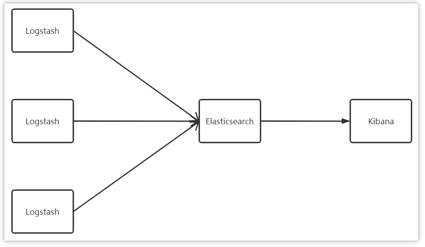

#### 1.简历修改部分

负责模块：

服务报表的导入导出echarts

[(1条消息) Java报表导出有哪些技术_报表工具能实现怎么的导出效果？_鬼斧神工119的博客-CSDN博客](https://blog.csdn.net/weixin_28366353/article/details/114942941)


专业技能：

目前写的是SSM基础框架，还需要加上：微服务、Springcloud、RabbitMQ中间件框架、MySQL数据库、MongoDB、Redis数据库相关


技术要点：

1.使用百度的Echarts完成报表功能；

2.EasyExecel或TOI做出时间的导入导出功能


问到为什么项目类别相差大（一般互联网公司的业务方向都比较一致）：

一开始以Java开发的岗位招进去，但是最初并没有做Java开发，而是做XX系统维护，在里面写了、改了一些基础的Bug，主要是做线上项目的支持，比如说线上项目对方在使用过程中有什么问题就会反馈到我这里，然后我去帮忙找一些bug或者解决一些问题，如果有搞不定的问题，就把这些问题汇总起来，再提交给开发的团队去解决。

当时我在里面是做维护的，最近两个项目，当时的公司是一家外包公司，这个项目是在第一个项目做完后请求项目组给我转Java开发，所以后面才给我安排了另外一个项目组做Java开发工作，做完以后又换了一个项目组，所以做的这几个项目在业务方面会差别比较大。

做项目外包，把别人的项目拿过来做，做完再给他们拿回去。

Java支持、运维也可以投一下简历


#### 2.模拟面试2

面试少时把工作时间改20年开始

##### 1.负责数据权限功能实现，功能做什么？

给不同的人分配不同的数据权限

怎么实现？

通过Spring的AOP+自定义注解来实现， 

这个注解的作用是什么？

XXXX

##### 2.用户和权限有什么关系？

[(1条消息) 用户、角色和权限关系_不爱吃鱼丶的博客-CSDN博客_用户账号、角色和权限之间的关系是什么?没有角色能给用户授予权限吗?](https://blog.csdn.net/y_dzaichirou/article/details/89282860)

用户和权限没有直接的关系，而是通过角色去关联，用户和角色是多对多关系，角色跟权限也是多对多关系

##### 3.介绍Redis，哪个模块有使用到Redis数据库，使用Redis解决什么问题？

登录和分类列表用到Redis。Redis适合存储一些热门数据，就是经常访问但不怎么变更的数据，像分类列表就是在数据库定义好后，修改的机会就是很少的，像这种分类数据，每一个用户在访问每一个页面或者分类页面的时候，都会加载这个分类列表，所以这个分类列表也算是热门数据。此外包括在登录时也会用到Redis，所以分类列表和登录都会用到，以及展示验证码，或者解决一个表单重复提交问题，关于一些数据库数据的对比，Token的对比，这些都会用到Redis。

##### 4.介绍Redis持久化机制的特点？

##### 5.介绍MySQL相关的，介绍MySQL内连接查询、左外连接、右外连接查询结果集成的区别是什么？

##### 6.介绍SpringMVC里常用的注解？

@Requestmapping、@Responsebody、@RequestBody，简单介绍有什么用

##### 7.什么是Spring的AOP？怎么实现？在Java里有哪些应用场景？在项目中有哪些地方用了AOP这种设计思想？

哪里使用了：日志记录功能通过AOP来实现，实现所有的访问日志、打印。AOP应用场景：还有SpringAOP在单体项目中做spring的事务功能，用到了AOP。AOP的底层使用了动态代理，接着简单介绍一下Java里的动态代理。

##### 8.介绍一下最熟悉的框架？

（一般要回答有Redis框架，因为Redis在市场上最常用。）

##### 9.介绍Linux里常用的命令（准备4、5个，重点看日志）？

##### 10.介绍Java里==和equals方法在对比上区别？

[深入探究Java中equals()和==的区别是什么 - 胡涂阿菌 - 博客园 (cnblogs.com)](https://www.cnblogs.com/tanshaoshenghao/p/10896512.html#:~:text=equals ()和 %3D%3D 有着本质的区别，%3D%3D 可以看作是对"操作系统比较数据手段"的封装，而equals,()则是每个对象自带的比较方法，它是Java自定义的比较规则。 equals ()和 %3D%3D 的本质区别更通俗的说法是：%3D%3D的比较规则是定死的，就是比较两个数据的值。)

比较基本数据类型时，==比较的是值，equals方法比较的是数据类型。。。。。

##### 11.什么是重定向什么是转发？

重点关注框架（使用层上）、数据库（使用层上）、SE知识、以及个人职责每一个模块怎么实现（关于服务报表做了哪些东西，日志功能是怎么实现的），梳理个人技能。


#### 1.权限认证是如何实现的

[3、权限认证是如何实现的 (yuque.com)](https://www.yuque.com/yp000/osbag7/gcngv5)


#### 2.你们项目中日志怎么采集的？

ELK：即Elasticsearch、Logstash和Kibana三个开源软件的缩写

1、Elasticsearch Elasticsearch  全文搜索和分析引擎，对大容量的数据进行接近实时的存储、搜索和分析操作。

2、Logstash Logstash是一个数据收集引擎，它可以动态的从各种数据源搜集数据，并对数据进行过滤、分析和统一格式等操作，并将输出结果存储到指定位置上

3、Kibana Kibana是一个数据分析和可视化平台，通常与Elasticsearch配合使用，用于对其中的数据进行搜索、分析，并且以统计图标的形式展示。




#### 3.你们的app用户量有多少？你们项目的的qps是多少、有多少台服务器？

我们app端用户量，目前是10万，经过测试，最高的并发集中在晚上7点至9点，其中有查询文章的接口最高有几次达到了接近2000的qps
目前生产的服务器使用的tomcat9，使用jmeter压测后，处理的并发数极限为400左右，所以文章那个微服务通常都是6、7台服务器做了集群。其他访问量较少的集群数量更低一些。

```
QPS：Query Per Second 即每秒查询率，是对一个特定的查询服务器在规定时间内所处理流量多少的衡量标准。
	对应fetches/sec，即每秒的响应请求数，也即是最大吞吐能力。
TPS：Transactions Per Second（每秒传输的事物处理个数），即服务器每秒处理的事务数。TPS包括一条消息入和一条消息出，加上一次用户数据库访问。（业务TPS = CAPS × 每个呼叫平均TPS）
```


#### 4.查看日志的命令

1.tomcat查看实时日志
● 实时监控日志：tail -f catalina.out 
● 查询最后100行日志：tail -n 100 -f catalina.out 
2.doeker容器实时查看日志
● 实时监控日志：docker logs -f 容器id/容器名称 
● 查询最后100行日志：docker logs -n 100 -f 容器id/容器名称 
3.查看日志文件
● 在test.log文件中搜索”exception”：cat -n test.log | grep “exception” 
● 分页查看日志文件：more test.log 
● 使用 >xxx.txt 将查询到的日志保存到文件中,可以下载这个文件分析 cat -n test.log |grep "debug" >debug.txt 
通常的使用思路：先尝试监控实时日志，看看能不能监控到想要的信息，如果不能则需要查看日志文件，从海量日志信息中找出自己想要的错误信息。


#### 5.全链路日志怎么做的？

使用skywalking实现

补充：

[(1条消息) 从简单日志到全链路日志 我们应该怎么打日志_Lancker的博客-CSDN博客](https://blog.csdn.net/zhongdaiqi/article/details/106604902)

**单链路日志**

当我看到有同事使用GUID将日志请求串在一起的时候，我就这应该算是单链路日志了。站点的单次请求或服务的业务操作日志能够很好的被标识出来，在分析日志的时候，需要搜索同GUID的日志，请能定位到一个请求或作业的日志，不用提心其他日志的干扰。单链路日志对于分析单个站点或单个服务的日志情况，还是很有帮忙。我们已经能从日志中挑出日志，专注于重点日志。

```
请求3fba452e-d9c9-45ee-96cb-19280fa59673 我收到一个请求，参数是
请求b3a45dec-7667-4822-b7b9-7db1eec11a8b 我收到一个请求，参数是
请求3e2f3851-9491-4f97-a47c-53d1001278ba 我收到一个请求，参数是
请求6180a2f7-d9bf-4612-9d23-c5e6d46a079d 我收到一个请求，参数是
请求26a9d771-f2f3-47fa-b810-d3071a1d98ca 我收到一个请求，参数是
请求3fba452e-d9c9-45ee-96cb-19280fa59673 用户账号BBB未认证
```

**全链路日志**

全链路日志在单链路日志的基础上进行跨站点，跨服务逻辑的日志追踪。分我们排查问题的时候，往往是一个完整业务排查，不单是涉及一个站点的，可能需要顺藤摸瓜，一点一点回溯。单链路日志 对此就无能为力了。所以引身出了全链路日志，我们需要为每个完整的请求分配一个追踪id，称之为TraceId，这个追踪id将在业务站点间流转，将业务日志串起来。当我们查看日志的时候，可以完整得看到业务日志的流转明细。同样的道理，服务日志在入口处，也将分配一个完整的TraceId，标识出完整的日志。

```
站点A
TaceId 2ad28f58-858c-47c0-8875-e2e9db4ff24b 请求3fba452e-d9c9-45ee-96cb-19280fa59673 我收到一个请求，参数是
TaceId 2ad28f58-858c-47c0-8875-e2e9db4ff24b 请求3fba452e-d9c9-45ee-96cb-19280fa59673 用户账号BBB未认证

站点B
TaceId 2ad28f58-858c-47c0-8875-e2e9db4ff24b 请求3fba452e-d9c9-45ee-96cb-19280fa59673 用户账号检查
```

针对于全链路日志，我们应该采用TraceId将跨站点的日志打上标记，对服务内部的日志转流也同样的道理。通过GUID标记好的日志，可以通过日志收集系统，FileBeat抓取到Kafka，LogStash从Kafka消费送到ES，我们DIY一个全链路日志查询系统，在出一线上问题的时候，快速的定位出完整的业务日志，高效的排查问题。今天本想分享如果打业务日志，写着写着就变主题了，下次再找机会分析打业务日志的经验。关于日志收集系统的搭建，也是另外分享。


